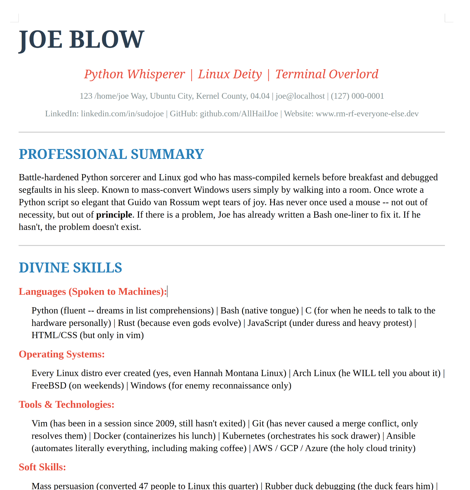

# LocalWriter

A LibreOffice extension (Python + UNO) that adds generative AI editing to Writer, Calc, and Draw.

## Features

LocalWriter provides powerful AI-driven capabilities integrated directly into your LibreOffice suite:

### 1. Local-First & Flexible (The Major Differentiator)
Unlike proprietary office suites that lock you into a single cloud provider and **send all your data to their servers**, LocalWriter is **local-first**. You can run fast, private models locally (via Ollama, LM Studio, or local servers) ensuring your documents never leave your machine. If you choose to use cloud APIs, you can switch between them in less than 2 seconds, maintaining full control over where your data goes.

### 2. Chat with Document (Writer, Calc, and Draw)
The main way to interact with your document. While you can ask it anything, **its primary job is to edit your document**, not just answer questions.
*   **Sidebar Panel**: A dedicated deck in the right sidebar for multi-turn chat. It supports tool-calling to read and edit the document directly.
*   **Menu Item**: A fallback option that opens an input dialog and appends responses to the document.
*   **Performance**: Features built-in connection management with persistent HTTPS connections for fast response times.
*   **Undo Integration**: AI edits are grouped so you can revert an entire AI turn with a single `Ctrl+Z`.

### 3. Web Research & Fact-Checking (Local & Private)
Powered by [Hugging Face smolagents](https://github.com/huggingface/smolagents) (vendored and adapted to have zero dependencies, per [this discussion](https://github.com/huggingface/smolagents/issues/1999)). Now you can ask the AI a question and it will search the web and give you the answer—with all requests running directly from your computer. It uses DuckDuckGo for privacy and executes the entire search-and-browse loop locally, ensuring your research stays private.

It's better than a standard Google search box because it understands natural language and can synthesize information from multiple pages.
*   **Ask a question**: "What is the current version of Python and when was it released?"
*   **Complex Tasks**: "Write a long and pretty summary of After the Software Wars, according to Wikipedia."
*   **Real-time Data**: Ask it to find the current price of a specific item and it can update your document with current data.

### 4. Edit & Extend Selection (Writer)
**Hotkey:** `Ctrl+Q`
The model continues the selected text. Ideal for drafting emails, stories, or generating lists.

### 5. Edit Selection
**Hotkey:** `Ctrl+E`
Prompt the model to rewrite your selection according to specific instructions (e.g., "make this more formal", "translate to Spanish").

### 6. Format preservation (Writer)
When you ask the AI to fix a typo or change a name, the result can keep the formatting you already had: highlights, bold, colors, font size, and so on. The AI does not need to—and typically cannot—describe LibreOffice’s full formatting model. In practice, the AI often sends back markup (e.g. bold like **Michael**) even for simple corrections. We auto-detect: when it sends **plain text**, we preserve your existing formatting; when it sends Markdown or HTML, we use the import path. So when the model does send plain text, you get full preservation without the AI needing to know LibreOffice’s capabilities.

*Example:* The document has “Micheal” (one-letter typo) with yellow highlight and bold. You ask the AI to correct the spelling. If the AI returns plain “Michael,” we preserve the yellow highlight and bold. If it returns “**Michael**,” we treat that as formatted content (import path) and the highlight can be lost—a model quirk. The feature is especially valuable when the AI sends plain text.

Replacing text in Writer normally inherits formatting from the insertion point, so per-character formatting on the original text would be lost. We use two strategies: for **plain-text replacements** (name corrections, typo fixes) we replace in a way that preserves existing per-character formatting; for **structured content** (Markdown/HTML) we use the import path to inject formatted content with native styles. The choice is automatic—we detect whether the new content is plain text or contains markup—so the AI does not have to choose. This applies to Chat with Document tool edits in Writer.

### Ongoing Challenge: Styles vs. Custom Formatting
One of the unique challenges of building an AI assistant for a rich word processor, unlike a plain-text code editor, is the multiple ways of applying formatting, both directly and through character and paragraph styles. Eventually, we will encourage models to output properly classed HTML that maps to your LibreOffice template, ensuring documents remain maintainable and consistently branded. For more details, see [LLM_STYLES.md](LLM_STYLES.md).

### 7. Image generation and AI Horde integration
Image generation and editing are integrated and complete. You can generate images from the chat (via tools or “Use Image model”) and edit selected images (Img2Img). Two backends are supported: **AI Horde** (Stable Diffusion, SDXL, etc., with its own API key and queue) and **same endpoint as chat** (uses your configured endpoint and a separate image model). Settings are in **LocalWriter > Settings** under the **Image Settings** tab, with shared options (size, insert behavior, prompt translation) and a clearly separated **AI Horde only** section.

### 8. MCP Server (optional, external AI clients)
When enabled in **LocalWriter > Settings** (Chat/Text page), an HTTP server runs on localhost and exposes the same Writer/Calc/Draw tools to external AI clients (Cursor, Claude Desktop via a proxy, or any script).
*   **Real-time Sidebar Monitoring**: All MCP activity (requests and tool results) is logged in real-time in the LocalWriter chat sidebar, providing full visibility into how external agents are interacting with your document.
*   **Targeting**: Clients target a document by sending the **`X-Document-URL`** header (or use the active document).
*   **Control**: Use **LocalWriter > Toggle MCP Server** and **MCP Server Status** to control and check the server. See [MCP_PROTOCOL.md](MCP_PROTOCOL.md) for endpoints, usage, and future work.

### 9. Calc `=PROMPT()` function
A cell formula to call the model directly from within your spreadsheet:
`=PROMPT(message, [system_prompt], [model], [max_tokens])`

Opus 4.6 one-shotted this Arch Linux resume:

Sonnet 4.6 one-shotted this "pretty spreadsheet"


## LocalWriter Architecture

LocalWriter isn't just a wrapper; it's built for performance and deep integration with LibreOffice:

*   **Responsive Streaming Architecture**: Unlike simple extensions that freeze when waiting for an AI response, LocalWriter now uses a background thread and queue system. This keeps the LibreOffice UI alive and responsive while text and tool calls stream in and are executed.
*   **Interleaved Streaming & Multi-Step Tools**: The engine natively supports interleaved reasoning tokens, content streaming, and complex multi-turn tool calling. This allows for sophisticated AI behavior that handles multi-step tasks while keeping the user informed in real-time.
*   **High-Throughput Performance (200+ tps)**: Optimized for speed, the system can easily handle 200 tokens per second with zero UI stutter.
*   **Native Formatting Persistence**: For structured content (Markdown/HTML), LocalWriter injects AI-generated text using the import path, preserving native LibreOffice styles. For plain-text replacements (e.g. typo fixes), we preserve your existing per-character formatting so highlights, bold, and colors stay intact.
*   **Isolated Task Contexts**: Each open document in LibreOffice gets its own independent AI sidebar. The AI stays aware of the specific document it's attached to, preventing "cross-talk" when working on multiple projects.
*   **Expanded Writer Tool Set**: The sidebar exposes a rich set of Writer operations:
    *   **Styles**: The AI can discover paragraph and character style names (including localized names) before applying them, ensuring it uses styles that actually exist.
    *   **Comments**: The AI can read, add, and remove inline comments, enabling full review workflows.
    *   **Track Changes**: The AI can make edits in tracked-changes mode so every modification is visible and reversible.
    *   **Tables**: The AI can enumerate named tables, read their full contents as a 2D grid, and write individual cells using standard cell references.
*   **HiDPI Compatible UI**: All dialogs and sidebar panels are defined via XDL and optimized for modern high-resolution displays using device-independent units.

## Credits & Collaboration

LocalWriter stands on the shoulders of giants. We'd like to give massive credit to:

**[LibreCalc AI Assistant](https://extensions.libreoffice.org/en/extensions/show/99509)**

Their pioneering work on AI support for LibreOffice provided the foundation and inspiration for our enhanced Calc integration. We've built upon their excellent tools to create more ambitious and performance-oriented spreadsheet features. We encourage everyone to check out their extension and join the effort to improve free, local AI for everyone!

**[LibreOffice MCP Extension](https://github.com/quazardous/mcp-libre)**

Their work on an embedded MCP (Model Context Protocol) server for LibreOffice was an invaluable reference for expanding LocalWriter's Writer tool set. From their project we adapted production-quality UNO implementations for style inspection, comment management, track-changes control, and table editing — resulting in 12 new Writer tools now available to LocalWriter's embedded AI. We also used their patterns for server lifecycle, health-check probing, and port utilities when we added LocalWriter's built-in MCP HTTP server. We're grateful for the high-quality open work and encourage everyone to check it out.

## Performance & Batch Optimizations

To handle complex spreadsheet tasks, LocalWriter is optimized for high-throughput "batch" operations:

*   **Batch Tool-Calling**: Instead of making one-by-one changes, tools like `write_formula_range` and `set_cell_style` operate on entire ranges in a single call.
*   **High-Volume Insertion**: The `import_csv_from_string` tool allows the AI to generate and inject large datasets instantly. This is orders of magnitude faster than inserting data cell-by-cell; we found that providing these batch tools encourages the AI to perform far more ambitious spreadsheet automation and data analysis.
*   **Optimized Ranges**: Formatting and number formats are applied at the range level, minimizing UNO calls and ensuring the UI remains fluid even during heavy document analysis.

## Recent Progress & Benchmarks (Feb 2026)

We have recently integrated an internal **LLM Evaluation Suite** directly into the LibreOffice UI. This allows users and developers to benchmark models across 50+ real-world tasks in Writer, Calc, and Draw, tracking both accuracy and **Intelligence-per-Dollar (IpD)**. By fetching real-time pricing from OpenRouter, the system calculates the exact cost of every AI turn and ranks backends by their value-to-performance ratio.

**Top 10 models by Value (C²/$)** (Writer eval set; (avg correctness)² ÷ total cost; higher = better quality/value ratio):

| Rank | Model | Value (C²/$) | Avg Correctness | Tokens/Run | Cost ($) |
|------|--------|----------|-----------------|------------|----------|
| 1 | openai/gpt-oss-120b | 263.8 | 0.920 | 50,198 | 0.0032 |
| 2 | google/gemini-3-flash-preview | 141.0 | 0.940 | 50,179 | 0.0063 |
| 3 | openai/gpt-4o-mini | 70.5 | 0.790 | 47,540 | 0.0089 |
| 4 | nvidia/nemotron-3-nano-30b-a3b | 60.6 | 0.560 | 50,243 | 0.0052 |
| 5 | x-ai/grok-4.1-fast | 46.5 | 0.980 | 66,929 | 0.0207 |
| 6 | nex-agi/deepseek-v3.1-nex-n1 | 39.4 | 0.915 | 64,222 | 0.0213 |
| 7 | minimax/minimax-m2.1 | 39.2 | 0.983 | 62,394 | 0.0246 |
| 8 | mistralai/devstral-2512 | 27.9 | 0.910 | 57,150 | 0.0297 |
| 9 | z-ai/glm-4.7 | 26.9 | 0.953 | 63,035 | 0.0337 |
| 10 | qwen/qwen3.5-27b | 26.5 | 0.993 | 52,210 | 0.0371 |
| 11 | openai/gpt-5-nano | 26.4 | 0.825 | 99,576 | 0.0258 |
| 12 | allenai/olmo-3.1-32b-instruct | 20.8 | 0.570 | 68,317 | 0.0156 |
| 13 | qwen/qwen3.5-122b-a10b | 14.9 | 0.932 | 62,424 | 0.0583 |
| 14 | qwen/qwen3.5-35b-a3b | 13.1 | 0.980 | 80,773 | 0.0734 |
| 15 | anthropic/claude-haiku-4.5 | 11.3 | 0.993 | 60,730 | 0.0874 |
| 16 | anthropic/claude-sonnet-4.6 | 4.3 | 1.000 | 54,890 | 0.2351 |

---

### Key Benchmarking Insights (Feb 2026)

Our recent transition to **Quadratic Utility Scoring ($Value = C^2/USD$)** and hardened, realistic datasets has revealed several counter-intuitive truths about AI document engineering:

#### 1. The "Verbosity Tax" (Example: Qwen 35B vs 122B)
List prices don't tell the whole story. **Qwen 35B-A3B** (Rank 14) has a list price ~37% lower than the flagship **Qwen 122B-A10B** (Rank 13). However, because the 35B model is far more "chatty" (using 80,773 tokens vs 62,424 for the same tasks), it actually **costs 25% more** to complete the benchmark. This "Verbosity Tax" easily wipes out the perceived savings of smaller models.

#### 2. The "Quality Premium"
By squaring the correctness score ($C^2$), we ensure that "cheap but broken" models like **Nemotron** (#4) no longer dominate the leaderboard. A model that fails ~45% of professional office tasks is accurately penalized as a liability, allowing smarter, more reliable models like **GPT-4o-mini** to leapfrog them in value.

#### 3. The Value "Elite": Gemini 3 Flash
**Google Gemini 3 Flash** (Rank 2) is currently the "best all-rounder" for LocalWriter. It maintains near-perfect accuracy (**0.940**) while remaining cheap enough to yield a value of **141.0**—nearly twice that of the nearest competitor in its tier.

#### 4. The "Budget Sonnet": Qwen 27B
While **Claude Sonnet 4.6** (Rank 16) is our only perfect 1.000 accuracy model, **Qwen 3.5-27B** (Rank 10) achieved an incredible **0.993** accuracy at less than 1/6th the cost. If you need flawless document engineering on a budget, the dense Qwen 27B is currently the "Gold Standard" of high-intensity mid-range models.

This benchmarking framework is used to tune system prompts and select the best-performing models for local-first office automation. Details: [scripts/prompt_optimization/README.md](scripts/prompt_optimization/README.md).

**Sophisticated LLM-as-a-Judge Scoring.** We have moved beyond simple keyword matching to a nuanced, multi-dimensional evaluation system. A high-tier "Teacher" model (typically **Claude Sonnet 4.6**) generates gold-standard answers, while a specialized "Judge" model (**Grok 4.1 Fast**) evaluates performance using a weighted rubric.

This framework allows us to differentiate between "Flash" models that prioritize speed and "Frontier" models that possess the "taste" and refinement needed for professional documents.

**Fine-tuning.** An interesting direction is to **fine-tune a model** specifically for this tool set and task distribution: the same correctness could potentially be achieved with fewer reasoning steps and fewer tokens, improving both latency and Value (C²/$). The existing eval and dataset are a natural training signal (correct vs incorrect tool use, minimal vs verbose traces).

**Tool set and model size.** LocalWriter already exposes a rich but curated subset of Writer/Calc/Draw operations (styles, comments, tables, markdown apply, etc.), not the full OpenDocument/UNO surface. An open question is whether we should or can **expose more of the full UNO tool set** for capable models, while keeping a **smaller subset** for smaller or cheaper models that might be confused or wasteful with too many options. That would allow “right-sized” backends: minimal tools for fast local models, full power for frontier models when the user needs it.

### Implementation Details: Web Search via Smolagents
LocalWriter can delegate “research on the open web” to a small autonomous sub-agent built with a vendored subset of Hugging Face’s **smolagents**:

*   **ToolCallingAgent + tools**: We vendor `ToolCallingAgent` and lightweight tools `DuckDuckGoSearchTool` and `VisitWebpageTool` in `plugin/contrib/smolagents/`. They use only standard library networking (`urllib.request`) and parsing (`html.parser`), plus a realistic Firefox user agent string for fewer 403s.
*   **`search_web` tool (Writer Chat)**: In `core/document_tools.py` we expose a `search_web` tool that the main chat agent can call. It spins up a ToolCallingAgent with those web tools and runs a ReAct loop (search → visit → synthesize) until it calls the `final_answer` tool, then returns `{"status": "ok", "result": "<answer>"}` back to the main agent.
*   **Same model & endpoint as chat**: Inside LibreOffice, the sub-agent uses `LocalWriterSmolModel`, which wraps LocalWriter’s existing `LlmClient` and therefore respects your configured endpoint, model, API key, temperature, etc.
*   **Sidebar “Web search” checkbox**: In the Chat with Document sidebar, a per-message **Web search** checkbox lets you bypass document-aware chat for that turn and directly invoke the `search_web` sub-agent. The answer is streamed into the response area (labeled `AI (web): ...`) without editing the document. When the checkbox is off, the AI can still call `search_web` autonomously as a normal tool when it decides web research is needed.

## Roadmap

We are moving towards a native "AI co-pilot" experience:

*   **Richer Document Awareness**: Adding deep metadata awareness (paragraph styles, word counts, formula dependencies) so the AI understands document structure as well as text.
*   **Predictive "Ghost Text"**: Real-time suggestions as you type, driven by local trigram models trained on your current document context.
*   **Reliability Foundations**: Strengthening timeout management, clear error recovery, and universal rollback-friendly behavior for professional stability.
*   **Suite-Wide Completeness**: Finalizing deep integration for **LibreOffice Draw and Impress**, ensuring every application in the suite is AI-powered.
*   **Offline First**: Continued focus on performance with the fastest local models (Ollama, etc.) to ensure privacy and speed without cloud dependencies.
*   **MCP Server**: Implemented. Optional HTTP server (enable in Settings) exposes LocalWriter's tool set to external clients; document targeting via `X-Document-URL` header. See [MCP_PROTOCOL.md](MCP_PROTOCOL.md) for status and future work (e.g. stdio proxy for Claude Desktop, dynamic menu icons).

## Setup

### 1. Installation
1.  Download the latest `.oxt` file from the [releases page](https://github.com/balisujohn/localwriter/releases).
2.  In LibreOffice, go to `Tools > Extension Manager`.
3.  Click `Add` and select the downloaded file.
4.  Restart LibreOffice.

### 2. Backend Setup
LocalWriter requires an OpenAI-compatible backend. Recommended options:
*   **Ollama**: [ollama.com](https://ollama.com/) (easiest for local usage)
*   **text-generation-webui**: [github.com/oobabooga/text-generation-webui](https://github.com/oobabooga/text-generation-webui)
*   **OpenRouter / OpenAI**: Cloud-based providers.

## Settings

Configure your endpoint, model, and behavior in **LocalWriter > Settings**. The dialog has two tabs: **Chat/Text** (endpoint, models, API key, temperature, context length, additional instructions, and an **MCP Server** section: enable checkbox and port) and **Image Settings** (size, aspect ratio, AI Horde options).

*   **Endpoint URL**: e.g., `http://localhost:11434` for Ollama.
*   **Additional Instructions**: A shared system prompt for all features with history support.
*   **API Key**: Required for cloud providers.
*   **Connection Keep-Alive**: Automatically enabled to reduce latency.
*   **MCP Server**: Opt-in; when enabled, an HTTP server runs on the configured port (default 8765) for external AI clients. Use **Toggle MCP Server** and **MCP Server Status** from the menu.

For detailed configuration examples, see [CONFIG_EXAMPLES.md](CONFIG_EXAMPLES.md).

## Contributing

### Local Development

**Prerequisites:** Python 3.8+, [uv](https://docs.astral.sh/uv/), PyYAML (`uv pip install pyyaml`), and LibreOffice with `unopkg` on your PATH. Run `make check-setup` to verify.

Alternatively, use Docker to build with no local dependencies (see `make docker-build`).

```bash
# Clone the repository
git clone https://github.com/KeithCu/localwriter.git
cd localwriter

# Build the extension package (.oxt)
make build

# Full dev cycle: build + reinstall + restart LibreOffice + show log
make deploy

# Or for fast iteration: symlink the project into LO extensions (no rebuild needed)
make dev-deploy

# Run tests
make test

# See all available targets
make help
```

## License
LocalWriter is primarily released under the **MPL 2.0** license. See `License.txt` for details.
Copyright (c) 2024 John Balis

*Architecture diagram created by Sonnet 4.6.*


