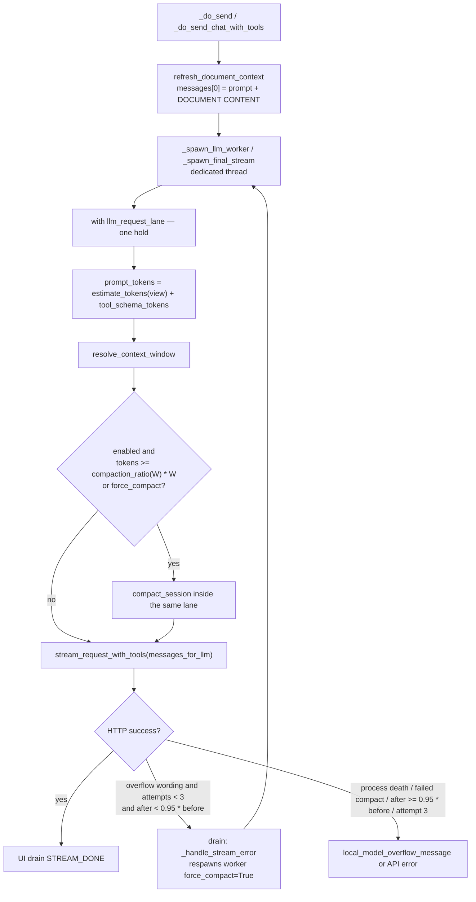

# Auto-compact conversation history (v2 — OpenClaw + Hermes)

| Field | Value |
| --- | --- |
| **Author** | Grok (proposed) |
| **Date** | 2026-09-09 |
| **Status** | Draft (v2, review revision) |
| **Intended location** | `docs/chat/compaction-dev-plan.md` (replaces v1 / revision 4) |
| **Scope** | WriterAgent sidebar `ChatSession` (Chat, Web Research, Librarian) in Writer / Calc / Draw. Not LibrePy, not `=PROMPT()`, not smol ReAct (`smol_agent.py`). |
| **Reference designs** | **OpenClaw** client-side compaction (v1 essence) **and** Hermes Agent `ContextCompressor` policy knobs (v2). Not Odysseus 85% as spec. Not OpenAI Responses `/responses/compact`. Not a port of either engine. |

This is a proposed development document, not an implementation. No code in either repo was changed.

---

## What changed from v1

v1 (revision 4) is the **implementable machinery**: one UNO-free `plugin/chatbot/compaction.py`, a cached view over `session.messages`, remaining-budget ceiling walk, `[DOCUMENT CONTENT]` never compacted, tool-pair integrity, overflow ≠ process death, max 3 retries inside the existing `llm_request_lane`, failure leaves history intact, default-ON kill switch, Librarian/Web in / smol/LibrePy/`=PROMPT()` out. That shape is unchanged.

v2 adds a **dual-reference** (OpenClaw *and* Hermes, with `file:function:line`) and changes **policy knobs** to follow other people's measured defaults, adapted to WriterAgent's 4k/8k llama.cpp regime:

| v1 | v2 |
| --- | --- |
| Flat `COMPACTION_RATIO = 0.70` | Window-tiered `compaction_ratio(window)`: **70%** if `W ≤ 8192`, **75%** if `8192 < W < 512_000`, **50%** if `W ≥ 512_000` |
| OpenClaw CJK chars/4 | Hermes `estimate_tokens_rough` (CJK=1 + UTF-8 bytes/4). Images stay OpenClaw **2000** |
| Ceiling walk only; `after == window` is success | Ceiling walk **then** last-real-user snap (Hermes `#10896`); **`GEN_RESERVE`** in the clamp; `after > window - GEN_RESERVE` reverts; exact fill of `n_ctx` is **not** success |
| Full tool bodies in summarizer input | Phase-1 stub of `role=tool` bodies `> 200` chars in **summarizer input**; **tail-pressure stub in the view** for the newest assistant+tools group if it exceeds `keep` (Hermes `_pressure_demote_tail` analog). `session.messages` still full |
| OpenClaw headings | Same + one temporal-anchoring sentence (clock failure omits the rule) |
| Overflow abort on `nothing_to_compact` / `failed` | Same, plus skip retry if `tokens_after >= tokens_before * 0.95` (Hermes `< 0.95` for “shrank”) |
| OpenClaw-only mapping table | Three-way OpenClaw \| Hermes \| WriterAgent v2 + steal-vs-omit |
| Complexity: OpenClaw 107 / 46,864 | Also Hermes **21,928 LOC** live path, **127** test files. Still **do not port either engine** |

**Policy remains the open question.** v2 *recommends* the tiered default as "follow other people's measured knobs, adapted to WA's 4k/8k regime." Alternatives A–D are in Open Questions.

Do **not** copy Hermes `ContextCompressor` (4931 LOC), lean 10k tail, micro-compaction, 256k unknown-window fallback, 64k `MINIMUM_CONTEXT_LENGTH`, in-place DB rewrite, or gateway 85% hygiene.

---

## Overview

WriterAgent sidebar chat currently sends growing `ChatSession.messages` (plus a freshly rebuilt `[DOCUMENT CONTENT]` system message) until the model context overflows. On Ollama / llama.cpp this often presents as an HTTP 500 (`llama-server process has terminated`, `truncating input prompt`) rather than a clean 400; the sidebar then shows a plain overflow sentence and the turn dies. Older turns are not summarized; they are simply part of the next request until the provider refuses.

Two production agents already solve this, at very different cost:

- **OpenClaw** auto-compacts older turns into a structured summary when usage nears the context limit, keeps a recent tail verbatim, persists the compacted *model view* while leaving the full transcript on disk, and compact-and-retries on overflow (capped at 3). Client-side trigger is `window − reserve`, **not** 70%. 70% is Anthropic / OpenAI *server-side* compact.
- **Hermes Agent** (Nous Research, MIT, `hermes-agent` 0.21.1) runs a four-phase compressor with a **window-tiered** trigger: config default **50%**, then a **75% raise-only floor** for windows `< 512k`, then an **85% cap** when a 64k absolute floor would eat the window. Overflow retry is also 3. The live path is **21,928 LOC** across 18 files plus **127** compact/compress tests. Hermes **rejects models `< 64k`** and was never tuned for llama.cpp 4k/8k `num_ctx`.

WriterAgent should get **OpenClaw's algorithm shape** (cached view, ceiling walk, one module) with **Hermes's cheap policy knobs** (~100–150 lines: estimator, tiered ratio, last-user snap, tool-stub serialize, tail-pressure view stub, `GEN_RESERVE`, temporal sentence, 5% shrink gate). OpenClaw's `*compact*` cluster is **107 files / 46,864 LOC**. Hermes's live path is **21,928 LOC**. The portable essence WriterAgent actually ships is still **~1 module + ~4 call sites + tests**.

Unlike OpenClaw, **`chat_compaction_enabled: false` turns off overflow retry as well as proactive compact.** OpenClaw keeps preflight/overflow recovery when `compaction.enabled` is false. Do not "fix" WriterAgent to match that without a product decision — one JSON kill switch is the operability story.

---

## Background & Motivation

### Current WriterAgent behavior

Each send in `ToolCallingMixin._do_send_chat_with_tools` (`plugin/chatbot/tool_loop.py` 183) — reached from `SendButtonListener._do_send` (`plugin/chatbot/panel.py` 1005) — calls `ChatSession.refresh_document_context`, which rewrites `messages[0]` as `base_prompt + "\n\n[DOCUMENT CONTENT]\n…\n[END DOCUMENT]"` (`panel.py` `set_system_context` 96–108, `refresh_document_context` 110–128). The user turn is appended. `_spawn_llm_worker` (423–468) then posts **the entire** `self.session.messages` list to `LlmClient.stream_request_with_tools`. Round N+1 is another `_spawn_llm_worker` via `SpawnLLMWorkerEffect` (`tool_loop_state.py` 523, `tool_loop_actions.py` 219–221) after tool results are appended. Exhausted rounds use `_spawn_final_stream` → `stream_chat_response(self.session.messages, …)` (`tool_loop.py` 497–498).

There is no history truncation, no token estimate vs. window, and no compact-and-retry. `chat_max_tokens` (config default 16384, `plugin/framework/config_schema.py` `WriterAgentConfig.chat_max_tokens` 307) is the **output** cap, not the context window. `CHAT_DOCUMENT_CONTEXT_MAX_CHARS = 8000` (`plugin/framework/constants.py` 46) is a **character** cap on the document excerpt, not a token window.

When the prompt does overflow a local llama-server, issue #570 already maps the 500 to a friendly sentence (`plugin/framework/client/errors.py` `local_model_overflow_message` 39–48, `is_local_model_server_crash` 51–63; `docs/chat/llm-hacks.md` §11). That helper **mixes process death** (`llama-server process has terminated`, `0xc0000005`) **with overflow wording** (`truncating input prompt`, `prompt overflow`). Compact-and-retry on a dead server is worse than today's sentence. This design splits those predicates.

Quote from llm-hacks §11: *"WriterAgent does not silently trim document/history, refuse the send, or enforce a minimum context floor. Those are later product decisions."* This design is that later product decision for history.

Persistence today (`plugin/chatbot/history_db.py`):

| What | In `session.messages` (model-facing) | In SQLite/JSON history DB | In sidebar UI |
| --- | --- | --- | --- |
| System prompt + `[DOCUMENT CONTENT]` | Yes (index 0, rewritten each send) | System text persisted; document snapshot goes stale | Skipped (`session_history_items` skips `role=system`) |
| User / assistant text | Yes | Yes (`add_message`) | Yes |
| Assistant `tool_calls` | Yes (in memory) | **No** (`ChatSession.add_assistant_message` 147: "Only persist the text content") | Tool-only turns render as `[Thinking...]` |
| `role=tool` results | Yes (in memory) | **No** (`add_tool_result` 150–153) | Skipped |

`session.messages` **is** the model-facing list. The UI during a live session is the rich-text control that was *appended to* as turns streamed; it is not re-read from `session.messages` until mode-switch / reload (`panel_factory._render_session_history` 441–470, `rich_text_paste.session_history_items` 417–432). After restart, `ChatSession.__init__` reloads the DB subset (no tools).

Related existing clips, **not** this feature:

- Writing / librarian *sub-agents* clip `history_text` to the last 4000 chars (`plugin/chatbot/writing.py` 160–161, `plugin/chatbot/librarian.py` 111–113). Sub-agent prompt stuffing, not main-chat compaction. The Librarian **sidebar session** is a normal `ChatSession` and **is** in v2.
- Tool-loop `finish_reason == "length"` injects a truncated-response banner (`tool_loop_state.py` 473–479). Output exhaustion, not input overflow.

### Why now

Long Writer/Calc editing sessions fill the window. Local 4k–8k `num_ctx` (often VRAM-limited, not the model's trained 32k — issue #570) overflow after a handful of tool rounds. That is the **primary** failure mode this feature exists to fix: keep-recent and the post-compact view must fit in `window - estimate(messages[0]) - summary - tools - GEN_RESERVE`, or compact "succeeds" and the next stream still overflows (Ollama silent-clip / llama.cpp shared `n_ctx`). Exact fill of `n_ctx` is **not** success.

v1 already specified that remaining-budget ceiling. v2's job is to pick **when** to fire and **what** to feed the summarizer using knobs other people measured, without importing their engines.

---

## Dual reference: OpenClaw design (verified in source)

Docs: `openclaw/docs/concepts/compaction.md`, `openclaw/docs/reference/session-management-compaction.md`.

Three scheduling paths (session-management-compaction.md "When auto-compaction happens"):

1. **Overflow recovery** — provider returns a context-overflow error; compact; retry. Cap `MAX_OVERFLOW_COMPACTION_ATTEMPTS = 3` (`src/agents/agent-compaction-constants.ts` 30). OpenClaw still runs this when `compaction.enabled` is false; WriterAgent **does not**.
2. **Usage-based maintenance / preflight** — projected usage ≥ `contextWindow - reserveTokens`, subject to a server-compaction threshold *floor* when Anthropic/OpenAI server compact is on (`src/auto-reply/reply/memory-flush.ts` `resolveCompactionThreshold` 46–54).
3. **Session-internal threshold** — `shouldCompact(contextTokens, contextWindow, settings)` in agent-core (`packages/agent-core/src/harness/compaction/compaction.ts` 267–275): `contextTokens > contextWindow - settings.reserveTokens`. Default `reserveTokens: 16384`, `keepRecentTokens: 20000` (`DEFAULT_COMPACTION_SETTINGS` 141–145). Gateway preflight uses a 20,000 reserve floor (`src/agents/agent-settings.ts` `DEFAULT_AGENT_COMPACTION_RESERVE_TOKENS_FLOOR` 9).

Reserve is capped for small windows (`resolveEffectiveCompactionReserveTokens`, `agent-compaction-constants.ts` 15–28): keep at least `min(8000, floor(window * 0.5))` tokens of prompt budget. So an 8k local model compact-triggers at 50%, not at token 1. Docs: *"This keeps small-context local models from entering compaction from the first token."*

**Where 70% actually lives:**

| Path | Formula | Source |
| --- | --- | --- |
| Anthropic *server-side* compact | `max(50000, floor(contextWindow * 0.7))` | `packages/ai/src/transports/anthropic-payload-policy.ts` `resolveAnthropicCompactThreshold` 51–63 |
| OpenAI Responses *server-side* compact | `max(1000, floor(effectiveBudget * 0.7))` | `packages/ai/src/transports/openai-responses-payload-policy.ts` `resolveOpenAIResponsesCompactThreshold` 305–318 |
| Client-side `shouldCompact` | `tokens > window - reserve` | `compaction.ts` 267–275 |

OpenClaw also: keeps tool-call / toolResult pairs together (`findCutPoint` + `isCutPointMessage` in `compaction.ts` 337–465; docs/concepts/compaction.md 16–17); CJK-aware chars/4 estimator (`packages/normalization-core/src/cjk-chars.ts`); full transcript on disk, compaction only changes what the model sees (compaction.md 21); `IMAGE_BLOCK_TOKENS = 2000` (`compaction.ts` 278); overflow strings in `packages/ai/src/utils/overflow.ts`; optional memory flush, `/compact`, safeguard quality audits.

`findCutPoint` 440–465 walks from the end until `accumulated >= keepRecentTokens` and **keeps that tail** — a **floor** ("preserve at least N"). WriterAgent remaining-budget `keep` is a **ceiling** ("tail may be at most N"). Copying the OpenClaw comparison inverts the 4k fit guarantee.

---

## Dual reference: Hermes design (verified in source)

Hermes tree: `/home/keithcu/.hermes/hermes-agent` (package `hermes-agent` 0.21.1, MIT, Nous Research 2025). This user's live config: `/home/keithcu/.hermes/config.yaml`. Defaults live in `hermes_cli/config_defaults.py` `DEFAULT_CONFIG["compression"]` (524–638), **not** in that YAML.

**`display.compact: false` at `config.yaml:250` is CLI whitespace, not compaction.** Real knobs are `compression:` at `config.yaml:134–142`.

Hermes is a **dual system**, not one threshold:

```
Incoming turn
    │
    ▼
Gateway session hygiene          ← 85% of context, rough tokens, safety net
    │  (gateway/run_turn.py:533–538)
    ▼
Agent ContextCompressor          ← 50% config, then floors (below)
    │  (agent/context_compressor.py)
    ├─ turn-start preflight      (turn_context_compaction.py)
    ├─ pre-API / post-tool gates (turn_preflight.py)
    ├─ overflow / 413 recovery   (turn_overflow.py, max_attempts=3)
    ├─ optional idle compact     (idle_compact_after_seconds, default 0)
    ├─ optional proactive prune  (no LLM; default OFF)
    └─ optional micro-compaction (per-turn; default OFF)
```

Gateway hygiene 85% (`run_turn.py` 533–538):

```python
# The 0.85 threshold is deliberately HIGHER than the agent's compressor (0.50): a safety net
model="anthropic/claude-sonnet-4.6", threshold_pct=0.85, compression_enabled=True,
```

WriterAgent has one chat loop, not a pre-agent net. **Do not add a second 85% gate.**

### Trigger math (the folklore 50/75/85)

Config default is 0.50 (`config_defaults.py:536`; parser `agent_init.py` `_compression_threshold` 1377; `ContextCompressor.__init__` 2279 `threshold_percent: float = 0.50`). Then **two floors** rewrite it.

**(A) Small-context percent floor — raise-only 75% under 512k**

```python
# context_compressor.py:988-989
_SMALL_CTX_WINDOW_LIMIT = 512_000
_SMALL_CTX_THRESHOLD_PERCENT = 0.75

# :2235-2239
def _effective_threshold_percent(context_length, threshold_percent):
    """Raise-only small-context threshold floor: models under 512K trigger at >= 75%."""
    if context_length and context_length < _SMALL_CTX_WINDOW_LIMIT:
        return max(threshold_percent, _SMALL_CTX_THRESHOLD_PERCENT)
    return threshold_percent
```

Pinned by `tests/agent/test_compression_small_ctx_threshold_floor.py:33-37`: 128k / 200k / 262144 / 511999 at config 0.50 all become **0.75**. Comment at `config_defaults.py:533-535`: *"Models with windows below 512K are floored at 0.75 (raise-only) so compaction doesn't fire with half the window free."*

**Every WriterAgent-relevant window (4k, 8k, 32k, 128k, 200k) is in this bucket.** Hermes's advertised "50%" is a large-window number.

**(B) Absolute 64k token floor, then 85% cap when that floor would eat the window**

```python
# model_metadata.py:316
MINIMUM_CONTEXT_LENGTH = 64_000   # "Sessions, model switches and cron jobs reject models below this"

# context_compressor.py:2202
_MIN_CTX_TRIGGER_RATIO = 0.85

# :2242-2276  _compute_threshold_tokens
# base = (context_length - max_tokens) * threshold_percent
# floored at MINIMUM_CONTEXT_LENGTH
# if the floor binds AND exceeds 85% of effective window → cap at 85%
```

Pinned by `tests/agent/test_context_compressor.py:399-428` (64k-floor / 85% cap only — **not** the 128k percent floor):

| Window | configured % | computed trigger | Why |
| ---: | ---: | ---: | --- |
| 64,000 | 0.50 | **54,400 (85%)** | 64k floor would equal the whole window (`#14690`) |
| 65,536 | 0.50 | **55,705 (85%)** | floor binds above 85% |
| 70,000 | 0.50 | **59,500 (85%)** | same |
| 100,000 | 0.50 | **64,000** | floor binds but ≤ 85% |

128k → 96,000 (75%) is pinned by `test_compression_small_ctx_threshold_floor.py:33-37` (`threshold_tokens == int(ctx * 0.75)`), already cited for the percent floor. Do not attribute that row to `:399-428`.

Hermes **subtracts `max_tokens` from the window** before applying the percent (`_compute_threshold_tokens` docstring 2255–2260, issue `#43547`). WriterAgent **explicitly does not** subtract `chat_max_tokens` (llama.cpp shares `n_ctx` with output — issue #570).

Hermes **rejects models below 64k** (`model_metadata.py:315-316`). WriterAgent's primary overflow case is 4k–8k `num_ctx`. **Hermes was never tuned for that regime.** Applying their 85% cap to a 4k window is an extrapolation, not a measured default.

Worked Hermes triggers at config 0.50, `max_tokens=None` (if you forced a 4k window through their formula):

| Window | After 75% floor | After 64k/85% cap | Hermes trigger | Headroom |
| ---: | ---: | ---: | ---: | ---: |
| 4,096 | 0.75 → 3,072 | 64k floor binds → **85% = 3,481** | 3,481 | 615 |
| 8,192 | 0.75 → 6,144 | binds → **85% = 6,963** | 6,963 | 1,229 |
| 32,768 | 0.75 → 24,576 | binds → **85% = 27,852** | 27,852 | 4,916 |
| 128,000 | 0.75 → 96,000 | floor does not bind | **96,000 (75%)** | 32,000 |
| 512,000 | 0.50 (floor off) | no | **256,000 (50%)** | 256,000 |

This user's live config (`config.yaml:136`) is `threshold: 0.85`. That **overrides** the 75% floor (raise-only: `max(0.85, 0.75) = 0.85`). So *this* Hermes install triggers at 85% of every window. That is a **personal override**, not the product default — evidence that a heavy user of this tree chose 85%, not a number to ship.

The **only 70% in Hermes live policy** is Codex Spark (`auxiliary_client.py:583` `_CODEX_SPARK_COMPACTION_THRESHOLD = 0.70`). Codex 5.4/5.5/5.6 autoraise is 85% (`:581`). Arcee Trinity is 75% (`:636-637`). Plugin `ContextEngine.threshold_percent = 0.75` (`context_engine.py:67`) is the *plugin* default; the built-in compressor starts at 0.50 then applies the 75% floor.

### Keep-recent / tail

Two modes (`tail_mode`, default **`lean`**, `config_defaults.py:546`):

| Mode | Tail budget | Source |
| --- | --- | --- |
| **lean** (default) | `max(10_000, min(25_000, int(W * 0.025)))` | `LEAN_TAIL_FLOOR_TOKENS = 10_000`, `LEAN_TAIL_CAP_TOKENS = 25_000` (`context_compressor.py:756-757`); property `:1805-1812` |
| **legacy** | `threshold_tokens × target_ratio` (default `0.20`) | same property, `summary_target_ratio` clamped `[0.10, 0.80]` |

Plus `protect_last_n` default **20**, walk-capped at `_MAX_TAIL_MESSAGE_FLOOR = 8` (`:971`). **Guaranteed last-N user turns:** `min_tail_user_messages` default **1** (`config_defaults.py:550`; `agent_init.py:1468`). `_ensure_last_user_message_in_tail` (`:3977-4003`) pulls the cut back so the last *real* user message stays in the tail (fixes `#10896`). Blank echoes and compaction handoffs do not count. **In Hermes the guarantee wins over the token budget.** WriterAgent cannot do that on 4k — see last-user snap below.

**Lean tail on a 4k window is unusable:** `max(10000, min(25000, int(4096*0.025))) = 10000` — 2.4× the entire window. Hermes lean mode is a 1M-window policy. WriterAgent remaining-budget *ceiling* is the correct small-window analog. Hermes `_walk_tail_budget` (`:2589-2608`) is a token ceiling **with** a message-count floor (`min_tail`); WA v2 is a pure token ceiling.

### Four-phase `compress()` (`context_compressor.py:4608-4696`)

1. **Phase 1 (no LLM):** `_prune_old_tool_results` (`:2737-2769`) replaces old tool results `> 200` chars (`_PRUNE_MIN_CHARS = 200`, `:661`) outside the protected tail with a one-line stub via `_summarize_tool_result` (`:1385-1392` generic fallback `"[tool_name] (N chars result)"`; the constant `_PRUNED_TOOL_PLACEHOLDER = "[Old tool output cleared to save context space]"` at `:651` is the already-cleared sentinel, not the stub writer).
2. **Phase 2:** cut head/middle/tail; align tool pairs (`_align_boundary_backward` / `_align_boundary_forward`).
3. **Phase 3:** `_generate_summary` via auxiliary `call_llm(task="compression")`. Structured headings. **No `max_tokens` on the wire.** Budget is prompt guidance: content × 0.20, min 2000, max `min(5% of window, 10_000)`.
4. **Phase 4:** assemble head + summary marker + tail. `_sanitize_tool_pairs` drops orphans.

**In-place (default `in_place: true`):** rewrite the live list on the same session id; pre-compaction rows are soft-archived (`active=0, compacted=1`). WriterAgent **must not** do this.

**Failure:** default `abort_on_summary_failure: false` — inserts a deterministic fallback summary and *drops the middle* (`:2321-2322`, `:4687-4693`). WriterAgent is stricter: failure leaves history intact. Hermes *can* match WA via `abort_on_summary_failure: true`.

### Overflow, estimator, temporal anchoring

Overflow: **`max_attempts` default 3**, floor 1, cap 10 (`agent_init.py:1437-1441`, `config_defaults.py:551-553`). `turn_overflow.py` `compress_scored_by_tokens` (`:179-208`) scores progress as **>5% token drop** (`new_tokens < original_tokens * 0.95`) or fewer messages (`#39550`). HTTP 413 scores **>5% serialized bytes** (`_recover_payload_too_large` `:218-252`, `#88960`) because images are token-cheap and byte-huge. WriterAgent v2 steals the 5% token gate; 413-bytes is a later note for screenshot-heavy Calc.

Estimator: no tiktoken. `estimate_tokens_rough` (`model_metadata.py:1966-1983`):

```python
def estimate_tokens_rough(text: str) -> int:
    # ASCII: ceil(len/4)
    # CJK/Hangul/Kana codepoints: 1 token each (_CJK_DENSE_RE)
    # other non-ASCII: ceil(UTF-8 bytes / 4)   # Cyrillic/Arabic/Hindi fix
```

Images: learned per `model@host`, default **1500** (`image_token_cost.py:23`). WriterAgent keeps OpenClaw **2000** (cannot calibrate: streaming `usage` is often `{}` at `llm_client.py` 1090).

Unknown-window fallback is **256k** (`DEFAULT_FALLBACK_CONTEXT = CONTEXT_PROBE_TIERS[0] = 256_000`, `model_metadata.py:297-298`) — catastrophic if applied to a 4k llama.cpp. WriterAgent returns `None` and skips compact (`no_window`).

Temporal anchoring (`context_compressor.py:1584-1594, 3392-3404`): inject "The current date is YYYY-MM-DD. … rewrite 'email John about the proposal' as 'Sent the proposal email to John on {today}.'" Clock failure omits the rule; compaction still runs (`tests/agent/test_context_compressor_temporal_anchoring.py:55-73`).

Micro-compaction (`docs/micro-compaction.md`, `agent/micro_compaction.py`): extra LLM after every turn; **off by default** (`config_defaults.py:570`, `agent_init.py:1492`). Omit.

---

## Three-way mapping

| Knob | OpenClaw | Hermes (source) | WriterAgent v2 |
| --- | --- | --- | --- |
| **Client trigger** | `tokens > window − reserve` (reserve 16–20k; small-window cap so ≥50% stays prompt) | Config **50%**, then **75% if `W < 512k`**, then **85% cap** if 64k floor would eat the window. Subtracts `max_tokens`. | **Tiered percent of resolved prompt window**, no `max_tokens` subtract: `≤8k → 70%`, `<512k → 75%`, `≥512k → 50%` |
| **Server-side 70%** | Anthropic / OpenAI Responses `0.7 × window` | Native Responses opt-in, gpt-5.6 only, local trigger − 8192 (not 70%) | Out of v2 (`docs/chat/responses-api-plan.md` 478–499) |
| **Small windows** | Reserve cap: 8k triggers at 50% | Product **rejects `< 64k`**. Forced 4k through their formula → **85%**. Lean 10k **overflows** 4k. | Remaining-budget **ceiling** on tail **minus `GEN_RESERVE`**; 70% gate on 4k/8k. Post-compact view must leave generation room (issue #570 / Ollama silent-clip). 85% on 4k leaves ~600 tokens of *trigger* headroom — one tool round — but v1 exact-fill of `n_ctx` left **zero** generation tokens |
| **Keep-recent** | Floor: `keepRecentTokens=20000`, walk until `accumulated ≥ keep` | Lean: `clamp(2.5%×W, 10k, 25k)` plus last-user guarantee. Walk is token ceiling **with** message-count floor | Ceiling: `min(20k, max(2048, 0.30×W))` then clamp to remainder after `GEN_RESERVE`; walk `tail ≤ keep`. 2048 is a preference, not a hard min |
| **Last-N user turns** | Not the essence | **`min_tail_user_messages=1`**, wins over budget (`#10896` at `_find_tail_cut_by_tokens:4245`) | Snap after `find_cut_index`; **re-check ceiling**. 4k fit wins if they conflict |
| **Tool-result prune** | Not in the 8-file essence | **Phase 1 of every compact** (`_PRUNE_MIN_CHARS=200`) plus `_pressure_demote_tail` (`:2687-2726`) | Stub in **summarizer input** for the middle; **view-only tail-pressure stub** for the newest assistant+tools group if it exceeds `keep`. `session.messages` still full |
| **Estimator** | CJK chars/4 + last-assistant usage delta | CJK=1 + **UTF-8 bytes/4**; usage anchor when present | Hermes `estimate_tokens_rough` extract; always re-estimate view; no usage stash |
| **Images** | 2000 / block | 1500 default, then learned | **2000** (OpenClaw; cannot calibrate) |
| **Unknown window** | (various) | **256k fallback** | `None` → skip compact and overflow retry (`no_window`) |
| **Overflow retry** | 3; still on when `enabled=false` | 3 (`max_attempts`); skip if shrink `< 5%` | 3; **off when flag false**; skip if shrink `< 5%` or `nothing_to_compact` / `no_window` / `failed` / `aborted` |
| **Mutate transcript?** | Compacted *view*; full history on disk | **In-place rewrite** + soft-archive (`in_place: true`) | Cached view; `session.messages` + history_db untouched |
| **Summarizer** | Same model; `0.8 × reserve` max_tokens; 16k char rail | **Auxiliary** model; prompt-guidance 2k–10k; **no wire max_tokens** | Same chat model; `_summary_budget = min(1024, max(256, W/8))`; `max_tokens` from worker, not `client.config` |
| **Failure** | leave history | default: **drop middle with fallback** | leave history (Hermes `abort_on_summary_failure=true` equivalent) |
| **Micro-compaction** | no | opt-in, **off** | **Omit** |
| **`/compact`** | yes | `/compress` (TUI `/compact` alias) | later (PR3) |
| **Memory flush** | yes, before compact | optional `checkpoint_required` | **non-goal** |
| **Engine size** | 107 files / 46,864 LOC; 2,503 portable essence | **21,928 LOC** live path + **127** tests | **1 module + ~4 call sites** |

Folklore check:

- **"Hermes is 85%"** — only for (a) gateway hygiene, (b) the 64k-floor cap, (c) Codex OAuth 5.4/5.5/5.6 autoraise, (d) **this user's `config.yaml`**. Product default for 128k–512k is **75%**. For ≥512k it is **50%**.
- **"Hermes is 50%"** — the config key. Almost never the effective trigger on models WriterAgent users run.
- **"Odysseus 85%"** — prior art only. Hermes independently arrived at 85% as a *small-window safety cap* and a *Codex-272k autoraise*, not as a global default.
- **OpenClaw 70%** — server-side only. Hermes does not use 70% except Codex Spark.

---

## Hermes steal vs omit

License: MIT (`LICENSE:1-13`, Copyright (c) 2025 Nous Research). Paste-adapting a function with the copyright notice is legally fine (MIT is GPL-compatible; WriterAgent is GPL-3.0-or-later). Practical constraint is **coupling**, **deps**, and LibreOffice's bundled Python (often older than 3.11; Hermes requires `>=3.11,<3.14`). Steal **functions / algorithms / prompt fragments**, not files. Do not copy `list[int]`-style hints from Hermes surrounding files; match chatbot (`from __future__ import annotations` already used in `panel.py`). The stolen estimator body is 3.7-safe (`str.isascii()`).

| Candidate | LOC | Verdict | Why |
| --- | ---: | --- | --- |
| `model_metadata.estimate_tokens_rough` + `_CJK_DENSE_RE` (`:1957-1983`) | ~20 of 2210 | **Steal function** | Better than chars/4 for Cyrillic/Arabic. Stdlib `re` + UTF-8. Drop the rest of `model_metadata.py` (HTTP probes, 256k fallback, 64k reject). Copyright comment required. |
| `_effective_threshold_percent` (`:2235-2239`) | ~5 | **Steal algorithm, drop 64k** | Idea of a window-tiered ratio. Do **not** import `MINIMUM_CONTEXT_LENGTH`. |
| `_ensure_last_user_message_in_tail` (`:3977-4003`) / `min_tail_user_messages=1` | ~15 | **Steal algorithm** | `#10896` at `_find_tail_cut_by_tokens:4245`. WA re-checks the remaining-budget ceiling after the snap. |
| `_prune_old_tool_results` placeholder + `_PRUNE_MIN_CHARS=200` | large as-is | **Steal algorithm, ~20 lines** | Stub `role=tool` bodies `>200` chars in **summarizer input**. Do not steal DB `archive_and_compact` or the per-tool `_sum_terminal` / `_sum_write_file` dispatch (`:1395+`). |
| `_pressure_demote_tail` (`:2687-2726`) | ~40 | **Steal algorithm, ~15 lines** | 4k analog: if the newest assistant+tools group, **or last-user + group**, exceeds `keep`, stub those `role=tool` bodies **in the view** (generic `[name] (N chars)`). Not DB prune, not `_sum_terminal`. Called both when the walk cannot start *and* when last-user snap fails. |
| `_temporal_anchoring_rule` + `_today_for_prompt` (`:1584-1594, 3392-3404`) | ~25 | **Steal prompt** | `datetime.date.today().isoformat()`; clock failure omits. |
| Summary "Completed Actions" `[tool: name]` fragment (`:3420-3427`) | prompt | **Steal fragment** | Fold into office-flavored OpenClaw headings. Not the full Hermes template. |
| `_align_boundary_backward` / `_sanitize_tool_pairs` | ~60 | **Steal algorithm only** | WA v1 already specified OpenClaw forward-snap + 20-line Odysseus sanitizer. Don't import the methods. |
| `turn_overflow.compress_scored_by_tokens` (`:179-208`) | ~30 | **Steal 5% gate** | `max_attempts=3` already specified. 413-bytes scoring is a later Calc note. |
| `resolve_model_threshold` (`:1558-1564`) | 7 | **Omit in v2** | Per-model JSON later. Tiers are by `context_length`, not model-name substring. |
| `should_compress_info` (`:2472-2481`) | ~10 | **Omit** | Cooldown state we will not grow. |
| **`ContextCompressor` class** | **4931** | **Omit** | Auxiliary client, SQLite, usage anchors, Codex branches. Violates one-module mandate. |
| `conversation_compression.py` | 4028 | **Omit** | SessionDB, commit fences, threads. |
| `hermes_state_compression.py` | 669 | **Omit** | SQLite lineage. No history_db rewrite. |
| `micro_compaction.py` + `docs/micro-compaction.md` | 419 | **Omit** | Extra LLM every turn; off even in Hermes. Sidebar cannot stall after every send. |
| `native_compaction.py` | 351 | **Omit** | OpenAI Responses; gpt-5.6 only. |
| `usage_anchor.py` | 165 | **Omit** | WA streaming usage is often `{}`; every send rewrites `messages[0]`. |
| Gateway hygiene (`run_turn.py` slice) | — | **Omit** | One worker, one gate. |
| Lean 10k tail + session_search recovery | hundreds | **Omit** | Overflows 4k. Eval win requires the archive WA refuses to build. |
| 256k `DEFAULT_FALLBACK_CONTEXT` | — | **Omit** | Keep `no_window`. |
| 64k `MINIMUM_CONTEXT_LENGTH` | — | **Omit** | Hermes product floor; WA's job is 4k/8k. |
| `trajectory_compressor.py` | 868 | **Omit** | Offline eval CLI, not the live path. |
| `compaction_display.py` | 54 | **Omit** | No UI notice in v2. |

**Smallest steal (mandate: one module):** ~100–150 lines of policy and estimator **inside** the already-designed `plugin/chatbot/compaction.py` (estimator + tiers + last-user snap + tool-stub serialize + tail-pressure view stub + `GEN_RESERVE` + temporal sentence + 5% gate). Not a file from `~/.hermes/hermes-agent/agent/`.

---

## Goals & Non-Goals

### Goals (v2)

1. Before **every** sidebar LLM worker spawn (tool-loop round 0, round N+1, `_spawn_final_stream`, and overflow-retry respawn), estimate tokens of the *model-facing* prompt: `estimate_tokens(messages_for_llm(session)) + tool_schema_tokens(tools)`.
2. If that estimate ≥ **`compaction_ratio(window)` of the resolved prompt window**, compact older conversation into one summary and keep a recent tail verbatim. The tail token sum is **≤ keep** (remaining-budget ceiling after **`GEN_RESERVE`**). Summarizer output is capped to `_summary_budget(window)`. After apply, if the view is still `> window - GEN_RESERVE`, revert and do not send it. Exact fill of `window - GEN_RESERVE` is success. Exact fill of `n_ctx` (`after == window`) is **not** success.
3. Never compact `[DOCUMENT CONTENT]` / the live document snapshot. It is rebuilt every send. Summarizer input is `messages[1:cut]` (or `messages[prev_kept:new_cut]`), never index 0.
4. Never split an assistant `tool_calls` message from its `role=tool` results.
5. After the ceiling walk, snap the cut so the last real `role=user` turn is in the tail when that still fits `keep`. If the snap would exceed `keep`, **try tail-pressure stub, re-walk, re-snap**; only then `nothing_to_compact` (4k fit wins). Aligns with Key Decision 3.
6. Stub oversized tool results in the **summarizer input** (`> _PRUNE_MIN_CHARS` chars → `[tool_name] (N chars)`). If the newest assistant+tools group, **or last-user + that group**, still exceeds `keep` (typical 4k overflow: fat newest `role=tool`, or `#10896` where the group fits but user+group does not), stub those bodies **in the view** until the `#10896` tail fits or nothing remains to reclaim, then re-run the ceiling walk. `session.messages` is never mutated. Last user stays in the tail.
7. On recognized **prompt-too-large** HTTP errors (not llama-server process death), compact-and-retry the same user turn, capped at 3 attempts. Skip retry when compact cannot shrink the view, or when `tokens_after >= tokens_before * 0.95`.
8. Persist so the next *in-process* turn sees the compacted view. Keep original turns in `session.messages` so the sidebar still shows them.
9. Compaction LLM call on a worker (`run_in_background` / existing `_spawn_llm_worker` thread), never the UI thread. Honor Stop via `resolve_stop_checker()`.
10. Failure leaves history intact. Log and continue uncompacted (or surface overflow as today after retry cap).
11. Default ON. One boolean in `writeragent.json`. No Settings dialog page in v2. The same flag disables overflow retry.
12. Unit tests with mocked `LlmClient`. No UNO tests unless a UI notice is added (it is not, in v2).

### Non-goals (v2)

- **Memory flush** (OpenClaw silent `NO_REPLY` agent turn before compact). WriterAgent memory (`plugin/chatbot/memory.py` `MemoryStore`, `upsert_memory`; `MEMORY_GUIDANCE` in `plugin/framework/prompts.py` 151–156) is experimental file-backed USER.md/MEMORY.md. Defer.
- **`/compact` slash command** and **`/tokens`**. Slash commands are mostly stubs (`plugin/chatbot/slash_commands.py` 44–57: only `/help` `/clear` `/stop` are wired). Stretch for PR3.
- **UI notice** in the sidebar (`notifyUser`). OpenClaw default is silent. v2 is silent except a drain `STATUS` line during the extra call.
- **Session pruning**, safeguard mode, quality-audit retries, `identifierPolicy`, `summarizeInStages`, plugin providers, context engines, successor transcripts, checkpoints, `maxActiveTranscriptBytes`.
- **Anthropic / OpenAI server-side compaction** (`context_management`, `/responses/compact`). Out of v2; see `docs/chat/responses-api-plan.md` (478–499).
- **Odysseus 85%** as the trigger. Prior art only (`docs/archive/integration-odysseus-ideas.md` Feature 1). Headings loosely inspired; 1024-token summarizer floor is an Odysseus number, not OpenClaw.
- **tiktoken**. No `last_prompt_tokens` delta (every send rewrites `messages[0]`; streaming `usage` is often `{}` at `llm_client.py` 1090).
- **LibrePy**, Calc `=PROMPT()` / `=PYTHON()`, smol ReAct (`smol_agent.py`). Librarian *sidebar* `ChatSession` **is** in v2 (same `_spawn_llm_worker`).
- **Settings UI checkbox**. Config key only. Optional later: `chat_compaction_ratio` override; v2 hardcodes the tiers.
- **Dual history DB** / rewriting `history_db` rows / Hermes `archive_and_compact`.
- **Mid-turn precheck** after every tool result (OpenClaw default false). Per-round worker gate is enough.
- **Post-compaction tool-loop guard**.
- **Compaction model override**. Same chat model in v2. Hermes aux model is later (`chat_compaction_model`).
- **Hermes micro-compaction, lean 10k tail, 256k fallback, 64k reject, gateway 85% hygiene, `ContextCompressor` class.**
- **Subtract `chat_max_tokens` from the trigger.** Hermes always does (`#43547`). WA issue #570 is the opposite bug (llama.cpp *does* share `n_ctx`). Provider-aware subtract is later.

---

## Proposed Design

### Essence, as an 8-step algorithm

```
1. Estimate tokens of the prompt (messages view + tool schemas)
   vs. the resolved context window. Estimator = Hermes
   estimate_tokens_rough (CJK=1, UTF-8 bytes/4); images = 2000.
2. Trigger when usage ≥ compaction_ratio(window) of that window
   (70% / 75% / 50% by tier). OpenClaw client-side is window-reserve;
   OpenClaw server-side is 70%; Hermes effective default on WA-relevant
   windows is 75% (then 85% if you copy their 64k floor — we do not).
3. Choose a split whose tail token sum is ≤ keep (remaining-budget
   ceiling after GEN_RESERVE, not OpenClaw's "at least keepRecent" floor
   and not Hermes lean 10k), does not split a tool_call / tool-result
   pair, keeps the last real user turn in the tail when that still fits
   keep, and leaves room for live messages[0] + summary + tools +
   GEN_RESERVE. If the newest assistant+tools group exceeds keep, or
   last-user + group exceeds keep after the #10896 snap, stub those
   role=tool bodies in the *view* and re-walk / re-snap.
4. Summarize the newly older slice with one non-streaming LLM call
   (same model; summarizer max_tokens and char cap = `_summary_budget(window)`).
   Stub tool bodies >200 chars in the serialized input; serialize
   assistant tool_calls as name(arguments) capped ~4k. Inject a
   temporal-anchoring sentence (omit if the clock fails).
5. Build a model-facing view: live system+document + summary pair + tail
   (tail tools may be view-stubbed). Do not delete original turns from
   session.messages.
6. Cache CompactionState on the session so the next round/turn reuses it.
7. On prompt-too-large error (not process death): respawn the worker
   with force_compact, capped at 3 attempts. Stop aborts recovery.
   nothing_to_compact / failed / tokens_after >= 0.95 * tokens_before → no retry.
8. Manual /compact, UI notice, memory flush: later.
```

### Complexity budget

| Surface | Files | LOC (wc -l) |
| --- | ---: | ---: |
| OpenClaw `*compact*` under `src/agents` + `packages/agent-core` | **107 files** (109 `find` hits incl. 2 dirs) | **46,864** |
| Of which `embedded-agent-runner` compact* | 54 | 23,764 |
| agent-core `harness/compaction/` | 9 | 4,052 |
| `agent-hooks` compaction* (safeguard) | 7 | 7,443 |
| **OpenClaw portable essence** (algorithm + overflow + pairing + CJK + threshold) | 8 files listed below | **2,503** |
| Hermes live path (18 files listed below) | 18 | **21,928** |
| Hermes tests matching `*compact*` / `*compress*` | **127 files** | — |
| Hermes `evals/compaction/` | 15 | — |
| Hermes `agent/context_compressor.py` alone | 1 | **4,931** |
| Odysseus `odysseus/src/context_compactor.py` (in-tree prior art) | 1 | 527 |
| **WriterAgent v2 target** | 1 new module + tests + ~4 call sites | ~520–850 LOC module (v1 400–700 + ~100–150 Hermes steal including GEN_RESERVE + tail-pressure stub), ~400–650 tests |

OpenClaw essence files:

- `packages/agent-core/src/harness/compaction/compaction.ts` (988)
- `packages/normalization-core/src/cjk-chars.ts` (52)
- `src/agents/agent-compaction-constants.ts` (30)
- `src/auto-reply/reply/memory-flush.ts` (187)
- `src/agents/failover/context-overflow.ts` (137)
- `packages/ai/src/utils/overflow.ts` (247)
- `src/agents/sessions/agent-session-compaction.ts` (497)
- `packages/agent-core/src/harness/session/tool-result-pairing.ts` (365)

Hermes live-path files (measured `wc -l`, 2026-09-09):

| File | LOC | Role |
| --- | ---: | --- |
| `agent/context_compressor.py` | 4931 | Default engine. Policy math, prune, summarize, assemble |
| `agent/conversation_compression.py` | 4028 | Host `compress_context()`, locks, commit fence, session split |
| `gateway/run_turn.py` | 3883 | Gateway **session hygiene** (85% safety net) |
| `agent/agent_init.py` | 2333 | Parses `compression:` into `CompressionSettings` |
| `agent/model_metadata.py` | 2210 | Window probe + `estimate_tokens_rough` |
| `trajectory_compressor.py` | 868 | **Offline eval CLI**, not the live path |
| `hermes_state_compression.py` | 669 | SQLite lineage, cooldowns, locks, `archive_and_compact` |
| `agent/turn_context_compaction.py` | 502 | Turn-start idle + preflight compaction |
| `agent/turn_overflow.py` | 466 | Overflow / 413 compact-and-retry |
| `agent/micro_compaction.py` | 419 | Opt-in per-turn rolling summary |
| `agent/turn_preflight.py` | 377 | Pre-API + post-tool gates |
| `agent/native_compaction.py` | 351 | OpenAI Responses server-side compact (gpt-5.6 only) |
| `agent/compression_facade.py` | 280 | `AIAgent._compress_context` timeout wrapper |
| `agent/context_engine.py` | 242 | ABC + `automatic_compaction_status_message` |
| `agent/usage_anchor.py` | 165 | Provider-usage + delta estimator |
| `agent/turn_preflight_gate.py` | 102 | Tiny gate helper |
| `agent/compaction_display.py` | 54 | UI projection of summary carriers |
| `agent/context_compressor_summary.py` | 48 | Summary-hook mixin |

Same conclusion as v1: **do not port the cluster.**

### Architecture



```mermaid
sequenceDiagram
  participant UI as UI / drain thread
  participant W as llm-worker (dedicated)
  participant C as compaction.py
  participant LLM as LlmClient
  UI->>UI: refresh_document_context
  UI->>W: run_in_background(_spawn_llm_worker)
  Note over W: with llm_request_lane()  (non-reentrant Lock)
  W->>C: compact_session(session, client, tools, force=...)
  alt should_compact / force and remainder >= MIN_TAIL
    W->>UI: STATUS "Compacting conversation..." via queue
    C->>C: find_cut_index ceiling walk (tail tokens <= keep)
    C->>C: if None, pressure-stub newest tool group in the view; re-walk
    C->>C: ensure_last_user_in_tail (Hermes #10896); re-check keep
    C->>C: if snap None and not yet stubbed, pressure-stub, re-walk, re-snap
    C->>C: serialize_for_summary with tool stubs >200 chars + assistant tool_calls
    C->>LLM: request_with_tools(summarizer, stream=False, stop_checker)
    LLM-->>C: summary text
    C->>C: session.compaction = CompactionState
    W->>UI: STATUS "Thinking..."
  end
  W->>LLM: stream_request_with_tools(messages_for_llm(session))
  LLM-->>UI: CHUNK / STREAM_DONE / ERROR via Queue
  alt prompt overflow and attempts < 3 and after < 0.95 * before
    UI->>UI: _set_status Compacting (drain thread OK)
    UI->>W: _spawn_llm_worker(..., force_compact=True)
    Note over UI: host does NOT _set_status Thinking when force_compact
    Note over UI: compact_session is NOT called on the drain thread
  end
```

### Module placement

**New file:** `plugin/chatbot/compaction.py`

UNO-free, LibreOffice-free, pytest-able. Lives under chatbot because it builds a *view* of session messages. Do not put it in `plugin/framework/` — framework must stay importable from LibrePy.

**Do not import** `plugin.chatbot.panel`, `plugin.chatbot.tool_loop`, or any UNO module. `compact_session(session, …)` duck-types `{messages: list, compaction: CompactionState | None}`. Allowed imports: `query_ollama_runtime_num_ctx`, `DEFAULT_MODELS` / `resolve_model_id` (`plugin/framework/default_models.py` 86+), `openrouter_model_ids_equivalent`, `get_config_bool_safe` (or take `enabled` as an argument), stdlib. Take an `LlmClient`-like object with `_get_provider`, `_endpoint`, `config`, `request_with_tools`. Keep window resolution in this module; do not add it to `model_fetcher.py`.

Public surface (v1 plus the Hermes steal; names are the contract):

```python
CHARS_PER_TOKEN = 4
# Tier constants. COMPACTION_RATIO remains the llama.cpp product number.
COMPACTION_RATIO_SMALL = 0.70   # W <= 8192  (WA product; Hermes 85% is too late on 4k)
COMPACTION_RATIO_DEFAULT = 0.75 # 8192 < W < 512_000  (Hermes small-context floor)
COMPACTION_RATIO_LARGE = 0.50   # W >= 512_000  (Hermes large-window default)
SMALL_CTX_WINDOW_LIMIT = 512_000
MAX_OVERFLOW_COMPACTION_ATTEMPTS = 3  # OpenClaw agent-compaction-constants.ts:30; Hermes config_defaults.py:553
MIN_SHRINK_RATIO = 0.95  # Hermes turn_overflow.compress_scored_by_tokens :203 (shrank iff after < before * this)
KEEP_RECENT_FRACTION = 0.30
KEEP_RECENT_FLOOR = 2048  # preference, not a hard min after remaining-budget clamp
KEEP_RECENT_CAP = 20_000  # OpenClaw DEFAULT_COMPACTION_SETTINGS.keepRecentTokens
MIN_TAIL_TOKENS = 256     # hard floor; below this, nothing to gain
MAX_SUMMARY_CHARS = 16_000  # OpenClaw safety rail only; v2 view cap is _summary_budget * 4
IMAGE_BLOCK_TOKENS = 2000   # OpenClaw compaction.ts:278 (Hermes default is 1500; we cannot calibrate)
AUDIO_BLOCK_TOKENS = 2000
PRUNE_MIN_CHARS = 200       # Hermes context_compressor.py:661
MAX_TOOL_CALL_ARGS_CHARS = 4000  # serialize_for_summary assistant tool_calls cap
DOCUMENT_MARKERS = ("[DOCUMENT CONTENT]", "[END DOCUMENT]")

def gen_reserve(window):
    """Generation tokens the compacted view must leave free. Independent of
    chat_max_tokens (which would zero a 4k remainder). 4k-viable analog of
    Hermes's 85% cap (test_context_compressor.py:409-423): Ollama's
    OpenAI-compatible endpoint silently clips over-window prompts, so
    exact-fill of n_ctx never reaches _handle_stream_error.
    4096 → 256; 8192+ → 512.
    """
    return min(512, max(256, window // 16))

def compaction_ratio(window):
    """Window-tiered trigger. Inspired by Hermes _effective_threshold_percent
    (context_compressor.py:2235-2239) WITHOUT MINIMUM_CONTEXT_LENGTH."""
    if window >= SMALL_CTX_WINDOW_LIMIT:
        return COMPACTION_RATIO_LARGE
    if window <= 8192:
        return COMPACTION_RATIO_SMALL
    return COMPACTION_RATIO_DEFAULT

def estimate_tokens_rough(text): ...   # Hermes extract; see below
def flatten_content(content): ...      # text, n_images, n_audio
def estimate_message_tokens(msg): ...
def estimate_tokens(messages): ...
def tool_schema_tokens(tools): ...
def prompt_tokens(messages, tools): ...
def resolve_context_window(client, model_id=None): ...
def should_compact(tokens, window, enabled=True): ...
def keep_recent_tokens(window, system_tokens, tool_tokens, force=False): ...
def find_cut_index(messages, keep_tokens, start_index=1): ...
def ensure_last_user_in_tail(messages, cut, start_index, keep_tokens): ...
def pressure_stub_newest_tool_group(messages, keep_tokens, start_index=1): ...
def serialize_for_summary(messages): ...  # stubs role=tool bodies > PRUNE_MIN_CHARS; assistant tool_calls
def summary_pair(summary): ...
def messages_for_llm(session, tools=None): ...
def sanitize_tool_pairs(messages): ...
def is_process_death_error(text): ...
def is_context_overflow_error(text): ...
def should_retry_overflow(attempts, compact_reason, tokens_before=None, tokens_after=None): ...

def compact_session(
    session,
    client,
    *,
    window,
    tools=None,
    max_tokens=None,  # worker's chat output cap from get_config_int("chat_max_tokens")
    stop_checker=None,
    force=False,
    status_callback=None,
    enabled=None,  # None → get_config_bool_safe("chat_compaction_enabled")
):
    """May call LlmClient (blocking). Must run off the UI thread.
    Must already be inside llm_request_lane; must not take the lane itself.
    Do not read client.config["chat_max_tokens"] — that key is not on LlmClient.config
    (get_api_config at config.py 816–825).
    enabled=False returns reason "disabled" without I/O (unit tests).
    """
```

`ChatSession` gains one in-memory field, not persisted:

```python
# plugin/chatbot/panel.py ChatSession.__init__
self.compaction = None  # CompactionState | None
# clear() sets self.compaction = None
```

No `last_prompt_tokens` in v2.

```python
@dataclass(frozen=True)
class CompactionState:
    summary: str
    first_kept_index: int   # into session.messages; always >= 1
    tokens_before: int
    window: int
    stubbed_tool_call_ids: tuple = ()  # view-only tail-pressure stubs; session.messages unchanged

@dataclass(frozen=True)
class CompactResult:
    compacted: bool
    reason: str  # "below_threshold" | "nothing_to_compact" | "no_window" | "ok" | "failed" | "aborted" | "disabled"
    tokens_before: int | None = None
    tokens_after: int | None = None
```

`first_kept_index` is never 0. Sentinel for “nothing to compact” is `None` from `find_cut_index` / `keep_recent_tokens` / `ensure_last_user_in_tail`, never `0`.

Do not add an `"ineffective"` CompactResult reason. Proactive compact that shrinks 3% still applies the view (it did work). Overflow retry consults `should_retry_overflow(..., tokens_before, tokens_after)` and refuses when `tokens_after >= tokens_before * MIN_SHRINK_RATIO` (Hermes `new_tokens < original * 0.95` for “shrank”; equality is not a shrink).

### `messages_for_llm` (cached view)

```
[session.messages[0]]                       # ALWAYS the live system + DOCUMENT CONTENT
+ summary_pair(state.summary)               # built here; NEVER appended to session.messages
+ tail from session.messages[state.first_kept_index:]
    # role=tool with tool_call_id in state.stubbed_tool_call_ids
    # is copied with content replaced by [name] (N chars); originals untouched
```

then `sanitize_tool_pairs`. If `session.compaction is None`, return `list(session.messages)` (still sanitized, no tail stubs).

The dummy user/ack pair exists **only** inside this function. Do not stamp `"_compaction": True` onto `session.messages`. Do not persist the pair.

### Why not mutate `session.messages` in place

OpenClaw: *"The full conversation history stays on disk. Compaction only changes what the model sees"* (`docs/concepts/compaction.md` 21).

Hermes default `in_place: true` rewrites the live list and soft-archives rows. WriterAgent does **not** have OpenClaw's two-layer store *or* Hermes's SessionDB lineage. Mutating `session.messages` would make mode-switch re-render show the dummy ack, and would need a `replace_prefix` DB API that does not exist (`history_db.py` 92–113, 132–155).

**v2:** compaction is a cached view. Originals stay in `session.messages` and history_db. Restart re-summarizes if still over the tiered threshold.

Librarian and Web sessions are separate `ChatSession` objects (`panel_factory.py` 884–890). Wiring `_spawn_llm_worker` / `_spawn_final_stream` covers all three. **v2 includes Librarian.**

### Token estimator (Hermes extract, no tiktoken)

v2 **always** uses `prompt_tokens(messages_for_llm(session), tools)`. Sidebar histories are small; the heuristic is cheap. OpenClaw's `estimateContextTokens` (last-assistant usage + trailing messages, `compaction.ts` 236–264) does not map: WriterAgent rewrites `messages[0]` every send (`refresh_document_context`), specialized-domain switches change `tools` (`_refresh_active_tools_for_session`), and streaming `usage` is often `{}` (`llm_client.py` 1090). `AddMessageEffect` / `_add_message` (`tool_loop_actions.py` 254–258) only sees role/content/tool_calls — it cannot stash usage. **Do not add `last_prompt_tokens`.** Optional later: scale the heuristic from a STREAM_DONE usage snapshot in `_handle_stream_completion` as a calibration factor, reset on `clear()` / successful compact / document refresh. Not v2.

Replace v1 `estimate_string_chars` (OpenClaw common-CJK chars/4) with Hermes `estimate_tokens_rough`. v1 returned *chars* then divided by 4; Hermes returns *tokens* directly. Call it on text parts and on the tool-schema JSON blob.

Paste-adapt with copyright (MIT → GPL-compatible):

```python
# Adapted from hermes-agent agent/model_metadata.py:1957-1983
# estimate_tokens_rough / _CJK_DENSE_RE.
# Copyright (c) 2025 Nous Research. MIT License.
# Byte-counting (not chars) is the corrective for non-CJK, non-ASCII text:
# Cyrillic/Greek/Arabic are 2 bytes/char so count ~chars/2, matching real BPE
# cost where chars/4 under-counted ~2x (Hermes docstring :1970-1975).

_CJK_DENSE_RE = re.compile(
    "[\u1100-\u11ff\u2e80-\u9fff\ua960-\ua97f\uac00-\ud7af\uf900-\ufaff\uff00-\uffef]"
)

def estimate_tokens_rough(text):
    if not text:
        return 0
    text = str(text)
    if text.isascii():
        return (len(text) + 3) // 4
    stripped = _CJK_DENSE_RE.sub("", text)
    dense = len(text) - len(stripped)
    return dense + ((len(stripped.encode("utf-8", "replace")) + 3) // 4)
```

Flattening / message walk stays v1 (OpenClaw content-list handling + image/audio constants):

```python
def flatten_content(content):
    """Return (text, image_count, audio_count). Never str() a content list."""
    if content is None:
        return "", 0, 0
    if isinstance(content, str):
        return content, 0, 0
    if not isinstance(content, list):
        return "", 0, 0
    texts = []
    n_img = n_aud = 0
    for part in content:
        if not isinstance(part, dict):
            continue
        kind = part.get("type")
        if kind == "text" and isinstance(part.get("text"), str):
            texts.append(part["text"])
        elif kind == "image_url":
            n_img += 1
        elif kind == "input_audio":
            n_aud += 1
    return " ".join(texts), n_img, n_aud

def estimate_message_tokens(msg):
    text, n_img, n_aud = flatten_content(msg.get("content"))
    tokens = estimate_tokens_rough(text)
    for tc in msg.get("tool_calls") or []:
        fn = (tc.get("function") or {}) if isinstance(tc, dict) else {}
        tokens += estimate_tokens_rough(str(fn.get("name") or ""))
        tokens += estimate_tokens_rough(str(fn.get("arguments") or ""))
    tokens += n_img * IMAGE_BLOCK_TOKENS
    tokens += n_aud * AUDIO_BLOCK_TOKENS
    return max(1, tokens)

def estimate_tokens(messages):
    return sum(estimate_message_tokens(m) for m in messages)

def tool_schema_tokens(tools):
    if not tools:
        return 0
    blob = json.dumps(tools, ensure_ascii=False, separators=(",", ":"))
    return estimate_tokens_rough(blob)

def prompt_tokens(messages, tools):
    return estimate_tokens(messages) + tool_schema_tokens(tools)
```

Role/separator overhead is omitted (slightly unconservative). CJK is conservative (1 token/codepoint). Audio/image constants are required: a wav data-URL must **not** scale with base64 length (`tool_loop.py` 343–375). Keep `IMAGE_BLOCK_TOKENS = 2000` (OpenClaw); Hermes 1500 is a different calibration.

### Context window resolution (the ratio denominator)

`resolve_context_window(client, model_id=None) -> int | None`. **Default `model_id` is `client.config.get("model")`**, same as `_peek_live_ollama_num_ctx` (`llm_client.py` 224–234). Callers may pass an explicit id; `resolve_context_window(client)` is valid.

```python
def resolve_context_window(client, model_id=None):
    model_id = str(model_id or (client.config or {}).get("model") or "").strip() or None
    if not model_id:
        return None
    ...
```

1. **Ollama live `num_ctx` only when the client is Ollama.** Same gate as `_peek_live_ollama_num_ctx`: if `client._get_provider() != "ollama"`, skip `/api/show`. If it is Ollama, `query_ollama_runtime_num_ctx(client._endpoint(), model_id)` (`model_fetcher.py` 711–726). **Do not** fall back to trained `model_info["*.context_length"]` (issue #570; `parse_ollama_runtime_num_ctx` 607–612). If Ollama and `num_ctx` is missing, return `None` — do **not** use the cloud catalog.
2. **Catalog `context_length`.** Walk `DEFAULT_MODELS` (`plugin/framework/default_models.py` 86+). Match `resolve_model_id(row, provider) == model_id`, **or** if provider is OpenRouter, `openrouter_model_ids_equivalent` (`plugin/framework/openrouter_model_id.py` 79–89) so `:nitro` suffixes hit. Return `row["context_length"]` when it is a positive int.
3. **None.** Skip **both** proactive compact **and** overflow compact. There is no remaining-budget clamp without a denominator, and a “last 4 user turns” fallback is not specified (it could still overflow a 4k window). Hermes's 256k fallback is the wrong shape here. `_handle_stream_error` treats reason `no_window` like `nothing_to_compact` (no retry loop) and shows today’s overflow sentence.

Never use `chat_max_tokens` as the window. The remaining `1 - compaction_ratio(W)` is **trigger** headroom (when to fire). llama.cpp shares `n_ctx` with output (issue #570) — v2 does not subtract `chat_max_tokens` from the trigger (that would zero a 4k remainder). Generation room in the **view** is `GEN_RESERVE` (`gen_reserve(window)`), baked into `keep_recent_tokens` and the after-apply check. `chat_max_tokens` is only an optional **upper bound on the summarizer’s output** (`max_tokens` passed in from the worker).

### Trigger policy (the open question; recommended default)

```python
def should_compact(tokens, window, enabled=True):
    if not enabled or window is None or window <= 0:
        return False
    return tokens >= int(window * compaction_ratio(window))
```

Worked triggers (v2 recommended tiers, no `max_tokens` reservation):

| Window | Ratio | Trigger | Headroom | Why this number |
| ---: | ---: | ---: | ---: | --- |
| 4,096 | 0.70 | 2,867 | 1,229 | WA product. Hermes 85% leaves 615 — one tool round |
| 8,192 | 0.70 | 5,734 | 2,458 | Same product; 8k is the llama.cpp `num_ctx` ceiling of the small tier |
| 32,768 | 0.75 | 24,576 | 8,192 | Hermes measured small-context floor |
| 131,072 | 0.75 | 98,304 | 32,768 | Hermes 128k×75%=96k, pinned by their tests |
| 512,000 | 0.50 | 256,000 | 256,000 | Hermes large-window default (floor off) |

See Open Questions for alternatives A–D. Shipping code hardcodes the tiers; a later `chat_compaction_ratio` JSON override can raise (Hermes raise-only) but v2 does not add that key.

### Keep-recent vs remaining budget (the 4k/8k path)

Preferred tail is `min(KEEP_RECENT_CAP, max(KEEP_RECENT_FLOOR, floor(0.30 * W)))`. That preference is then **clamped to what can actually fit**:

```python
def _summary_budget(window):
    """Token allowance for the summary pair in the *view*, and the summarizer
    max_tokens / char cap. One number, used three times, so the clamp cannot
    lie. Odysseus SUMMARY_MAX_TOKENS = 1024 is the cap; OpenClaw's 16k-char
    MAX_COMPACTION_SUMMARY_CHARS is a safety rail only (compaction.ts 110).
    Hermes _MIN_SUMMARY_TOKENS=2000 would blow a 4k view — do not copy it.
    """
    return min(1024, max(256, window // 8))

def summary_char_cap(window):
    return min(MAX_SUMMARY_CHARS, _summary_budget(window) * CHARS_PER_TOKEN)

def keep_recent_tokens(window, system_tokens, tool_tokens, force=False):
    reserve = gen_reserve(window)
    remainder = window - system_tokens - tool_tokens - _summary_budget(window) - reserve
    if remainder < MIN_TAIL_TOKENS:
        return None  # document+system+tools already fill the window
    desired = min(KEEP_RECENT_CAP, max(KEEP_RECENT_FLOOR, window * 3 // 10))
    clamped = min(desired, remainder)  # MAY be below KEEP_RECENT_FLOOR
    if force:
        # Halve the *already-clamped* value so remainder-bound 4k actually shrinks.
        # (Halving `desired` first then min(desired, remainder) is a no-op when
        # remainder already bound the tail.)
        return max(MIN_TAIL_TOKENS, clamped // 2)
    return clamped
```

`KEEP_RECENT_FLOOR` is a preference for large windows, **not** a hard minimum after the remaining-budget clamp. A hard floor of 2048 would make 4k `num_ctx` + ~2k document still overflow after “successful” compact — the failure mode this feature exists to fix. Nothing-to-gain is `remainder < MIN_TAIL_TOKENS` (256), not `< 2048`. Hermes lean 10k is that hard-floor bug on 4k; we already have the analog.

**`GEN_RESERVE` is the 4k-viable version of Hermes’s 85% cap** (`test_context_compressor.py:409-423`): Ollama’s OpenAI-compatible endpoint silently clips over-window prompts and never returns the overflow that would drive force-halve. The 70% *trigger* leaving 1,229 tokens of headroom does not protect the *view* if compact then fills all of `n_ctx`. Do **not** subtract `chat_max_tokens` here (16384 would zero a 4k remainder). Landing the view at `compaction_ratio(W) * W` on 4k with a 2k document would leave ~355 tokens of tail — too small; 256–512 is the workable floor.

Worked examples (`tools=0` unless noted). Trigger column uses v2 tiers; **keep** is independent of the trigger (still 30% of W, clamped to remainder after `GEN_RESERVE`). `gen_reserve(4096)=256`, `gen_reserve(8192+)=512`.

| Window | system+doc | trigger | summary_budget | GEN_RESERVE | remainder | desired 30% | **keep** | **force keep** |
| ---: | ---: | ---: | ---: | ---: | ---: | ---: | ---: | ---: |
| 4,096 | 2,000 | 2,867 (70%) | 512 | 256 | 1,328 | 2,048 | **1,328** (clamped) | **664** |
| 4,096 | 2,000 + tools 800 | 2,867 | 512 | 256 | 528 | 2,048 | **528** | **264** |
| 4,096 | 3,500 | 2,867 | 512 | 256 | −172 | 2,048 | **None** | **None** |
| 8,192 | 2,000 | 5,734 (70%) | 1,024 | 512 | 4,656 | 2,457 | **2,457** | **1,228** |
| 32,768 | 2,000 | 24,576 (75%) | 1,024 | 512 | 29,232 | 9,830 | **9,830** | **4,915** |
| 131,072 | 2,000 | 98,304 (75%) | 1,024 | 512 | 127,536 | 20,000 | **20,000** | **10,000** |

`keep` is a **ceiling** on tail tokens. `find_cut_index` must treat it as a ceiling (`tail_sum <= keep`), not OpenClaw’s floor (`accumulated >= keepRecent`). The fit check lives **inside** `compact_session` (after applying `CompactionState`): if `after > window - GEN_RESERVE`, revert the state and return `failed` — do not send a too-large view, and do not drop unsliced tail turns from the model’s summary. **`after == window - GEN_RESERVE` is success** (the 4k clamp is built to produce that equality: 2000 + 512 + 1328 + 0 = 3840 = 4096 − 256). **`after == window` is not success** (zero generation tokens; Ollama silent-clip / llama.cpp shared `n_ctx`).

OpenClaw on 8k would reserve 4096 and trigger at 50%. Hermes on 8k (if you ignore the 64k reject) would trigger at 85%. WriterAgent 70% on 8k compact-triggers later than OpenClaw and earlier than Hermes-85%; remaining-budget clamp + `GEN_RESERVE` + ceiling cut + summary-budget cap is what makes 4k viable.

### Split point (tool-pair integrity + last-user snap)

OpenClaw `isCutPointMessage` (`compaction.ts` 337–351): user / assistant are valid cuts; **`toolResult` is not**. OpenClaw `findCutPoint` 440–465 is a **floor**. WriterAgent remaining-budget `keep` is a **ceiling**. Steal the **tool-pair snap**, invert the **keep comparison**. WriterAgent messages are `assistant` + `tool_calls` then `role=tool` + `tool_call_id` (`panel.py` 135–153), not `toolResult`.

```python
def _is_cut_point(msg):
    return msg.get("role") in ("user", "assistant")  # not "tool", not "system"

def find_cut_index(messages, keep_tokens, start_index=1):
    """First index of a verbatim tail whose token sum is <= keep_tokens.

    Ceiling walk (not OpenClaw's floor). start_index is 1 (skip DOCUMENT
    CONTENT) or the previous first_kept_index. None if nothing to compact
    or if even the last user turn cannot fit in keep_tokens.
    """
    n = len(messages)
    if keep_tokens <= 0 or n <= start_index:
        return None
    cut_points = [i for i in range(start_index, n) if _is_cut_point(messages[i])]
    if not cut_points:
        return None
    accumulated = 0
    earliest = n  # tail would be messages[earliest:]
    for i in range(n - 1, start_index - 1, -1):
        t = estimate_message_tokens(messages[i])
        if accumulated + t > keep_tokens:
            break
        accumulated += t
        earliest = i
    if earliest >= n:
        return None  # last message alone exceeds keep
    # Snap FORWARD to a legal cut (user/assistant). Forward-only shrinks the
    # tail, so it cannot exceed keep. If earliest is a tool message, the
    # assistant+tools block goes to the summarized side together.
    candidates = [cp for cp in cut_points if cp >= earliest]
    if not candidates:
        return None
    cut_index = candidates[0]
    if cut_index <= start_index:
        return None  # entire unsummarized range already fits — nothing to compact
    return cut_index
```

Then Hermes `#10896` — last real user turn must survive — **after** the ceiling walk:

```python
def _is_real_user(msg):
    if msg.get("role") != "user":
        return False
    text = flatten_content(msg.get("content"))[0].strip()
    return bool(text)
    # Dummy compaction ack is view-only and never appears in session.messages.

def ensure_last_user_in_tail(messages, cut, start_index, keep_tokens):
    """Pull cut back so the last real user is in the tail (Hermes
    _ensure_last_user_message_in_tail, context_compressor.py:3977-4003).

    Hermes lets this win over the token budget. WriterAgent cannot: a 4k
    remaining-budget ceiling is the product. If the snap would make
    estimate(messages[new_cut:]) > keep_tokens, return None
    (nothing_to_compact) rather than blow the fit guarantee.
    A user message is already a clean boundary — do not backward-align
    into the preceding assistant+tools group (Hermes #22566).
    """
    last = None
    for i in range(len(messages) - 1, start_index - 1, -1):
        if _is_real_user(messages[i]):
            last = i
            break
    if last is None or last >= cut:
        return cut
    new_cut = last
    if estimate_tokens(messages[new_cut:]) > keep_tokens:
        return None
    return new_cut
```

Typical case: last user is already in the newest-first ceiling tail; snap is a no-op. The snap fires when messages *after* the last user (assistant + fat tool results) filled `keep` and pushed the user onto the summarized side — exactly `#10896` (called from `_find_tail_cut_by_tokens` `:4245`). Adding the user then exceeds `keep` → **`compact_session` must pressure-stub those tools and re-walk / re-snap** (not bail immediately). Only if the snap still fails after stubbing: `nothing_to_compact` / force-halve.

Consequences:

- Walk takes messages from the end while `accumulated + next <= keep`. Tail is **at most** keep tokens.
- If the first index in that feasible tail is `role=tool`, snap forward to the next user/assistant so the whole assistant+tools block is summarized together (OpenClaw invariant, cheaper here because forward-snap only shrinks).
- Two parallel `tool_calls` + two `role=tool` stay together either in tail or in summary.
- Last user turn larger than keep → helper `None`; `compact_session` then tries tail-pressure stub. If the user *alone* still exceeds `keep`, `nothing_to_compact`.
- Last-user snap never backward-aligns into a tool group.

View sanitizer (`sanitize_tool_pairs`), ~20 lines from Odysseus `_sanitize_tool_messages` (`odysseus/src/context_compactor.py` 82–125): drop orphan `role=tool`; strip dangling `tool_calls` with no following results (keep assistant text if any).

### Tail-pressure stub (view-only; newest assistant+tools group)

Summarizer-input stubs never run if there is no slice to serialize. Two 4k overflow shapes:

1. Last `role=tool` alone `> keep` (test 23: 2500 vs 1328) → `find_cut_index` is `None` on the first step.
2. **`#10896`:** newest assistant+tools **fit** `keep`, so the walk succeeds with `cut` at the assistant; last user ~400 + tool ~1000 = 1400 `> keep` 1328 → `ensure_last_user_in_tail` returns `None` (test 25). Wiring the stub *only* on (1) leaves (2) as `nothing_to_compact`.

Force-halve makes `keep` *smaller*, so overflow retry cannot recover either shape. Hermes Phase 1 plus `_pressure_demote_tail` (`context_compressor.py:2687-2726`, `#61932`) demote *inside* a tail that already exists when it exceeds budget — not only when the walk cannot start. WriterAgent must not mutate `session.messages`. ~15 lines, still not `_sum_terminal` / DB prune. Fit target is **last-user + group** (not group alone), or the stub after snap-None is a no-op:

```python
def newest_assistant_tool_span(messages, start_index):
    """(asst_idx, end_idx exclusive) of the newest assistant+tool_calls group
    in messages[start_index:], skipping a trailing user so the last user
    stays in the tail. None if there is no such group.
    """
    n = len(messages)
    i = n - 1
    if i >= start_index and _is_real_user(messages[i]):
        i -= 1
    end = i + 1
    while i >= start_index and messages[i].get("role") == "tool":
        i -= 1
    if i < start_index or messages[i].get("role") != "assistant":
        return None
    if not (messages[i].get("tool_calls") or []):
        return None
    return i, end

def pressure_stub_newest_tool_group(messages, keep_tokens, start_index=1):
    """Copy messages; stub newest-group role=tool bodies > PRUNE_MIN_CHARS
    (largest first, newest last-resort — Hermes _pressure_demote_tail)
    until the #10896 tail fits keep: last real user immediately before
    the group + the group, or the group alone if there is no such user.

    Must not no-op when group <= keep but last_user + group > keep
    (that is the typical #10896 overflow). Last user is never stubbed.

    Returns (work, stubbed_tool_call_ids). Does not mutate the input.
    """
    work = list(messages)
    span = newest_assistant_tool_span(work, start_index)
    if span is None:
        return work, ()
    asst_i, end_i = span
    tail_i = asst_i
    if asst_i - 1 >= start_index and _is_real_user(work[asst_i - 1]):
        tail_i = asst_i - 1

    def tail_tokens():
        return sum(estimate_message_tokens(work[j]) for j in range(tail_i, end_i))

    if tail_tokens() <= keep_tokens:
        return work, ()
    tool_idxs = [j for j in range(asst_i + 1, end_i) if work[j].get("role") == "tool"]
    tool_idxs.sort(key=lambda j: len(flatten_content(work[j].get("content"))[0]), reverse=True)
    stubbed = []
    for j in tool_idxs:
        text = flatten_content(work[j].get("content"))[0]
        if len(text) <= PRUNE_MIN_CHARS:
            continue
        copied = dict(work[j])
        copied["content"] = "[%s] (%d chars)" % (_tool_name_for(messages, j), len(text))
        work[j] = copied
        cid = copied.get("tool_call_id")
        if cid:
            stubbed.append(cid)
        if tail_tokens() <= keep_tokens:
            break
    return work, tuple(stubbed)
```

`compact_session` uses `work` (stubbed copies) for `find_cut_index` / `ensure_last_user_in_tail` token estimates. Indices remain valid for `session.messages`. `CompactionState.stubbed_tool_call_ids` is applied only in `messages_for_llm`. If after stubbing the `#10896` tail still exceeds `keep` (last user alone, or assistant `tool_calls` JSON itself huge), `nothing_to_compact` as specified — that is **not** the expected 4k success path.

OpenClaw `TURN_PREFIX_SUMMARIZATION_PROMPT` (`compaction.ts` 859–872) is **omitted**.

### `compact_session` (index math)

Inputs: duck-typed `session`, `client`, `window`, `tools`, `max_tokens` (worker chat cap), `stop_checker`, `force`, `status_callback`, `enabled`.

**Fit rule (all inside this function, not a side paragraph):**

1. **Before HTTP:** `keep = keep_recent_tokens(...)` (remainder already subtracts `GEN_RESERVE`); if `find_cut_index` on full bodies is `None`, `pressure_stub_newest_tool_group` then re-walk; `new_cut = ensure_last_user_in_tail(...)`. If the snap returns `None` and nothing is stubbed yet (`#10896`: group fits `keep`, user+group does not), pressure-stub, re-walk, re-snap. Target: `estimate(messages[0]) + _summary_budget(window) + estimate(tail) + tools + GEN_RESERVE <= window`.
2. **Summarizer output cap = `_summary_budget(window)`**, optionally further min’d with the worker’s `max_tokens`. Char cap = `summary_char_cap(window)` (`min(16000, budget * 4)`). Not OpenClaw’s 16k-char / `0.8 * keep` output, which would blow a 4k view. Not Hermes `_MIN_SUMMARY_TOKENS=2000`.
3. **After apply:** re-estimate the view (with tail-pressure stubs applied). If `after > window - gen_reserve(window)`, **revert** `session.compaction` to the previous state and return `failed`. Do not send that view. Do not recut by dropping tail turns that were never in the summary (that would hide unsliced conversation from the model). `after == window - GEN_RESERVE` is success. `after == window` is **not**.

```
if enabled is None:
    enabled = get_config_bool_safe("chat_compaction_enabled")
if not enabled:
    return CompactResult(False, "disabled")

messages = session.messages
if not messages:
    return CompactResult(False, "nothing_to_compact")

view = messages_for_llm(session, tools)
before = prompt_tokens(view, tools)
if window is None or window <= 0:
    # No denominator → no remaining-budget clamp. Skip proactive *and* force.
    # Do not use Hermes 256k fallback.
    return CompactResult(False, "no_window", before, before)

if not force and not should_compact(before, window, True):
    return CompactResult(False, "below_threshold", before, before)

system_tokens = estimate_message_tokens(messages[0])
tool_tokens = tool_schema_tokens(tools)
keep = keep_recent_tokens(window, system_tokens, tool_tokens, force=force)
if keep is None:
    return CompactResult(False, "nothing_to_compact", before, before)

state = getattr(session, "compaction", None)
prev_kept = state.first_kept_index if state is not None else 1
# Walk only the unsummarized tail. Never start at 0.
# Token estimates may use a stubbed copy; indices match session.messages.
work, stubbed_ids = messages, ()
new_cut = find_cut_index(work, keep, start_index=prev_kept)
if new_cut is None:
    work, stubbed_ids = pressure_stub_newest_tool_group(messages, keep, prev_kept)
    new_cut = find_cut_index(work, keep, start_index=prev_kept)
if new_cut is None or new_cut <= prev_kept:
    return CompactResult(False, "nothing_to_compact", before, before)
new_cut = ensure_last_user_in_tail(work, new_cut, prev_kept, keep)
if new_cut is None or new_cut <= prev_kept:
    # #10896: group fit keep so the walk succeeded; user+group did not.
    # Helper only ran above when find_cut_index was None. Stub now, re-walk,
    # re-snap. pressure_stub fits last_user+group (not group alone).
    if stubbed_ids:
        return CompactResult(False, "nothing_to_compact", before, before)
    work, stubbed_ids = pressure_stub_newest_tool_group(messages, keep, prev_kept)
    new_cut = find_cut_index(work, keep, start_index=prev_kept)
    if new_cut is None or new_cut <= prev_kept:
        return CompactResult(False, "nothing_to_compact", before, before)
    new_cut = ensure_last_user_in_tail(work, new_cut, prev_kept, keep)
    if new_cut is None or new_cut <= prev_kept:
        return CompactResult(False, "nothing_to_compact", before, before)

slice_to_summarize = messages[prev_kept:new_cut]   # NEVER messages[0]; originals
text = serialize_for_summary(slice_to_summarize)   # tool stubs + assistant tool_calls here

if status_callback:
    status_callback("Compacting conversation...")

if stop_checker and stop_checker():
    return CompactResult(False, "aborted", before, before)

if state is not None and state.summary:
    prompt = UPDATE_SUMMARIZATION_PROMPT   # OpenClaw compaction.ts 531–568 + temporal
    user_body = (
        "<previous-summary>\n" + state.summary + "\n</previous-summary>\n\n"
        "<conversation>\n" + text + "\n</conversation>\n\n" + prompt
    )
else:
    user_body = "<conversation>\n" + text + "\n</conversation>\n\n" + SUMMARIZATION_PROMPT

budget = _summary_budget(window)
max_out = budget
if max_tokens is not None and max_tokens > 0:
    max_out = min(max_out, max_tokens)
try:
    result = client.request_with_tools(
        [
            {"role": "system", "content": SUMMARIZATION_SYSTEM_PROMPT},
            {"role": "user", "content": user_body},
        ],
        max_tokens=max_out,
        tools=None,
        stream=False,
        stop_checker=stop_checker,
        prepend_dev_build_system_prefix=False,
    )
except Exception:
    log.exception("Compaction failed")
    return CompactResult(False, "failed", before, before)

if stop_checker and stop_checker():
    return CompactResult(False, "aborted", before, before)

summary = (result or {}).get("content") or ""
if not summary.strip():
    return CompactResult(False, "failed", before, before)
summary = cap_summary(summary, summary_char_cap(window))
# Pair (user summary + dummy ack) must itself fit in _summary_budget.
while estimate_tokens(summary_pair(summary)) > budget and len(summary) > 32:
    summary = cap_summary(summary, max(32, len(summary) * 3 // 4))

prev_state = state
session.compaction = CompactionState(
    summary=summary,
    first_kept_index=new_cut,   # monotonic: new_cut > prev_kept
    tokens_before=before,
    window=window,
    stubbed_tool_call_ids=stubbed_ids,
)
after = prompt_tokens(messages_for_llm(session, tools), tools)
reserve = gen_reserve(window)
if after > window - reserve:
    session.compaction = prev_state  # revert; do not ship a too-large view
    return CompactResult(False, "failed", before, after)
if status_callback:
    status_callback("Thinking...")
return CompactResult(True, "ok", before, after)
```

**Invariants:**

- `first_kept_index` only increases (append-only conversation + rewrite of index 0).
- UPDATE input is `messages[old_first_kept:new_cut]`, **not** `messages[1:new_cut]` (would re-include already-summarized turns) and **not** `messages[0]` (would freeze `[DOCUMENT CONTENT]` into the summary).
- `serialize_for_summary` starts at the slice it is given. If any message contains `[DOCUMENT CONTENT]…[END DOCUMENT]`, strip that span (defensive).
- `messages_for_llm` always prefixes the **current** `messages[0]`, not a snapshot taken at compact time. Mid-loop `UpdateDocumentContextEffect` (`tool_loop_actions.py` 211–235) only rewrites index 0, so indices stay valid.
- Summarizer-input stubs exist only in `serialize_for_summary` output. Tail-pressure stubs exist only in `messages_for_llm` (via `stubbed_tool_call_ids`). `session.messages` always has full tool bodies.

### Summarizer prompt and serialization

One non-streaming `request_with_tools(..., tools=None, stream=False, stop_checker=stop_checker, prepend_dev_build_system_prefix=False)`. Do **not** use `chat_completion_sync` (`llm_client.py` 1251–1257) — no `stop_checker`.

`compaction.py` must **not** take `llm_request_lane`. The caller holds it.

Headings: OpenClaw `SUMMARIZATION_PROMPT` (`compaction.ts` 498–529) / `UPDATE_SUMMARIZATION_PROMPT` (531–568), office-flavored (sheet names, cell ranges, headings), plus:

1. Hermes **Completed Actions** numbered `[tool: name]` fragment (`context_compressor.py:3420-3427`) folded into Progress / Done — more agent-useful than OpenClaw's generic Progress on tool-heavy Writer/Calc sessions.
2. Hermes **temporal anchoring** paragraph (`:3392-3404`):

```python
def _today_for_prompt():
    """YYYY-MM-DD; '' on clock failure. Hermes _today_for_prompt
    (context_compressor.py:1584-1594) uses hermes_time; we use datetime."""
    try:
        return datetime.date.today().isoformat()
    except Exception:
        return ""

def _temporal_anchoring_rule():
    today = _today_for_prompt()
    if not today:
        return ""
    return (
        "\nTEMPORAL ANCHORING: The current date is %s. When an "
        "action has already been carried out, phrase it as a completed, "
        "dated, past-tense fact rather than an open instruction. For "
        "example, rewrite \"email John about the proposal\" as \"Sent the "
        "proposal email to John on %s.\" Never leave a finished "
        "action worded as if it still needs doing, and never invent a date "
        "for work that has not happened yet.\n" % (today, today)
    )
```

Clock failure omits the rule; compaction still runs. Do not abort.

Truncate with OpenClaw's marker `\n\n[Compaction summary truncated to fit budget]` (`compaction.ts` 110–111) but the **char budget is `summary_char_cap(window)`** (`min(16000, _summary_budget(window) * 4)`), not a flat 16k. A 16k-char summary is ~4k tokens and cannot fit in a 4k view.

`max_tokens` for the summarizer: `_summary_budget(window)`, then `min` with the worker’s `max_tokens` argument if provided. That argument is the same value `_do_send_chat_with_tools` already loaded via `get_config_int("chat_max_tokens")` (`tool_loop.py` 243) and passed into `_spawn_llm_worker`. **Do not** read `client.config.get("chat_max_tokens")` — `get_api_config()` (`config.py` 816–825) puts `model`, `endpoint`, `request_timeout`, `chat_max_tool_rounds` on the client dict, not `chat_max_tokens`. OpenClaw `generateSummary` uses `floor(0.8 * reserveTokens)` (674–676); Odysseus uses 1024; Hermes uses prompt-guidance 2k–10k with **no wire cap**. v2 uses `_summary_budget` so the view clamp, HTTP cap, and char cap are the same number.

Serialize as `ROLE: text` lines. `flatten_content` for text; `[image data omitted from summary input]` / `[audio omitted]` for media (OpenClaw compaction.md 23–24). **Tool stub (Hermes Phase 1, summarizer input):** `role=tool` bodies `> PRUNE_MIN_CHARS`. **Assistant `tool_calls`:** one-line `name(arguments)` per entry, total args capped at `MAX_TOOL_CALL_ARGS_CHARS` (4000). Without this, an assistant turn with empty `content` serializes as `ASSISTANT: ` and the Completed Actions `[tool: name]` fragment has nothing to quote.

```python
def _tool_name_for(messages, idx):
    """Best-effort name from the preceding assistant tool_calls matching tool_call_id."""
    call_id = messages[idx].get("tool_call_id")
    for j in range(idx - 1, -1, -1):
        tcs = messages[j].get("tool_calls") or []
        for tc in tcs:
            if not isinstance(tc, dict):
                continue
            if call_id and tc.get("id") == call_id:
                fn = tc.get("function") or {}
                return str(fn.get("name") or "tool")
        if messages[j].get("role") == "assistant":
            break
    return "tool"

def _format_tool_calls(msg):
    parts = []
    budget = MAX_TOOL_CALL_ARGS_CHARS
    for tc in msg.get("tool_calls") or []:
        if not isinstance(tc, dict):
            continue
        fn = tc.get("function") or {}
        name = str(fn.get("name") or "tool")
        args = str(fn.get("arguments") or "")
        if len(args) > budget:
            args = args[:budget] + "…"
        budget = max(0, budget - len(args))
        parts.append("%s(%s)" % (name, args))
    return " ".join(parts)

def serialize_for_summary(messages):
    lines = []
    for i, msg in enumerate(messages):
        role = msg.get("role") or ""
        text, n_img, n_aud = flatten_content(msg.get("content"))
        if DOCUMENT_MARKERS[0] in text:
            # defensive: never leak a frozen document snapshot into the summary
            start = text.find(DOCUMENT_MARKERS[0])
            end = text.find(DOCUMENT_MARKERS[1])
            if end >= 0:
                text = (text[:start] + text[end + len(DOCUMENT_MARKERS[1]):]).strip()
            else:
                text = text[:start].strip()
        if role == "assistant":
            calls = _format_tool_calls(msg)
            if calls:
                text = (text + " " + calls).strip() if text else calls
        if role == "tool" and len(text) > PRUNE_MIN_CHARS:
            text = "[%s] (%d chars)" % (_tool_name_for(messages, i), len(text))
        if n_img:
            text = (text + " [image data omitted from summary input]").strip()
        if n_aud:
            text = (text + " [audio omitted]").strip()
        lines.append("%s: %s" % (role.upper(), text))
    return "\n".join(lines)
```

Generic `[tool_name] (N chars)` only — do **not** copy Hermes's per-tool `_sum_terminal` / `_sum_write_file` dispatch. Middle tool results are stubbed in this serialize path; the newest group may also be stubbed in the *view* via `stubbed_tool_call_ids`. `session.messages` is never stubbed.

Summary pair (view-only):

```python
def summary_pair(summary):
    return [
        {"role": "user", "content": "[CONVERSATION SUMMARY]\n" + summary + "\n[END SUMMARY]"},
        {"role": "assistant", "content": "Acknowledged. I will continue from the summary above."},
    ]
```

### Failure and cancellation

| Event | Behavior |
| --- | --- |
| Summarizer HTTP error / empty text | `log.exception("Compaction failed")`; leave `session.compaction` unchanged; reason `failed`; do **not** wipe `session.messages`. Do **not** drop the middle with a fallback (Hermes default `abort_on_summary_failure=false` is a warning, not a steal). |
| Stop during summarizer | reason `aborted`; worker posts `STOPPED` |
| Stop during overflow recovery | Check `stop_requested` / `stop_checker` in `_handle_stream_error` **before** respawn (OpenClaw compaction.md 41) |
| Window unknown (`None` / ≤ 0), including `force=True` | `no_window` — skip compact; overflow retry must not loop. Not Hermes 256k. |
| `keep is None` or `new_cut is None` (including last-user snap blowing keep, or newest tool group still over `keep` after pressure stub) | `nothing_to_compact` — overflow retry **must not** loop |
| Applied view `> window - GEN_RESERVE` | revert `session.compaction`; `failed`. `after == window - GEN_RESERVE` is success. `after == window` is **not** |
| Compact applied but `after >= before * 0.95` | reason stays `ok` (view is used); overflow retry **must not** loop (Hermes `new_tokens < original * 0.95`) |
| Document+system+tools already fill the window | `nothing_to_compact`; do **not** compact or truncate `[DOCUMENT CONTENT]` |

### Overflow retry — crash vs prompt-too-large

`is_local_model_server_crash` (`errors.py` 18–23 / 51–63) is the **display** predicate for issue #570. It is the **wrong** retry predicate: compact-and-retry on `llama-server process has terminated` / `0xc0000005` hits a dead server up to 3 times (summarizer + stream each attempt).

```python
_PROCESS_DEATH_MARKERS = (
    "llama-server process has terminated",
    "0xc0000005",
)

# Case-insensitive substrings from OpenClaw ASSISTANT_OVERFLOW_PATTERNS
# (packages/ai/src/utils/overflow.ts:44-72). Not the full regex engine, not
# silent-overflow usage detection, not Xiaomi length-stop. Groq TPM-413 is
# excluded via _NON_OVERFLOW_MARKERS (OpenClaw NON_OVERFLOW_PATTERNS :146-150).
_OVERFLOW_MARKERS = (
    "request_too_large",
    "context length exceeded",
    "context_length_exceeded",
    "prompt is too long",
    "prompt too long",
    "input exceeds the maximum number of tokens",
    "exceeds the maximum number of tokens allowed",       # Gemini
    "exceeds the maximum number of input tokens",
    "input is too long for requested model",              # Bedrock (overflow.ts:48)
    "input is too long for the model",
    "exceeds the context window",
    "exceeds the available context size",                 # llama.cpp
    "maximum context length",
    "is longer than the model's context length",          # Together
    "reduce the length of the messages",                  # Groq
    "truncating input prompt",                            # overflow wording, retryable
    "prompt overflow",
    "maximum prompt length",                              # xAI
    "context window exceeds limit",                       # MiniMax
    "413 status code (no body)",                          # Cerebras
    "tokens in request more than max tokens allowed",     # z.ai 1210
    "prompt exceeds max",                                 # z.ai 1261
    "too large for model with",                           # Mistral
    "exceeds the limit of",                               # GitHub Copilot
    "greater than the context length",                    # LM Studio
    "exceeded model token limit",                         # Kimi For Coding
    "model_context_window_exceeded",
    "too many tokens",                                    # generic; rate-limit carved out below
)

_NON_OVERFLOW_MARKERS = (
    "rate limit",
    "too many requests",
    "tokens per minute",
    "tpm",
)

def is_process_death_error(text):
    lower = (text or "").lower()
    return any(m in lower for m in _PROCESS_DEATH_MARKERS)

def is_context_overflow_error(text):
    """Prompt-too-large only. Process death and 429/TPM are NOT overflow."""
    if is_process_death_error(text):
        return False
    lower = (text or "").lower()
    if any(m in lower for m in _NON_OVERFLOW_MARKERS):
        return False
    if any(m in lower for m in _OVERFLOW_MARKERS):
        return True
    if "llama.cpp" in lower and "overflow" in lower:
        return True
    return False

def should_retry_overflow(attempts, compact_reason, tokens_before=None, tokens_after=None):
    if attempts >= MAX_OVERFLOW_COMPACTION_ATTEMPTS:
        return False
    if compact_reason in ("nothing_to_compact", "no_window", "failed", "aborted", "disabled"):
        return False
    if (
        tokens_before is not None and tokens_after is not None
        and tokens_before > 0
        and tokens_after >= tokens_before * MIN_SHRINK_RATIO
    ):
        return False  # Hermes compress_scored_by_tokens :203 is after < before * 0.95
    return True
```

Do **not** treat 429 / TPM / "rate limit" as overflow (`_NON_OVERFLOW_MARKERS` first). Do **not** `return True` from `is_local_model_server_crash`. `truncating input prompt` without process death **is** retryable. v2 does **not** port OpenClaw silent-overflow (`usage.input > contextWindow`) or Xiaomi `stopReason=length` + zero output.

Drain ERROR items go to `on_error=_handle_stream_error`, **not** to `on_stream_done` / `next_state` (`async_stream.py` 387–409, `tool_loop.py` 593). `EventKind.ERROR` → `ExitLoopEffect` (`tool_loop_state.py` 439–442) is unused for these payloads. Returning `True` keeps the drain running (STT fallback, `tool_loop.py` 599–634; `async_stream.py` 387–393).

**ERROR never enters `next_state` today.** Overflow is a host-side branch, not an FSM event. Do not add `EventKind.COMPACT` or a `StreamQueueKind`. `force_compact` is a new `_spawn_llm_worker` kwarg; `SpawnLLMWorkerEffect` does not need it.

`_handle_stream_error` order:

1. Existing STT / native-audio fallback (unchanged; different error class).
2. **Overflow retry (first among remaining checks)** — before the llama crash sentence at 653–662:
   - Parse `crash_blob` as today (642–650).
   - If `not get_config_bool_safe("chat_compaction_enabled")`: skip (retry is **off** when the flag is false).
   - If `is_process_death_error(crash_blob)`: skip retry; fall through to `local_model_overflow_message()`.
   - If `not is_context_overflow_error(crash_blob)`: skip.
   - If `self.stop_requested` or stop_checker(): skip (OpenClaw: stopping a run stops overflow recovery).
   - If `self._overflow_compact_attempts >= MAX_OVERFLOW_COMPACTION_ATTEMPTS`: skip; fall through to display. Test: attempt 3 shows `local_model_overflow_message()` / API error, does **not** set `_terminal_status` on the retry path.
   - If `not should_retry_overflow(self._overflow_compact_attempts, self._last_compact_reason, self._last_compact_tokens_before, self._last_compact_tokens_after)`: skip.
   - Increment attempts. `_set_status("Compacting conversation...")` is OK here — this function runs on the **drain / UI thread** (`panel.py` `_set_status` 641–647 is UNO `setText`).
   - `_spawn_llm_worker(..., force_compact=True)` on the same queue. **Never call `compact_session` from `_handle_stream_error`.**
   - Do **not** append the overflow sentence, do **not** set `_terminal_status`. `return True`.
3. Existing crash / API error display (653–666), including process death.

Reset `_overflow_compact_attempts = 0` in `_start_tool_calling_async` (worker is recreated per send).

**`force_compact` must not immediately overwrite Compacting with Thinking.** Today `_spawn_llm_worker` line 430 does `self._set_status("Thinking..." if round_num == 0 else "Thinking (round %d)..." % (round_num + 1))` **on the caller** (drain thread) before `run_in_background`. After `_handle_stream_error` sets `"Compacting conversation..."`, that line would flash Thinking then the worker might STATUS Compacting again. PR2: when `force_compact=True`, skip the host `_set_status("Thinking...")`; let the worker’s `status_callback` own both strings. Drain-thread `_set_status("Compacting…")` stays as the immediate UI ack.

Inside the **respawned worker**, `force_compact=True` skips the ratio gate and uses `max(MIN_TAIL, clamped // 2)` so a remainder-bound 4k tail actually shrinks. If `compact_session` returns `nothing_to_compact`, `no_window`, `failed`, or `aborted`, send the current (uncompacted or previous) view once; if that overflows again, `_handle_stream_error` must **not** retry. Practical v2: stash `self._last_compact_reason` and the before/after token counts on the host.

Hermes 413-bytes-not-tokens scoring (`turn_overflow.py:218-252`) is worth a later note for screenshot-heavy Calc. Not v2 — WA image blocks are already charged 2000 tokens, not base64 length.

### Where it runs in the tool loop

**Do compact** (ratio check + maybe summarizer) inside:

- `_spawn_llm_worker.run()` on the dedicated worker, **after** Stop precheck, **inside** the existing `with llm_request_lane():` (`tool_loop.py` 443–450), **before** `stream_request_with_tools`. Use `messages_for_llm(self.session)` instead of `self.session.messages`.
- `_spawn_final_stream` the same way (`stream_chat_response` at 497–498 currently sends `self.session.messages`).

`_LLM_REQUEST_LOCK` is a non-reentrant `threading.Lock` (`queue_executor.py` 49, `llm_request_lane` 237–246). Compact **must not** take the lane itself. One `with` around compact + stream.

**Do not compact:**

- On the UI thread in `_do_send` / `_do_send_chat_with_tools` or `_handle_stream_error`.
- Inside `next_state`.
- Via `_set_status` from the worker (UNO). Worker status goes through `status_callback` → `StreamQueueKind.STATUS`. Only post `"Compacting conversation..."` when compact is actually about to call the summarizer (`CompactResult` path after `should_compact` / `force`, before HTTP). Restore `"Thinking..."` after. Do **not** flash that status on every send. Host `_spawn_llm_worker` must **not** `_set_status("Thinking...")` when `force_compact=True` (would overwrite the drain-thread Compacting ack at line 430).

Round N+1: `SpawnLLMWorkerEffect` runs after tool results are appended (`tool_loop_actions.py` 219–221), so pairs are complete. Compacting on every worker spawn is the v2 mid-loop story.

### Config

```python
chat_compaction_enabled: bool = True  # WriterAgentConfig
```

No Settings XDL. `make schema-docs` regenerates `docs/writeragent-config-schema.md` (`Makefile` 369–370; omitted keys pick up defaults, that doc 6–9). One flag disables **both** proactive compact and overflow retry.

No `chat_compaction_ratio` key in v2. Tiers are hardcoded. A later override can raise (Hermes raise-only: `max(configured, floor_for_window)`).

### Persistence

No history_db schema change. `ChatSession.clear()` (`panel.py` 155–165) sets `self.compaction = None`.

---

## API / Interface Changes

### Before

```python
# tool_loop.py _spawn_llm_worker.run
with llm_request_lane():
    response = client.stream_request_with_tools(
        self.session.messages, max_tokens, tools=tools,
        append_callback=..., append_thinking_callback=...,
        stop_checker=stop_checker,
        status_callback=lambda t: real_q.put((StreamQueueKind.STATUS, t)),
    )
```

### After

```python
# tool_loop.py _spawn_llm_worker(..., force_compact: bool = False)
# Host: do NOT self._set_status("Thinking...") when force_compact=True
# (line 430 today would overwrite drain-thread "Compacting conversation...").
# run() on the dedicated worker — no self._set_status here (UNO).

def run():
    stop_checker = self.resolve_stop_checker()
    if stop_checker and stop_checker():
        ...
        real_q.put((StreamQueueKind.STOPPED,))
        return
    status_cb = lambda t: real_q.put((StreamQueueKind.STATUS, t))
    with llm_request_lane():  # non-reentrant; compact must not take this again
        enabled = get_config_bool_safe("chat_compaction_enabled")
        if enabled:
            result = compact_session(
                self.session,
                client,
                window=resolve_context_window(client),  # model_id defaults to client.config["model"]
                tools=tools,
                max_tokens=max_tokens,  # worker arg from get_config_int("chat_max_tokens"), not client.config
                stop_checker=stop_checker,
                force=force_compact,
                status_callback=status_cb,  # only fires "Compacting…" if summarizer will run
                enabled=True,
            )
            self._last_compact_reason = result.reason
            self._last_compact_tokens_before = result.tokens_before
            self._last_compact_tokens_after = result.tokens_after
            if result.reason == "aborted":
                real_q.put((StreamQueueKind.STOPPED,))
                return
        payload = messages_for_llm(self.session)
        response = client.stream_request_with_tools(
            payload, max_tokens, tools=tools,
            append_callback=...,
            append_thinking_callback=...,
            stop_checker=stop_checker,
            status_callback=status_cb,
        )
```

`_spawn_final_stream` is the same pattern with `stream_chat_response(messages_for_llm(self.session), …)`.

`_handle_stream_error` overflow branch (drain thread): `_set_status("Compacting conversation...")` OK; `_spawn_llm_worker(..., force_compact=True)` which **must not** host-`_set_status("Thinking...")`; `return True`; never `compact_session`. Flag false: skip this branch entirely (today's overflow sentence, no respawn).

`ChatSession.__init__` / `clear`: `self.compaction = None`.

`config_schema.WriterAgentConfig`: `chat_compaction_enabled: bool = True`.

**No change** to `service.next_state` / `tool_loop_state.next_state`. **No** `AddMessageEffect` usage stash.

---

## Data Model Changes

**None on disk.** One boolean with default true.

In-memory only:

```
ChatSession.compaction: CompactionState | None
ToolLoopHost._overflow_compact_attempts: int   # reset in _start_tool_calling_async
ToolLoopHost._last_compact_reason: str | None  # skip overflow retry after failed/nothing_to_compact
ToolLoopHost._last_compact_tokens_before: int | None
ToolLoopHost._last_compact_tokens_after: int | None  # 5% shrink gate
```

Rollback: `"chat_compaction_enabled": false` or revert PR2. history_db untouched.

---

## File-level change list

### New

| File | Role |
| --- | --- |
| `plugin/chatbot/compaction.py` | Estimator (Hermes extract), window resolver, tiered ratio, `GEN_RESERVE`, remaining-budget keep-recent, cut point + last-user snap, tail-pressure view stub, tool-stub serialize + assistant tool_calls, temporal prompt, view builder, overflow vs death detectors |
| `tests/chatbot/test_compaction.py` | Unit tests, mocked LlmClient |

### Touch

| File | Change |
| --- | --- |
| `plugin/chatbot/panel.py` | `ChatSession.compaction`; `clear()` resets it |
| `plugin/chatbot/tool_loop.py` | `_spawn_llm_worker(..., force_compact=False)` compact inside existing lane, send `messages_for_llm`; skip host `_set_status("Thinking...")` when `force_compact=True`; `_spawn_final_stream` same; overflow **first** in `_handle_stream_error` after STT, respawn only |
| `plugin/framework/config_schema.py` | `chat_compaction_enabled: bool = True` |
| `docs/writeragent-config-schema.md` | Regenerated via `make schema-docs` in PR1 |
| `docs/chat/compaction-dev-plan.md` | This document |
| `docs/chat/llm-hacks.md` §11 | Overflow compact-and-retry for prompt-too-large; process death still the plain sentence |
| `docs/repo-map.md` | One row |
| `tests/chatbot/test_chat_session.py` | `clear()` resets `compaction` |
| `tests/chatbot/test_tool_loop_errors.py` | Overflow respawn; attempt 3 falls through; process death does not retry; worker does not call `_set_status`; shrink `< 5%` does not retry |

### Do not add / do not touch

- New FSM events, `StreamQueueKind`, history_db methods, Settings XDL
- `plugin/framework/service.py` `next_state`
- `plugin/main_core.py`, LibrePy, `plugin/calc/analyzer.py`, `smol_agent.py`
- `plugin/framework/client/llm_client.py` request builder (except we may *read* `_get_provider` / `_endpoint` on the duck-typed client)
- `tool_loop_actions.py` `AddMessageEffect` / `_add_message` — **no usage stash**
- Importing `panel` / `tool_loop` from `compaction.py`
- Any file from `~/.hermes/hermes-agent/` copied into the tree

---

## Alternatives Considered

1. **Drop-oldest / sliding window, no LLM.** Reject. Tool-pair 400s; loses the active ask; 4k still overflows if the document snapshot is large.
2. **Odysseus 85% as spec.** Reject as trigger. Steal headings + failure-leaves-history + 20-line sanitizer. 85% on 4k is the Hermes-cap extrapolation we are explicitly not shipping.
3. **Responses server compact.** Later; see `docs/chat/responses-api-plan.md`. Hermes itself keeps this opt-in and gpt-5.6-only after live breakage on 5.1/5.2 (`native_compaction.py:1-8`).
4. **Full OpenClaw port (107 files) or full Hermes `ContextCompressor` (4931 LOC / 22k live path).** Reject. One-module mandate.
5. **Mutate `session.messages` + rewrite history_db / Hermes `archive_and_compact`.** Reject. Sidebar UI is `session.messages`; no dual store.
6. **Hermes lean 10k tail + session_search recovery.** Reject. Overflows 4k. Eval win requires the archive.
7. **Hermes micro-compaction.** Reject. Extra LLM every turn; off even upstream; sidebar stall.
8. **OpenClaw `window − 20k reserve` as the WA trigger.** Reject for mixed 8k–1M (see Open Questions, option D). Remaining-budget clamp already is the small-window analog of their reserve cap.
9. **This user's Hermes `threshold: 0.85` as the WA default.** Reject as too late on 4k (see option C). Cite as evidence that 85% is a *chosen* heavy-user override, not a measured 4k default.

---

## Security & Privacy Considerations

Summarizer is the same trust boundary as chat (same model, same endpoint, same API key). Do not log the serialized conversation — `log.info` on trigger records window / estimated tokens / cut index / prev_kept / tokens_before/after / overflow attempt / reason only. Dummy pair is view-only and never persisted. Stop via `stop_checker`. Compact off the UI thread. `compaction.py` is UNO-free.

Tool-stub serialize shrinks summarizer input; it does not redact secrets. The summarizer prompt (OpenClaw + Hermes) already says never to preserve API keys / tokens / passwords — keep that sentence.

Hermes MIT extract of `estimate_tokens_rough` must retain the Nous Research copyright comment. No other Hermes file is copied.

---

## Observability

- `log.info` on trigger: window, `compaction_ratio(window)`, estimated tokens (including tools), cut index, prev_kept, last-user snap (old cut → new cut, or skipped), tokens_before/after, shrink fraction, overflow attempt, reason.
- `log.exception("Compaction failed")` on summarizer errors.
- Drain STATUS `Compacting conversation...` only when the summarizer HTTP is about to run.
- HTTP 500 diagnostic already has `n_ctx` / `prompt_chars` (`llm_client.py` 253–270).

No new metrics backend. Sidebar has no telemetry channel.

---

## Rollout Plan

1. PR1 pure module + tests + config key + `make schema-docs` — no behavior change. Includes estimator, tiered ratio, `GEN_RESERVE`, last-user snap, tool-stub serialize, tail-pressure view stub, temporal prompt.
2. PR2 wire + overflow retry (3 attempts, 5% shrink gate), default **true**. JSON kill switch disables **both** proactive compact and overflow retry. Default-ON is acceptable **because** keep-recent is clamped to remaining budget so 4k users are not compact-fail-retry-looping on the first long send.
3. PR3 optional `/compact` after slash commands are real.
4. Rollback: config false, or revert PR2.

No feature flag beyond `chat_compaction_enabled`. No staged cohort — this is a desktop extension.

---

## Risks

| Risk | Severity | Mitigation |
| --- | --- | --- |
| Compact view still > window on 4k `num_ctx` | High | `GEN_RESERVE` in clamp; ceiling cut (`tail <= keep`); summarizer cap = `_summary_budget`; after-apply revert if `after > window - GEN_RESERVE` (`after == window` is **not** success); last-user snap re-checks keep; tail-pressure stub for fat newest tool; `nothing_to_compact`/`failed`/shrink `< 5%` abort overflow retry |
| Fat newest `role=tool` makes `find_cut_index` return `None` | High | `pressure_stub_newest_tool_group` in the view; last user stays in tail; if still over `keep`, documented `nothing_to_compact` (not the 4k success path) |
| `#10896` snap fails without stub (group `< keep`, user+group `> keep`) | High | After `ensure_last_user_in_tail` is `None`, if `stubbed_ids` is empty, pressure-stub (fit target is last-user+group), re-walk, re-snap. Test 25. |
| Retry on dead llama-server | High | `is_process_death_error` ≠ overflow; no retry |
| Tool-pair 400 | High | `find_cut_index` snap-forward; last-user snap does not backward-align (`#22566`); view sanitizer; tests on `role=tool` landing and parallel calls |
| Worker calls `_set_status` (UNO) | High | Status only via `status_callback` → `StreamQueueKind.STATUS` |
| Double-take `llm_request_lane` | High | Compact inside the existing `with`; module does not import the lane |
| UPDATE re-summarizes index 0 / already-summarized turns | High | Slice `messages[prev_kept:new_cut]` only; tests |
| Last-user snap blows 4k ceiling | Med | Re-check `estimate(tail) > keep` → `nothing_to_compact`. Hermes lets the guarantee win; we do not |
| Under-trigger without tool schemas | Med | `tool_schema_tokens` in the numerator |
| Summarizer itself overflows | Med | Tool-stub serialize (`>200` chars); per-message remaining cap; slice is the unsummarized tail only |
| Cyrillic/Arabic under-count (v1 chars/4) | Med | Hermes `estimate_tokens_rough` UTF-8 bytes/4 |
| 75% on 128k is "too late" vs v1 70% | Low | Hermes measured this; 5 extra percent of a 128k window is 6.4k tokens. Open Question A vs recommended tier |
| 85% (user's Hermes config) on 4k | High if shipped | Not the default. Negative test: 4k remainder still fits a tool round if someone later raises globally |
| `chat_compaction_enabled: false` vs OpenClaw overflow-still-on | Low | Documented; one kill switch |
| Hermes MIT extract bit-rots | Low | ~20 lines, pinned by tests; we do not vendor the file |

---

## Tests

New: `tests/chatbot/test_compaction.py` (pytest, no soffice). Mock `LlmClient.request_with_tools`. Duck-type session as a simple namespace (`messages`, `compaction`); **do not import `ChatSession`**.

Must cover v1 1–16, updated, plus Hermes-derived 17–25:

1. **Threshold math (tiered)** — `compaction_ratio(4096) == 0.70`, `compaction_ratio(8192) == 0.70`, `compaction_ratio(8193) == 0.75`, `compaction_ratio(131072) == 0.75`, `compaction_ratio(511999) == 0.75`, `compaction_ratio(512000) == 0.50`. `should_compact(5733, 8192)` false, `should_compact(5734, 8192)` true (70% of 8192 = 5734). `should_compact(98303, 131072)` false, `should_compact(98304, 131072)` true (75%). `should_compact(255999, 512000)` false, `should_compact(256000, 512000)` true (50%). Invalid/None window false; `enabled=False` false. `compact_session(..., enabled=False)` returns `disabled` without calling the client.
2. **Fit guarantee (pinned sizes)** — `gen_reserve(4096) == 256`, `gen_reserve(8192) == 512`. window=4096, system+doc **exactly ~2000 tokens**, three user/assistant turns of **~1000 tokens each** (history ~3000). After compact, `prompt_tokens(view, tools) <= 4096 - 256`. A floor-walk (`>= keep`) would keep ~2000 of tail and fail this; the ceiling walk must keep ≤1328. Same fixture with `force=True` → keep **664** (half of clamped 1328, not still 1328). **Exact-fill of `window - GEN_RESERVE`:** system 2000 + tail 1328 + pair 512 + tools 0 → `compacted=True`, `after == 3840`, state **not** reverted. **Negative:** `after == 4096` is **not** success (revert / `failed`). 4096 / system 3500 → `keep_recent_tokens` is `None`. 8192 / small system → keep 2457. 131072 → 20000. Applied view `> window - GEN_RESERVE` reverts state (`failed`).
3. **Estimator** — `"hello"` → 2 (`(5+3)//4`). Four CJK chars → 4 tokens not 1. Cyrillic/Arabic: UTF-8 bytes/4 **greater** than chars/4 (Hermes docstring calibration). ASCII fast path does not encode.
4. **Document exclusion** — `messages_for_llm` always starts with live `messages[0]`; `serialize_for_summary` / UPDATE slice never includes index 0 or `[DOCUMENT CONTENT]`.
5. **Tool-pair integrity** — `assistant(tool_calls=[t1,t2])` + `tool(t1)` + `tool(t2)` + `user`; cut never between assistant and its tools; threshold landing **on** a `role=tool` message snaps forward; sanitizer drops orphan `tool` and strips dangling `tool_calls`. Last-user snap does **not** backward-align into the preceding tool group.
6. **Image + audio** — `image_url` / `input_audio` charged 2000 each, not len(base64)/4; a wav data-URL test must not scale with payload length; summarizer serialization omits pixels/audio.
7. **Failure leaves history intact** — mocked client raises; `session.messages` identical; `session.compaction is None`. No fallback summary, no dropped middle.
8. **Overflow vs death** — `is_context_overflow_error` true for `prompt is too long`, `request_too_large`, Together `is longer than the model's context length`, Groq `reduce the length of the messages`, Gemini `exceeds the maximum number of tokens allowed`, `truncating input prompt`, xAI `maximum prompt length`, Bedrock `input is too long for requested model`, MiniMax `context window exceeds limit`, Cerebras `413 status code (no body)`, z.ai `tokens in request more than max tokens allowed` / `Prompt exceeds max length`, Mistral `too large for model with 32000 maximum context length`, Copilot `exceeds the limit of`, LM Studio `greater than the context length`; **false** for `llama-server process has terminated`, `0xc0000005`, `Rate limited (429)`, `TPM`, `too many requests`. `should_retry_overflow` true for attempts 0–2 when reason is `ok`/`below_threshold` and `after < before * 0.95`; false for attempt 3 and for `nothing_to_compact`/`no_window`/`failed`/`aborted`/`disabled`; false when `after >= before * 0.95`. `window is None` → reason `no_window` even with `force=True`.
9. **Nothing to compact** — only system + one user; `new_cut is None`.
10. **View does not mutate** — after compact, `session.messages` still has original N turns **including full tool bodies** (even when `stubbed_tool_call_ids` is non-empty); dummy pair exists only in `messages_for_llm` output.
11. **clear() resets compaction** — `tests/chatbot/test_chat_session.py`.
12. **Window resolver** — Ollama: monkeypatch `query_ollama_runtime_num_ctx` 4096 wins, no catalog fallback; non-Ollama must not call `/api/show`; catalog hit for an OpenRouter id that is **not** raw `ids` equality (`:nitro`); None when unknown (not 256k).
13. **UPDATE path** — first compact `first_kept_index = K`; append turns; second compact sends UPDATE with `messages[K:new_cut]` only (no `[DOCUMENT CONTENT]`, no already-summarized prefix); `first_kept_index` strictly increases.
14. **`compact_session` does not import panel / take the lane.**
15. **`find_cut_index` ceiling** — three 1000-token turns, keep=1328 → tail token sum ≤ 1328 (not 2000). Last user turn > keep → `None`. (1584 was the pre-`GEN_RESERVE` 4k keep; the walk itself is still a ceiling at whatever `keep` is passed.)
16. **`resolve_context_window(client)`** with no model_id uses `client.config.get("model")`. `compact_session(..., max_tokens=512)` never reads `client.config["chat_max_tokens"]`.
17. **Last-user snap (`#10896`)** — ceiling cut would summarize the last real user because a fat assistant+tools block filled `keep`; snap pulls `cut` back to that user when the new tail still fits; the **helper** returns `None` when it would exceed `keep`. Blank / empty user does not count. Dummy ack is not in `session.messages`. `compact_session` must not stop at that `None` — see test 25.
18. **Tool-stub serialize** — `role=tool` body 201 chars becomes `[name] (201 chars)` in `serialize_for_summary`; body 200 chars is unchanged; `session.messages` still have the full body. Tool name resolved from preceding `tool_calls`. Assistant with `tool_calls=[{function:{name: "read_file", arguments: "..."}}]` and empty content serializes `ASSISTANT: ... read_file ...`, not `ASSISTANT: `. Args longer than 4000 chars are capped.
19. **Temporal anchoring** — monkeypatch `datetime.date.today` → prompt contains `TEMPORAL ANCHORING` and that YYYY-MM-DD; clock raises → rule omitted, summarizer still called (mirror `test_context_compressor_temporal_anchoring.py:55-73`).
20. **Negative 85% on 4k** — pin that `compaction_ratio(4096) == 0.70` not 0.85, and that 4096 − 3481 = 615 is documented as "too small for a tool round" so a later global-85% change fails this test.
21. **Estimator copyright / ASCII / CJK / Cyrillic** — covered in (3); keep a dedicated Cyrillic string (`"привет"`) asserting tokens > `ceil(chars/4)`.
22. **5% shrink gate** — Hermes `:203` is `new_tokens < original * 0.95`. `should_retry_overflow(0, "ok", 1000, 950) is False` (exact 5% is not a shrink). `should_retry_overflow(0, "ok", 1000, 949)` true. `should_retry_overflow(0, "ok", 1000, 960)` false. `should_retry_overflow(0, "ok", 1000, 951)` false.
23. **Tail-pressure stub (4k fat newest tool)** — window=4096, system=2000, last `role=tool` **2500 tokens**, last user present. Compact produces a view `<= 4096 - GEN_RESERVE` with the last user in the tail and that tool stubbed only in `messages_for_llm`; `session.messages` still has the 2500-token body. If after stubbing the group still exceeds `keep`, reason is `nothing_to_compact` — that outcome is **not** the expected 4k success path (assert the success path in the 2500-token fixture).
24. **`compact_session(enabled=False)`** — returns `disabled`, no client call, `session.compaction is None`.
25. **Last-user snap then tail-pressure (`#10896`)** — window=4096, system=2000, last user **~400 tokens**, last `role=tool` **~1000 tokens** (group `< keep` 1328 so `find_cut_index` succeeds; user+group `> keep` so snap would `None` without stub). Compact produces a view `<= 3840` with the last user in the tail and that tool stubbed **only** in `messages_for_llm`. `session.messages` still has the 1000-token body. This is the expected 4k success path; `nothing_to_compact` here is a failure of the spec.

Host-level (`tests/chatbot/test_tool_loop_errors.py`):

- Overflow payload → `_handle_stream_error` respawns `_spawn_llm_worker(..., force_compact=True)`, does not append the overflow sentence, does not set `_terminal_status`, returns `True`. Host `_set_status("Thinking...")` is **not** called on that respawn (force_compact path).
- Attempt 3 falls through to `local_model_overflow_message()` / API error.
- Process death does **not** respawn.
- `nothing_to_compact` / `no_window` / `failed` / shrink `< 5%` (including exact 5%) does not retry.
- **`chat_compaction_enabled: false` + overflow payload does not respawn**, does append today's overflow sentence, returns non-True-retry.
- Worker `run()` does not call `_set_status` (patch it; assert not called from the background function). Mock `compact_session` so the test does not HTTP.

No UNO test in v2.

`make typecheck` after edits. PR1 also `make schema-docs`.

---

## Key Decisions

1. **Window-tiered trigger, not a flat 70% and not OpenClaw's `window − 20k reserve`.** `compaction_ratio(W)`: 70% on `W ≤ 8192` (WA llama.cpp product — Hermes 85% is too late on 4k), 75% on `8192 < W < 512k` (Hermes measured small-context floor, `context_compressor.py:988-989, 2235-2239`, pinned by `test_compression_small_ctx_threshold_floor.py:33-37`), 50% on `W ≥ 512k` (Hermes large-window default, `config_defaults.py:536`). Remaining `1 − ratio` is **trigger** headroom; do not also subtract `chat_max_tokens`. **Policy is still the open question** (options A–D below); this is the recommended steal.
2. **Keep-recent is a remaining-budget *ceiling* after live `messages[0]` + summary + tools + `GEN_RESERVE`.** `GEN_RESERVE = min(512, max(256, window // 16))`. `find_cut_index` walks while `accumulated + next <= keep` (not OpenClaw’s `>= keepRecent` floor, not Hermes lean 10k). 2048 is a preference, not a hard min. `force=True` halves the already-clamped value. After apply, `after > window - GEN_RESERVE` reverts state; `after == window - GEN_RESERVE` is success; **`after == window` is not** (issue #570 / Ollama silent-clip).
3. **Last real user turn snaps into the tail after the ceiling walk** (Hermes `min_tail_user_messages=1`, `_ensure_last_user_message_in_tail` `:3977-4003`, `#10896` at `_find_tail_cut_by_tokens:4245`). If the snap exceeds `keep`, try tail-pressure stub then `nothing_to_compact` — 4k fit wins. Hermes lets the guarantee win over budget; we do not copy that on 4k.
4. **Tool-result stub in summarizer *input* for the middle** (Hermes Phase 1, `_PRUNE_MIN_CHARS=200`) **and view-only tail-pressure stub for the newest assistant+tools group** if the group, or last-user + group, exceeds `keep` (Hermes `_pressure_demote_tail` `:2687-2726`). Invoked when the walk cannot start **and** when last-user snap fails with `stubbed_ids` still empty. `session.messages` always keeps full tool bodies. Generic `[tool_name] (N chars)` — not the per-tool dispatch, not DB prune. Assistant `tool_calls` serialize as `name(arguments)` capped ~4k.
5. **Estimator is Hermes `estimate_tokens_rough` (MIT extract, copyright comment), images stay OpenClaw 2000.** No `last_prompt_tokens`, no `AddMessageEffect` stash.
6. **One module `plugin/chatbot/compaction.py`, UNO-free, no import of `panel` / `tool_loop`.** Duck-type the session. Hermes steal is functions/algorithms/prompt fragments, not files. Do not copy `ContextCompressor` (4931 LOC) / 22k live path / 127 tests.
7. **Cached view, do not mutate `session.messages`, do not rewrite history_db.** Dummy pair is built only in `messages_for_llm`. Hermes `in_place` / `archive_and_compact` omitted.
8. **Never compact `[DOCUMENT CONTENT]`.** Serialize `messages[1:cut]` / `messages[prev_kept:new_cut]` only.
9. **Do not split tool_call / tool result.** Steal OpenClaw’s forward snap; **invert** the keep comparison so the tail is `<= keep`. Last-user snap does not backward-align (`#22566`).
10. **Overflow retry ≤ 3, first check in `_handle_stream_error` after STT, respawn worker with `force_compact`.** Never `compact_session` on the drain thread. ERROR never enters `next_state`. Process death is not overflow. `nothing_to_compact`/`no_window`/`failed`/`aborted` **or `tokens_after >= tokens_before * 0.95`** abort retry. Hermes `max_attempts=3` (`config_defaults.py:553`) confirms the OpenClaw/WA cap. Overflow markers steal OpenClaw `overflow.ts:44-72` as substrings.
11. **`chat_compaction_enabled: false` disables overflow retry too.** Unlike OpenClaw. `compact_session(..., enabled=False)` returns `disabled` without I/O.
12. **Compact inside the existing worker `llm_request_lane` hold.** Lock is non-reentrant (`queue_executor.py` 49).
13. **Status via `status_callback` → `StreamQueueKind.STATUS`, only if the summarizer will run.** Never `_set_status` from the worker. Host `_spawn_llm_worker` skips `_set_status("Thinking...")` when `force_compact=True` so drain-thread Compacting is not overwritten.
14. **Librarian/Web ChatSessions are in v2** (same host). Smol ReAct is not. LibrePy / `=PROMPT()` are not.
15. **Summarizer `max_tokens` and char cap = `_summary_budget(window)`**, then `min` with the worker’s `max_tokens` (from `get_config_int("chat_max_tokens")`). Not `client.config["chat_max_tokens"]` (absent from `get_api_config`). Not OpenClaw 16k chars as the view budget. Not Hermes `_MIN_SUMMARY_TOKENS=2000`.
16. **Temporal anchoring sentence in the summarizer prompt.** Clock failure omits; do not abort. (`_temporal_anchoring_rule` `:3392-3404`.)
17. **Default ON, config boolean, `make schema-docs` in PR1, no Settings page.**
18. **No memory flush, no `/compact` in v2, no tiktoken, no FSM events, no 256k fallback, no 64k reject, no micro-compaction, no gateway 85% hygiene.**
19. **Ollama window = live `num_ctx` via the `_peek_live_ollama_num_ctx` provider gate, never trained `context_length`, never `/api/show` for Together/OpenRouter.** Catalog match uses `openrouter_model_ids_equivalent`.
20. **Every worker spawn including round N+1 and `_spawn_final_stream`.**
21. **Odysseus is prior art, not the spec.** Hermes is a policy reference, not an engine to vendor.
22. **This user's `~/.hermes/config.yaml` `compression.threshold: 0.85` is a personal override, not an upstream default.** `display.compact: false` is CLI whitespace.

---

## Open Questions

**THE open question — compaction policy.** Three-way folklore, four shipping options. v2 **recommends the tiered default** (option below, "the steal") as "follow other people's measured knobs, adapted to WA's 4k/8k regime." An engineer reading the dual-reference sections should see *why* each knob was picked.

| Folklore | What it actually is |
| --- | --- |
| "70% product request" | v1. Simple. Matches OpenClaw *server-side* Anthropic/OpenAI compact, **not** OpenClaw client-side (`window − reserve`) and **not** Hermes effective default on 128k (75%). |
| "OpenClaw 70%" | Server-side only (`anthropic-payload-policy.ts:51-63`, `openai-responses-payload-policy.ts:305-318`). Client trigger is `window − reserve`, 50% on 8k. |
| "Hermes 50%" | Config key (`config_defaults.py:536`). Almost never the effective trigger on WA-relevant windows. |
| "Hermes 75%" | Raise-only floor for `W < 512k` (`_effective_threshold_percent` `:2235-2239`). **This is the measured default for 128k–512k**, pinned by tests. |
| "Hermes 85%" | (a) gateway hygiene, (b) 64k-floor cap, (c) Codex 272k autoraise, (d) **this user's `config.yaml:136`**. Product never ships 85% as the 128k default. Forced through their 64k floor, a 4k window would trigger at 85% (615 tokens of headroom). |

Options:

- **(A) Flat 70% as v1.** Simplest. Ignores Hermes's tested 75% on 128k (compacts ~6.4k tokens earlier on a 128k cloud model). Fine on 4k/8k — that *is* the 70% tier.
- **(B) Hermes 75% for all WA-relevant windows (`W < 512k`).** One number, matches Hermes's small-context floor. On 4k: trigger 3072, headroom 1024 — tighter than 70%'s 1229, still better than 85%'s 615. Ignores the llama.cpp product request to compact a bit earlier on 4k/8k.
- **(C) This user's 85%.** Too late on 4k (one tool round of headroom). Personal override, not upstream. Negative test 20 exists so we do not silently slide here.
- **(D) OpenClaw `window − reserve`.** Wrong for mixed 8k–1M: 20k reserve on 1M is ~2% (compacts almost never by percent); on 8k the reserve cap already forces 50%. WA's remaining-budget *ceiling on the tail* is the small-window analog of their reserve cap; using reserve as the *trigger* would compact an 8k model at 50% while a 128k cloud model waited until 128k−20k = 84% — the opposite of Hermes's "don't compact with half the window free on large models, but don't wait until 85% on small ones" lesson.

**Recommended: the tiered steal** (`compaction_ratio` as in Key Decision 1). 70% on llama.cpp 4k/8k (product + remaining-budget story). 75% on 32k–256k (Hermes's tested floor). 50% only if someone runs a ≥512k cloud model in the sidebar. Not 85% globally. Not micro-compaction. Not D.

Closed in this revision (carried from v1):

1. Tool schemas in the numerator — **yes** (`tool_schema_tokens`).
2. `llm_request_lane` reentrancy — **no**; non-reentrant `Lock` at `queue_executor.py` 49. One `with` around compact+stream.
3. Librarian — **yes** in v2.
4. Overflow attempt 2 shrinks keep-recent — **yes** (`force=True` → `max(MIN_TAIL, clamped // 2)` so remainder-bound 4k shrinks).
5. Unknown window — **skip both** proactive and overflow compact (`no_window`). No last-4-turns fallback. No Hermes 256k.
6. Summarizer cap — **`_summary_budget(window)`**, plus worker `max_tokens` from `get_config_int("chat_max_tokens")`. Not `client.config`.
7. Last-user vs 4k ceiling — **ceiling wins**, but **after** tail-pressure stub + re-walk + re-snap (`nothing_to_compact` only if still over). Test 25.
8. Tool stubs in the view — **yes, newest assistant+tools group only** (`pressure_stub_newest_tool_group`); middle is summarizer-input only; `session.messages` never stubbed.
9. Hermes engine / micro / lean / in-place DB — **omit**.
10. Exact fill of `n_ctx` — **not success**. `GEN_RESERVE` in clamp; `after > window - GEN_RESERVE` reverts.
11. `compact_session` `enabled=` — **yes** (`None` → `get_config_bool_safe`).
12. Overflow marker set — **OpenClaw `overflow.ts:44-72` as substrings**, not a llama.cpp-only subset; still not silent-overflow usage detection.

Still open (non-blocking):

13. Dummy assistant ack vs. folding the summary after `[END DOCUMENT]` on picky local templates. Default: user+ack pair in the view. One Ollama smoke after PR2.
14. Persist `CompactionState` across restart? v2 no.
15. Calc `=PROMPT()` long-context? Out of v2.
16. Later: `chat_compaction_ratio` JSON override (Hermes raise-only), aux compaction model, 413-bytes scoring for screenshot Calc, `protect_first_n` decay, broader proactive prune in the *view* gated on `min_reclaim=4096` (v2 only pressure-stubs the newest group).

---

## References

### OpenClaw

- `docs/concepts/compaction.md` — auto-compact, overflow retry, keepRecentTokens 20k, full transcript on disk (line 21), cancellation (line 41)
- `docs/reference/session-management-compaction.md` — three scheduling paths; overflow still on when `enabled: false`
- `packages/agent-core/src/harness/compaction/compaction.ts` — `shouldCompact` 267–275, `IMAGE_BLOCK_TOKENS` 278, `findCutPoint` 422–465, `generateSummary` 674–676, prompts 498–568, 16k cap 110
- `packages/normalization-core/src/cjk-chars.ts`
- `src/agents/agent-compaction-constants.ts` — attempts = 3, reserve cap 15–28
- `src/agents/agent-settings.ts` — reserve floor 20_000
- `packages/ai/src/transports/anthropic-payload-policy.ts` / `openai-responses-payload-policy.ts` — 70% *server* thresholds
- `packages/ai/src/utils/overflow.ts` — `ASSISTANT_OVERFLOW_PATTERNS` 44–72 (v2 steals as substrings); `NON_OVERFLOW_PATTERNS` 146–150
- `src/auto-reply/reply/memory-flush.ts` `resolveCompactionThreshold` 46–54

### Hermes Agent (`/home/keithcu/.hermes/hermes-agent`, MIT, `hermes-agent` 0.21.1)

- `hermes_cli/config_defaults.py:524-638` — `DEFAULT_CONFIG["compression"]` (threshold 0.50, max_attempts 3, min_tail_user_messages 1, micro_compact false, in_place true, lean tail)
- `agent/agent_init.py:1373-1505` — parser (`_compression_threshold` 1377, `_parse_compression_config` 1430)
- `agent/context_compressor.py:988-989, 2235-2276, 2472-2481` — 75% floor, 85% cap, `should_compress_info`
- `agent/context_compressor.py:756-757, 1805-1812, 2589-2608, 3977-4003, 4213-4257, 4245` — lean tail, walk, last-user (`#10896` at `_find_tail_cut_by_tokens:4245`)
- `agent/context_compressor.py:651, 661, 1385-1392, 2687-2726, 2737-2769, 4608-4696` — prune placeholder, `_pressure_demote_tail`, Phase 1, `compress()`
- `agent/context_compressor.py:1584-1594, 3392-3404, 3420-3427` — temporal anchoring, Completed Actions
- `agent/model_metadata.py:297-298, 315-316, 1957-1983` — 256k fallback, 64k reject, `estimate_tokens_rough`
- `agent/turn_overflow.py:46-64, 179-208, 218-252` — `OverflowVerdict`, 5% token gate, 413-bytes
- `agent/auxiliary_client.py:579-642` — Codex 85/70, Arcee 75
- `agent/image_token_cost.py:23` — `DEFAULT_IMAGE_TOKEN_COST = 1500`
- `agent/context_engine.py:67` — plugin ABC default 0.75
- `gateway/run_turn.py:533-538` — hygiene 85%
- `agent/micro_compaction.py` + `docs/micro-compaction.md` — off by default
- `tests/agent/test_compression_small_ctx_threshold_floor.py:33-37`
- `tests/agent/test_context_compressor.py:399-428`
- `tests/agent/test_context_compressor_temporal_anchoring.py:55-73`
- `LICENSE:1-13` — MIT, Copyright (c) 2025 Nous Research
- This user's `~/.hermes/config.yaml:134-142` (`threshold: 0.85`) and `:250` (`display.compact: false`)

### WriterAgent

- `plugin/chatbot/panel.py` — `ChatSession`, `refresh_document_context`, `_set_status` 641–647 (UNO), `_do_send` 1005
- `plugin/chatbot/tool_loop.py` — `_do_send_chat_with_tools` 183, `_spawn_llm_worker` 423–468 (host `_set_status("Thinking...")` at 430 — skip when `force_compact`), `_spawn_final_stream` 470–516, `_handle_stream_error` 593–674, `get_config_int("chat_max_tokens")` 243
- `plugin/chatbot/tool_loop_actions.py` — `SpawnLLMWorkerEffect` 219–221, `_add_message` 254–258, mid-loop refresh 211–235
- `plugin/chatbot/tool_loop_state.py` — ERROR unused for drain payloads 439–442; round N+1 at 523; `finish_reason == "length"` 473–479
- `plugin/framework/queue_executor.py` — `_LLM_REQUEST_LOCK` 49, `llm_request_lane` 237–246
- `plugin/framework/async_stream.py` — ERROR → `on_error`, `return True` keeps drain 387–393
- `plugin/framework/client/llm_client.py` — `_peek_live_ollama_num_ctx` 224–234; HTTP 500 diag 253–270; streaming usage often `{}` 1090; `chat_completion_sync` 1251–1257
- `plugin/framework/client/errors.py` — crash markers mix death + overflow 18–23
- `plugin/framework/client/model_fetcher.py` — `query_ollama_runtime_num_ctx` 711–726; `parse_ollama_runtime_num_ctx` 607–612
- `plugin/framework/default_models.py` — `DEFAULT_MODELS` 86+
- `plugin/framework/openrouter_model_id.py` — `openrouter_model_ids_equivalent` 79–89
- `plugin/framework/config.py` — `get_api_config` 816–825 (client dict has `model` / `endpoint` / `request_timeout` / `chat_max_tool_rounds`; **not** `chat_max_tokens`); `get_config_bool_safe` 493
- `plugin/framework/config_schema.py` — `chat_max_tokens` 307
- `plugin/framework/constants.py` — `CHAT_DOCUMENT_CONTEXT_MAX_CHARS = 8000`
- `plugin/chatbot/panel_factory.py` — Librarian/Web sessions 884–890; `_render_session_history` 441
- `plugin/chatbot/rich_text_paste.py` — `session_history_items` 417–432
- `plugin/chatbot/slash_commands.py` 44–57
- `Makefile` 369–370 — `schema-docs`
- `docs/chat/llm-hacks.md` §11, `docs/chat/responses-api-plan.md` 478–499
- `odysseus/src/context_compactor.py` 82–125 — sanitizer prior art
- `tests/chatbot/test_tool_loop_errors.py`, `tests/chatbot/test_chat_session.py`

---

## PR Plan

### PR 1 — Pure compaction module (no behavior change)

- **Title:** Add `plugin/chatbot/compaction.py` estimator, tiered gate, remaining-budget keep-recent, tool-safe cut, view builder
- **Files:** `plugin/chatbot/compaction.py` (new), `tests/chatbot/test_compaction.py` (new), `plugin/framework/config_schema.py` (`chat_compaction_enabled` default true, unused yet), `docs/writeragent-config-schema.md` via `make schema-docs`, `docs/chat/compaction-dev-plan.md`
- **Dependencies:** none
- **Changes:** Implement the public surface above. Duck-typed session. No `tool_loop` wiring. Includes Hermes steal: `estimate_tokens_rough` (MIT copyright comment), `compaction_ratio` tiers, `GEN_RESERVE`, `ensure_last_user_in_tail`, tool-stub `serialize_for_summary` + assistant `tool_calls`, `pressure_stub_newest_tool_group`, temporal-anchoring prompt fragment, `enabled=` on `compact_session`. Tests 1–16 plus Hermes-derived 17–25 except host-level. Independently reviewable: no UI, no HTTP.

### PR 2 — Wire into sidebar tool loop + overflow retry

- **Title:** Auto-compact sidebar history on the tiered trigger and retry on prompt overflow (not process death)
- **Files:** `plugin/chatbot/tool_loop.py` (`_spawn_llm_worker(..., force_compact=)`, skip host `_set_status("Thinking...")` when `force_compact=True`, `_spawn_final_stream` → `messages_for_llm`, `_handle_stream_error` overflow-first after STT), `plugin/chatbot/panel.py` (`ChatSession.compaction` / `clear`), `tests/chatbot/test_chat_session.py`, `tests/chatbot/test_tool_loop_errors.py` (respawn, attempt 3, process death, `nothing_to_compact`, shrink `< 5%`, **flag false does not retry**, worker does not `_set_status`, force_compact does not host-`Thinking`), `docs/chat/llm-hacks.md` §11, `docs/repo-map.md`
- **Dependencies:** PR 1
- **Changes:** Compact **inside** the existing `llm_request_lane` hold. Status via `status_callback` only when the summarizer runs. Overflow respawns the worker with `force_compact=True`; never compact on the drain thread; host does not overwrite Compacting with Thinking. Flag false disables retry (host test). Default ON. 5% shrink gate on retry (`after >= 0.95 * before` skips).

### PR 3 — Optional `/compact` + UI notice (later)

- **Title:** Manual `/compact` and optional sidebar compaction notice
- **Files:** `plugin/chatbot/slash_commands.py`, `docs/chat/slash-commands.md`
- **Dependencies:** PR 2; real slash-command implementation (currently stubs)
- **Changes:** Not required to ship the product feature. Hermes name is `/compress` with TUI alias `/compact`; WA can ship `/compact` to match OpenClaw / user expectation.

Do not split overflow out of PR 2.
