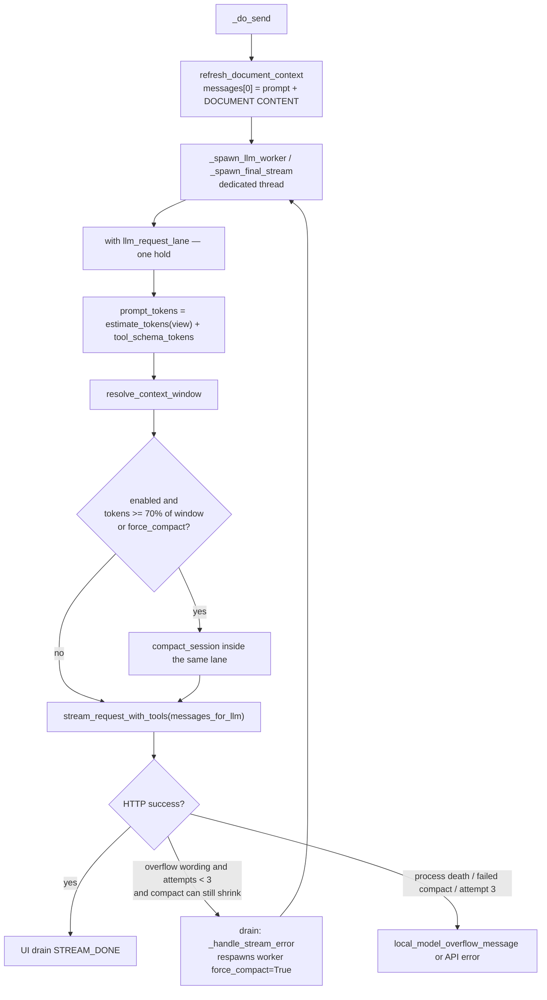
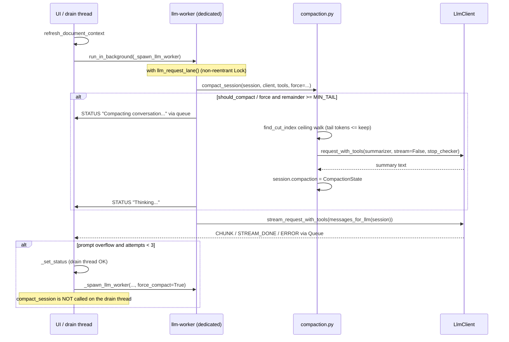

# Auto-compact conversation history at ~70% context

| Field | Value |
| --- | --- |
| **Author** | Grok (proposed) |
| **Date** | 2026-09-09 |
| **Status** | Draft (revision 4) |
| **Intended location** | `docs/chat/compaction-dev-plan.md` |
| **Scope** | WriterAgent sidebar `ChatSession` (Chat, Web Research, Librarian) in Writer / Calc / Draw. Not LibrePy, not `=PROMPT()`, not smol ReAct (`smol_agent.py`). |
| **Reference design** | OpenClaw client-side compaction, simplified. Not Odysseus 85%. Not OpenAI Responses `/responses/compact`. |

This is a proposed development document, not an implementation. No code in either repo was changed.

---

## Overview

WriterAgent sidebar chat currently sends growing `ChatSession.messages` (plus a freshly rebuilt `[DOCUMENT CONTENT]` system message) until the model context overflows. On Ollama / llama.cpp this often presents as an HTTP 500 (`llama-server process has terminated`, `truncating input prompt`) rather than a clean 400; the sidebar then shows a plain overflow sentence and the turn dies. Older turns are not summarized; they are simply part of the next request until the provider refuses.

OpenClaw solves this by auto-compacting older turns into a structured summary when usage nears the context limit, keeping a recent tail verbatim, persisting the compacted *model view* while leaving the full transcript on disk, and compact-and-retrying on overflow (capped at 3 attempts).

WriterAgent should get **the same algorithm**, implemented in **one new UNO-free module** plus a handful of call sites. OpenClaw's `*compact*` cluster under `src/agents` + `packages/agent-core` is **107 files / 46,864 LOC** (109 `find` hits including 2 directories). The portable essence is **2,503 LOC** across eight core files. WriterAgent v1 target: **~1 module + ~4 call sites + tests**.

**Critical correction vs. folklore:** OpenClaw's *client-side* trigger is **not** 70%. It is `contextTokens > contextWindow - reserveTokens` with a default reserve of **20,000** tokens, then capped so small windows keep at least 50% of the window for prompt (or 8,000 tokens, whichever is smaller). The **70%** figure is OpenClaw's *server-side* Anthropic / OpenAI Responses compaction threshold. WriterAgent v1 still triggers at **70% of the resolved prompt window** (the remaining 30% is generation headroom). That is the product request, it is simpler than reserve-token math, and it is a better default for mixed 8k–1M windows than a 20k absolute reserve. v1 does **not** also subtract `chat_max_tokens` from the denominator; llama.cpp sharing `n_ctx` with output is already issue #570.

Unlike OpenClaw, **`chat_compaction_enabled: false` turns off overflow retry as well as proactive compact.** OpenClaw keeps preflight/overflow recovery when `compaction.enabled` is false. Do not "fix" WriterAgent to match that without a product decision — one JSON kill switch is the v1 operability story.

---

## Background & Motivation

### Current WriterAgent behavior

Each send in `ToolCallingMixin._do_send` (`plugin/chatbot/tool_loop.py` ~297) calls `ChatSession.refresh_document_context`, which rewrites `messages[0]` as `base_prompt + "\n\n[DOCUMENT CONTENT]\n…\n[END DOCUMENT]"` (`plugin/chatbot/panel.py` `set_system_context` 96–108, `refresh_document_context` 110–128). The user turn is appended. `_spawn_llm_worker` (423–468) then posts **the entire** `self.session.messages` list to `LlmClient.stream_request_with_tools`. Round N+1 is another `_spawn_llm_worker` via `SpawnLLMWorkerEffect` (`tool_loop_state.py` 523, `tool_loop_actions.py` 219–221) after tool results are appended. Exhausted rounds use `_spawn_final_stream` → `stream_chat_response(self.session.messages, …)` (`tool_loop.py` 497–498).

There is no history truncation, no token estimate vs. window, and no compact-and-retry. `chat_max_tokens` (config default 16384, `plugin/framework/config_schema.py` `WriterAgentConfig.chat_max_tokens` 307) is the **output** cap, not the context window. `CHAT_DOCUMENT_CONTEXT_MAX_CHARS = 8000` (`plugin/framework/constants.py` 46) is a **character** cap on the document excerpt, not a token window.

When the prompt does overflow a local llama-server, issue #570 already maps the 500 to a friendly sentence (`plugin/framework/client/errors.py` `local_model_overflow_message` 39–48, `is_local_model_server_crash` 51–63; `docs/chat/llm-hacks.md` §11). That helper **mixes process death** (`llama-server process has terminated`, `0xc0000005`) **with overflow wording** (`truncating input prompt`, `prompt overflow`). Compact-and-retry on a dead server is worse than today's sentence. This design splits those predicates.

Quote from llm-hacks §11: *"WriterAgent does not silently trim document/history, refuse the send, or enforce a minimum context floor. Those are later product decisions."* This design is that later product decision for history.

Persistence today (`plugin/chatbot/history_db.py`):

| What | In `session.messages` (model-facing) | In SQLite/JSON history DB | In sidebar UI |
| --- | --- | --- | --- |
| System prompt + `[DOCUMENT CONTENT]` | Yes (index 0, rewritten each send) | System text persisted; document snapshot goes stale | Skipped (`session_history_items` skips `role=system`) |
| User / assistant text | Yes | Yes (`add_message`) | Yes |
| Assistant `tool_calls` | Yes (in memory) | **No** (`ChatSession.add_assistant_message` 147: "Only persist the text content") | Tool-only turns render as `[Thinking...]` |
| `role=tool` results | Yes (in memory) | **No** (`add_tool_result` 150–153) | Skipped |

`session.messages` **is** the model-facing list. The UI during a live session is the rich-text control that was *appended to* as turns streamed; it is not re-read from `session.messages` until mode-switch / reload (`panel_factory._render_session_history` 441–470, `rich_text_paste.session_history_items` 417–432). After restart, `ChatSession.__init__` reloads the DB subset (no tools).

Related existing clips, **not** this feature:

- Writing / librarian *sub-agents* clip `history_text` to the last 4000 chars (`plugin/chatbot/writing.py` 160–161, `plugin/chatbot/librarian.py` 111–113). Sub-agent prompt stuffing, not main-chat compaction. The Librarian **sidebar session** is a normal `ChatSession` and **is** in v1.
- Tool-loop `finish_reason == "length"` injects a truncated-response banner (`tool_loop_state.py` 473–479). Output exhaustion, not input overflow.

### OpenClaw behavior (verified in source)

Docs: `openclaw/docs/concepts/compaction.md`, `openclaw/docs/reference/session-management-compaction.md`.

Three scheduling paths (session-management-compaction.md "When auto-compaction happens"):

1. **Overflow recovery** — provider returns a context-overflow error; compact; retry. Cap `MAX_OVERFLOW_COMPACTION_ATTEMPTS = 3` (`src/agents/agent-compaction-constants.ts` 30). OpenClaw still runs this when `compaction.enabled` is false; WriterAgent v1 does **not** (see Overview).
2. **Usage-based maintenance / preflight** — projected usage ≥ `contextWindow - reserveTokens`, subject to a server-compaction threshold *floor* when Anthropic/OpenAI server compact is on (`src/auto-reply/reply/memory-flush.ts` `resolveCompactionThreshold` 46–54, `shouldRunPreflightCompaction` 162–174).
3. **Session-internal threshold** — `shouldCompact(contextTokens, contextWindow, settings)` in agent-core (`packages/agent-core/src/harness/compaction/compaction.ts` 267–275): `contextTokens > contextWindow - settings.reserveTokens`. Default `reserveTokens: 16384`, `keepRecentTokens: 20000` (`DEFAULT_COMPACTION_SETTINGS` 141–145). Gateway preflight uses a 20,000 reserve floor (`src/agents/agent-settings.ts` `DEFAULT_AGENT_COMPACTION_RESERVE_TOKENS_FLOOR` 9).

Reserve is capped for small windows (`resolveEffectiveCompactionReserveTokens`, `agent-compaction-constants.ts` 15–28): keep at least `min(8000, floor(window * 0.5))` tokens of prompt budget. So an 8k local model compact-triggers at 50%, not at token 1. Docs: *"This keeps small-context local models from entering compaction from the first token"* (session-management-compaction.md ~249).

**Where 70% actually lives:**

| Path | Formula | Source |
| --- | --- | --- |
| Anthropic *server-side* compact | `max(50000, floor(contextWindow * 0.7))` | `packages/ai/src/transports/anthropic-payload-policy.ts` `resolveAnthropicCompactThreshold` 51–63; docs/providers/anthropic.md; `memory-flush.test.ts` 226–229 ("uses 70 percent of the Anthropic context window", 200k → 140k) |
| OpenAI Responses *server-side* compact | `max(1000, floor(effectiveBudget * 0.7))` | `packages/ai/src/transports/openai-responses-payload-policy.ts` `resolveOpenAIResponsesCompactThreshold` 305–318 |
| Client-side `shouldCompact` | `tokens > window - reserve` | `compaction.ts` 267–275 |

OpenClaw also: keeps tool-call / toolResult pairs together (`findCutPoint` + `isCutPointMessage` in `compaction.ts` 337–492; docs/concepts/compaction.md 16–17); CJK-aware chars/4 estimator (`packages/normalization-core/src/cjk-chars.ts`); full transcript on disk, compaction only changes what the model sees (compaction.md 21); optional memory flush, `/compact`, safeguard quality audits, plugin providers, successor transcripts, `maxActiveTranscriptBytes`.

### Why now

Long Writer/Calc editing sessions fill the window. Local 4k–8k `num_ctx` (often VRAM-limited, not the model's trained 32k — issue #570) overflow after a handful of tool rounds. That is the **primary** failure mode this feature exists to fix: keep-recent and the post-compact view must fit in `window - estimate(messages[0]) - summary - tools`, or compact "succeeds" and the next stream still overflows.

---

## Goals & Non-Goals

### Goals (v1)

1. Before **every** sidebar LLM worker spawn (tool-loop round 0, round N+1, `_spawn_final_stream`, and overflow-retry respawn), estimate tokens of the *model-facing* prompt: `estimate_tokens(messages_for_llm(session)) + tool_schema_tokens(tools)`.
2. If that estimate ≥ **70% of the resolved prompt window**, compact older conversation into one summary and keep a recent tail verbatim. The tail token sum is **≤ keep** (remaining-budget ceiling). Summarizer output is capped to `_summary_budget(window)`. After apply, if the view is still `> window`, revert and do not send it. Exact fill (`after == window`) is success.
3. Never compact `[DOCUMENT CONTENT]` / the live document snapshot. It is rebuilt every send. Summarizer input is `messages[1:cut]` (or `messages[prev_kept:new_cut]`), never index 0.
4. Never split an assistant `tool_calls` message from its `role=tool` results.
5. On recognized **prompt-too-large** HTTP errors (not llama-server process death), compact-and-retry the same user turn, capped at 3 attempts. Skip retry when compact cannot shrink the view.
6. Persist so the next *in-process* turn sees the compacted view. Keep original turns in `session.messages` so the sidebar still shows them.
7. Compaction LLM call on a worker (`run_in_background` / existing `_spawn_llm_worker` thread), never the UI thread. Honor Stop via `resolve_stop_checker()`.
8. Failure leaves history intact. Log and continue uncompacted (or surface overflow as today after retry cap).
9. Default ON. One boolean in `writeragent.json`. No Settings dialog page in v1. The same flag disables overflow retry.
10. Unit tests with mocked `LlmClient`. No UNO tests unless a UI notice is added (it is not, in v1).

### Non-goals (v1)

- **Memory flush** (OpenClaw silent `NO_REPLY` agent turn before compact). WriterAgent memory (`plugin/chatbot/memory.py` `MemoryStore`, `upsert_memory`; `MEMORY_GUIDANCE` in `plugin/framework/prompts.py` 151–156) is experimental file-backed USER.md/MEMORY.md. A silent extra agent turn does not map cleanly. Defer.
- **`/compact` slash command** and **`/tokens`**. Slash commands are mostly stubs (`plugin/chatbot/slash_commands.py` 44–57: only `/help` `/clear` `/stop` are wired). Stretch for a later PR.
- **UI notice** in the sidebar (`notifyUser`). OpenClaw default is silent (`types.agent-defaults.ts` 430–435). v1 is silent except a drain `STATUS` line during the extra call.
- **Session pruning**, safeguard mode, quality-audit retries, `identifierPolicy`, `summarizeInStages`, plugin providers, context engines, successor transcripts, checkpoints, `maxActiveTranscriptBytes`.
- **Anthropic / OpenAI server-side compaction** (`context_management`, `/responses/compact`). Out of v1; see `docs/chat/responses-api-plan.md` (478–499).
- **Odysseus 85%** as the trigger. Prior art only (`docs/archive/integration-odysseus-ideas.md` Feature 1). Headings loosely inspired; 1024-token summarizer floor is an Odysseus number, not OpenClaw.
- **tiktoken**. No `last_prompt_tokens` delta in v1 (every send rewrites `messages[0]`; streaming `usage` is often `{}` at `llm_client.py` 1090).
- **LibrePy**, Calc `=PROMPT()` / `=PYTHON()`, smol ReAct (`smol_agent.py`). Librarian *sidebar* `ChatSession` **is** in v1 (same `_spawn_llm_worker`).
- **Settings UI checkbox**. Config key only.
- **Dual history DB** / rewriting `history_db` rows.
- **Mid-turn precheck** after every tool result (OpenClaw default false). Per-round worker gate is enough.
- **Post-compaction tool-loop guard**.
- **Compaction model override**. Same chat model in v1.

---

## Proposed Design

### Essence of OpenClaw, as an 8-step algorithm

```
1. Estimate tokens of the prompt (messages view + tool schemas)
   vs. the resolved context window.
2. Trigger when usage ≥ 70% of that window (WriterAgent product;
   OpenClaw client-side is window-reserve, server-side is 70%).
3. Choose a split whose **tail token sum is ≤ keep** (remaining-budget
   ceiling, not OpenClaw's "at least keepRecent" floor), does not split a
   tool_call / tool-result pair, and leaves room for live
   messages[0] + summary + tools.
4. Summarize the newly older slice with one non-streaming LLM call
   (same model; summarizer max_tokens and char cap = `_summary_budget(window)`).
5. Build a model-facing view: live system+document + summary pair + tail.
   Do not delete original turns from session.messages.
6. Cache CompactionState on the session so the next round/turn reuses it.
7. On prompt-too-large error (not process death): respawn the worker
   with force_compact, capped at 3 attempts. Stop aborts recovery.
   nothing_to_compact / failed → no retry.
8. Manual /compact, UI notice, memory flush: later.
```

### Complexity budget

| Surface | Files | LOC (wc -l) |
| --- | ---: | ---: |
| OpenClaw `*compact*` under `src/agents` + `packages/agent-core` | **107 files** (109 `find` hits incl. 2 dirs) | 46,864 |
| Of which `embedded-agent-runner` compact* | 54 | 23,764 |
| agent-core `harness/compaction/` | 9 | 4,052 |
| `agent-hooks` compaction* (safeguard) | 7 | 7,443 |
| **Portable essence** (algorithm + overflow + pairing + CJK + threshold) | 8 files listed below | **2,503** |
| Odysseus `odysseus/src/context_compactor.py` (in-tree prior art) | 1 | 527 |
| **WriterAgent v1 target** | 1 new module + tests + ~4 call sites | ~400–700 LOC module, ~300–500 tests |

Essence files:

- `packages/agent-core/src/harness/compaction/compaction.ts` (988)
- `packages/normalization-core/src/cjk-chars.ts` (52)
- `src/agents/agent-compaction-constants.ts` (30)
- `src/auto-reply/reply/memory-flush.ts` (187)
- `src/agents/failover/context-overflow.ts` (137)
- `packages/ai/src/utils/overflow.ts` (247)
- `src/agents/sessions/agent-session-compaction.ts` (497)
- `packages/agent-core/src/harness/session/tool-result-pairing.ts` (365)

### Architecture





### Module placement

**New file:** `plugin/chatbot/compaction.py`

UNO-free, LibreOffice-free, pytest-able. Lives under chatbot because it builds a *view* of session messages. Do not put it in `plugin/framework/` — framework must stay importable from LibrePy.

**Do not import** `plugin.chatbot.panel`, `plugin.chatbot.tool_loop`, or any UNO module. `compact_session(session, …)` duck-types `{messages: list, compaction: CompactionState | None}`. Allowed imports: `query_ollama_runtime_num_ctx`, `DEFAULT_MODELS` / `resolve_model_id`, `openrouter_model_ids_equivalent`, `get_config_bool_safe` (or take `enabled` as an argument), stdlib. Take an `LlmClient`-like object with `_get_provider`, `_endpoint`, `config`, `request_with_tools`. Keep window resolution in this module; do not add it to `model_fetcher.py`.

Public surface:

```python
CHARS_PER_TOKEN = 4
COMPACTION_RATIO = 0.70
MAX_OVERFLOW_COMPACTION_ATTEMPTS = 3  # OpenClaw agent-compaction-constants.ts:30
KEEP_RECENT_FRACTION = 0.30
KEEP_RECENT_FLOOR = 2048  # preference, not a hard min after remaining-budget clamp
KEEP_RECENT_CAP = 20_000  # OpenClaw DEFAULT_COMPACTION_SETTINGS.keepRecentTokens
MIN_TAIL_TOKENS = 256     # hard floor; below this, nothing to gain
MAX_SUMMARY_CHARS = 16_000  # OpenClaw safety rail only; v1 view cap is _summary_budget * 4
IMAGE_BLOCK_TOKENS = 2000   # OpenClaw compaction.ts:278
AUDIO_BLOCK_TOKENS = 2000
DOCUMENT_MARKERS = ("[DOCUMENT CONTENT]", "[END DOCUMENT]")

def estimate_string_chars(text: str) -> int: ...
def flatten_content(content) -> tuple[str, int, int]: ...  # text, n_images, n_audio
def estimate_message_tokens(msg: dict) -> int: ...
def estimate_tokens(messages: list[dict]) -> int: ...
def tool_schema_tokens(tools: list | None) -> int: ...
def prompt_tokens(messages: list[dict], tools: list | None) -> int: ...
def resolve_context_window(client, model_id: str | None = None) -> int | None: ...
def should_compact(tokens: int, window: int | None, enabled: bool = True) -> bool: ...
def keep_recent_tokens(window: int, system_tokens: int, tool_tokens: int, *, force: bool = False) -> int | None: ...
def find_cut_index(messages: list[dict], keep_tokens: int, *, start_index: int = 1) -> int | None: ...
def serialize_for_summary(messages: list[dict]) -> str: ...
def summary_pair(summary: str) -> list[dict]: ...
def messages_for_llm(session, tools: list | None = None) -> list[dict]: ...
def sanitize_tool_pairs(messages: list[dict]) -> list[dict]: ...
def is_process_death_error(text: str) -> bool: ...
def is_context_overflow_error(text: str) -> bool: ...
def should_retry_overflow(attempts: int, compact_reason: str | None) -> bool: ...

def compact_session(
    session,
    client,
    *,
    window: int | None,
    tools: list | None = None,
    max_tokens: int | None = None,  # worker's chat output cap from get_config_int("chat_max_tokens")
    stop_checker=None,
    force: bool = False,
    status_callback=None,
) -> "CompactResult":
    """May call LlmClient (blocking). Must run off the UI thread.
    Must already be inside llm_request_lane; must not take the lane itself.
    Do not read client.config["chat_max_tokens"] — that key is not on LlmClient.config
    (get_api_config at config.py 816–825).
    """
```

`ChatSession` gains one in-memory field, not persisted:

```python
# plugin/chatbot/panel.py ChatSession.__init__
self.compaction = None  # CompactionState | None
# clear() sets self.compaction = None
```

No `last_prompt_tokens` in v1.

```python
@dataclass(frozen=True)
class CompactionState:
    summary: str
    first_kept_index: int   # into session.messages; always >= 1
    tokens_before: int
    window: int

@dataclass(frozen=True)
class CompactResult:
    compacted: bool
    reason: str  # "below_threshold" | "nothing_to_compact" | "no_window" | "ok" | "failed" | "aborted" | "disabled"
    tokens_before: int | None = None
    tokens_after: int | None = None
```

`first_kept_index` is never 0. Sentinel for “nothing to compact” is `None` from `find_cut_index` / `keep_recent_tokens`, never `0`.

### `messages_for_llm` (cached view)

```
[session.messages[0]]                       # ALWAYS the live system + DOCUMENT CONTENT
+ summary_pair(state.summary)               # built here; NEVER appended to session.messages
+ session.messages[state.first_kept_index:] # verbatim tail
```

then `sanitize_tool_pairs`. If `session.compaction is None`, return `list(session.messages)` (still sanitized).

The dummy user/ack pair exists **only** inside this function. Do not stamp `"_compaction": True` onto `session.messages`. Do not persist the pair.

### Why not mutate `session.messages` in place

OpenClaw: *"The full conversation history stays on disk. Compaction only changes what the model sees"* (`docs/concepts/compaction.md` 21).

WriterAgent does **not** have OpenClaw's two-layer store. Mutating `session.messages` would make mode-switch re-render show the dummy ack, and would need a `replace_prefix` DB API that does not exist (`history_db.py` 92–113, 132–155).

**v1:** compaction is a cached view. Originals stay in `session.messages` and history_db. Restart re-summarizes if still over 70%.

Librarian and Web sessions are separate `ChatSession` objects (`panel_factory.py` 884–890). Wiring `_spawn_llm_worker` / `_spawn_final_stream` covers all three. **v1 includes Librarian.**

### Token estimator (no tiktoken)

v1 **always** uses `prompt_tokens(messages_for_llm(session), tools)`. Sidebar histories are small; chars/4 is cheap. OpenClaw's `estimateContextTokens` (last-assistant usage + trailing messages, `compaction.ts` 236–264) does not map: WriterAgent rewrites `messages[0]` every send (`refresh_document_context`), specialized-domain switches change `tools` (`_refresh_active_tools_for_session`), and streaming `usage` is often `{}` (`llm_client.py` 1090). `AddMessageEffect` / `_add_message` (`tool_loop_actions.py` 254–258) only sees role/content/tool_calls — it cannot stash usage. **Do not add `last_prompt_tokens`.** Optional later: scale the heuristic from a STREAM_DONE usage snapshot in `_handle_stream_completion` as a calibration factor, reset on `clear()` / successful compact / document refresh. Not v1.

CJK fast path (steal `cjk-chars.ts` 10–47 common path; skip rare-plane tables):

```python
CHARS_PER_TOKEN = 4
_NON_ASCII = re.compile(r"[\u0080-\U0010FFFF]")
_COMMON_CJK = re.compile(r"[\u00B7\u3000-\u319F\u4E00-\u9FA5\uAC00-\uD7AF\uFF01-\uFF60]")

def estimate_string_chars(text: str) -> int:
    if not text:
        return 0
    if not _NON_ASCII.search(text):
        return len(text)
    cjk = len(_COMMON_CJK.findall(text))
    return len(text) + cjk * (CHARS_PER_TOKEN - 1)

def flatten_content(content) -> tuple[str, int, int]:
    """Return (text, image_count, audio_count). Never str() a content list."""
    if content is None:
        return "", 0, 0
    if isinstance(content, str):
        return content, 0, 0
    if not isinstance(content, list):
        return "", 0, 0
    texts: list[str] = []
    n_img = n_aud = 0
    for part in content:
        if not isinstance(part, dict):
            continue
        kind = part.get("type")
        if kind == "text" and isinstance(part.get("text"), str):
            texts.append(part["text"])
        elif kind == "image_url":
            n_img += 1
        elif kind == "input_audio":
            n_aud += 1
    return " ".join(texts), n_img, n_aud

def estimate_message_tokens(msg: dict) -> int:
    text, n_img, n_aud = flatten_content(msg.get("content"))
    chars = estimate_string_chars(text)
    for tc in msg.get("tool_calls") or []:
        fn = (tc.get("function") or {}) if isinstance(tc, dict) else {}
        chars += estimate_string_chars(str(fn.get("name") or ""))
        chars += estimate_string_chars(str(fn.get("arguments") or ""))
    tokens = (chars + CHARS_PER_TOKEN - 1) // CHARS_PER_TOKEN
    tokens += n_img * IMAGE_BLOCK_TOKENS
    tokens += n_aud * AUDIO_BLOCK_TOKENS
    return max(1, tokens)

def estimate_tokens(messages: list[dict]) -> int:
    return sum(estimate_message_tokens(m) for m in messages)

def tool_schema_tokens(tools: list | None) -> int:
    if not tools:
        return 0
    blob = json.dumps(tools, ensure_ascii=False, separators=(",", ":"))
    return (len(blob) + CHARS_PER_TOKEN - 1) // CHARS_PER_TOKEN

def prompt_tokens(messages: list[dict], tools: list | None) -> int:
    return estimate_tokens(messages) + tool_schema_tokens(tools)
```

Role/separator overhead is omitted (slightly unconservative). CJK is conservative. Audio/image constants are required: a wav data-URL must **not** scale with base64 length (`tool_loop.py` 343–375).

### Context window resolution (the 70% denominator)

`resolve_context_window(client, model_id=None) -> int | None`. **Default `model_id` is `client.config.get("model")`**, same as `_peek_live_ollama_num_ctx` (`llm_client.py` 224–234). Callers may pass an explicit id; `resolve_context_window(client)` is valid.

```python
def resolve_context_window(client, model_id: str | None = None) -> int | None:
    model_id = str(model_id or (client.config or {}).get("model") or "").strip() or None
    if not model_id:
        return None
    ...
```

1. **Ollama live `num_ctx` only when the client is Ollama.** Same gate as `_peek_live_ollama_num_ctx`: if `client._get_provider() != "ollama"`, skip `/api/show`. If it is Ollama, `query_ollama_runtime_num_ctx(client._endpoint(), model_id)` (`model_fetcher.py` 711–726). **Do not** fall back to trained `model_info["*.context_length"]` (issue #570; `parse_ollama_runtime_num_ctx` 607–612). If Ollama and `num_ctx` is missing, return `None` — do **not** use the cloud catalog.
2. **Catalog `context_length`.** Walk `DEFAULT_MODELS` (`default_models.py` 86+). Match `resolve_model_id(row, provider) == model_id`, **or** if provider is OpenRouter, `openrouter_model_ids_equivalent` (`plugin/framework/openrouter_model_id.py` 79–89) so `:nitro` suffixes hit. Return `row["context_length"]` when it is a positive int.
3. **None.** Skip **both** proactive compact **and** overflow compact. There is no remaining-budget clamp without a denominator, and a “last 4 user turns” fallback is not specified (it could still overflow a 4k window). `_handle_stream_error` treats reason `no_window` like `nothing_to_compact` (no retry loop) and shows today’s overflow sentence.

Never use `chat_max_tokens` as the window. 70% is of the **resolved prompt window**; the remaining 30% is generation headroom. llama.cpp shares `n_ctx` with output (issue #570) — v1 does not also subtract `chat_max_tokens`. `chat_max_tokens` is only an optional **upper bound on the summarizer’s output** (`max_tokens` passed in from the worker).

### Keep-recent vs remaining budget (the 4k/8k path)

Preferred tail is `min(KEEP_RECENT_CAP, max(KEEP_RECENT_FLOOR, floor(0.30 * W)))`. That preference is then **clamped to what can actually fit**:

```python
def _summary_budget(window: int) -> int:
    """Token allowance for the summary pair in the *view*, and the summarizer
    max_tokens / char cap. One number, used three times, so the clamp cannot
    lie. Odysseus SUMMARY_MAX_TOKENS = 1024 is the cap; OpenClaw's 16k-char
    MAX_COMPACTION_SUMMARY_CHARS is a safety rail only (compaction.ts 110).
    """
    return min(1024, max(256, window // 8))

def summary_char_cap(window: int) -> int:
    return min(MAX_SUMMARY_CHARS, _summary_budget(window) * CHARS_PER_TOKEN)

def keep_recent_tokens(window: int, system_tokens: int, tool_tokens: int, *, force: bool = False) -> int | None:
    remainder = window - system_tokens - tool_tokens - _summary_budget(window)
    if remainder < MIN_TAIL_TOKENS:
        return None  # document+system+tools already fill the window
    desired = min(KEEP_RECENT_CAP, max(KEEP_RECENT_FLOOR, window * 3 // 10))
    clamped = min(desired, remainder)  # MAY be below KEEP_RECENT_FLOOR
    if force:
        # Halve the *already-clamped* value so remainder-bound 4k actually shrinks.
        # (Halving `desired` first then min(desired, remainder) is a no-op when
        # remainder already bound the tail.)
        return max(MIN_TAIL_TOKENS, clamped // 2)
    return clamped
```

`KEEP_RECENT_FLOOR` is a preference for large windows, **not** a hard minimum after the remaining-budget clamp. A hard floor of 2048 would make 4k `num_ctx` + ~2k document still overflow after “successful” compact — the failure mode this feature exists to fix. Nothing-to-gain is `remainder < MIN_TAIL_TOKENS` (256), not `< 2048`.

Worked examples (`tools=0` unless noted):

| Window | system+doc | 70% trigger | summary_budget | remainder | desired 30% | **keep** | **force keep** |
| ---: | ---: | ---: | ---: | ---: | ---: | ---: | ---: |
| 4,096 | 2,000 | 2,867 | 512 | 1,584 | 2,048 | **1,584** (clamped) | **792** |
| 4,096 | 2,000 + tools 800 | 2,867 | 512 | 784 | 2,048 | **784** | **392** |
| 4,096 | 3,500 | 2,867 | 512 | 84 | 2,048 | **None** | **None** |
| 8,192 | 2,000 | 5,734 | 1,024 | 5,168 | 2,457 | **2,457** | **1,228** |
| 32,768 | 2,000 | 22,937 | 1,024 | 29,744 | 9,830 | **9,830** | **4,915** |
| 131,072 | 2,000 | 91,750 | 1,024 | 128,048 | 20,000 | **20,000** | **10,000** |

`keep` is a **ceiling** on tail tokens. `find_cut_index` must treat it as a ceiling (`tail_sum <= keep`), not OpenClaw’s floor (`accumulated >= keepRecent`). The fit check lives **inside** `compact_session` (after applying `CompactionState`): if `after > window`, revert the state and return `failed` — do not send a too-large view, and do not drop unsliced tail turns from the model’s summary. `after == window` is success (the 4k clamp is built to produce that equality: 2000 + 512 + 1584 + 0 = 4096).

OpenClaw on 8k would reserve 4096 and trigger at 50%. WriterAgent 70% compacts later; remaining-budget clamp + ceiling cut + summary-budget cap is what makes 4k viable.

### Split point (tool-pair integrity)

OpenClaw `isCutPointMessage` (`compaction.ts` 337–351): user / assistant are valid cuts; **`toolResult` is not**. OpenClaw `findCutPoint` 440–465 walks from the end until `accumulated >= keepRecentTokens` and **keeps that tail** — a **floor** (“preserve at least N”). WriterAgent remaining-budget `keep` is a **ceiling** (“tail may be at most N”). Copying the OpenClaw comparison inverts the fit guarantee: three 1000-token turns with keep=1584 would keep a 2000-token tail.

Steal the **tool-pair snap**, invert the **keep comparison**. WriterAgent messages are `assistant` + `tool_calls` then `role=tool` + `tool_call_id` (`panel.py` 135–153), not `toolResult`.

```python
def _is_cut_point(msg: dict) -> bool:
    return msg.get("role") in ("user", "assistant")  # not "tool", not "system"

def find_cut_index(messages: list[dict], keep_tokens: int, *, start_index: int = 1) -> int | None:
    """First index of a verbatim tail whose token sum is <= keep_tokens.

    Ceiling walk (not OpenClaw's floor). start_index is 1 (skip DOCUMENT
    CONTENT) or the previous first_kept_index. None if nothing to compact
    or if even the last user turn cannot fit in keep_tokens.
    """
    n = len(messages)
    if keep_tokens <= 0 or n <= start_index:
        return None
    cut_points = [i for i in range(start_index, n) if _is_cut_point(messages[i])]
    if not cut_points:
        return None
    accumulated = 0
    earliest = n  # tail would be messages[earliest:]
    for i in range(n - 1, start_index - 1, -1):
        t = estimate_message_tokens(messages[i])
        if accumulated + t > keep_tokens:
            break
        accumulated += t
        earliest = i
    if earliest >= n:
        return None  # last message alone exceeds keep
    # Snap FORWARD to a legal cut (user/assistant). Forward-only shrinks the
    # tail, so it cannot exceed keep. If earliest is a tool message, the
    # assistant+tools block goes to the summarized side together.
    candidates = [cp for cp in cut_points if cp >= earliest]
    if not candidates:
        return None
    cut_index = candidates[0]
    if cut_index <= start_index:
        return None  # entire unsummarized range already fits — nothing to compact
    return cut_index
```

Consequences:

- Walk takes messages from the end while `accumulated + next <= keep`. Tail is **at most** keep tokens.
- If the first index in that feasible tail is `role=tool`, snap forward to the next user/assistant so the whole assistant+tools block is summarized together (OpenClaw invariant, cheaper here because forward-snap only shrinks).
- Two parallel `tool_calls` + two `role=tool` stay together either in tail or in summary.
- Last user turn larger than keep → `None` (nothing_to_compact).

View sanitizer (`sanitize_tool_pairs`), ~20 lines from Odysseus `_sanitize_tool_messages` (`odysseus/src/context_compactor.py` 82–125): drop orphan `role=tool`; strip dangling `tool_calls` with no following results (keep assistant text if any).

OpenClaw `TURN_PREFIX_SUMMARIZATION_PROMPT` (`compaction.ts` 859–872) is **omitted**.

### `compact_session` (index math, no stubs)

Inputs: duck-typed `session`, `client`, `window`, `tools`, `max_tokens` (worker chat cap), `stop_checker`, `force`, `status_callback`.

**Fit rule (all inside this function, not a side paragraph):**

1. **Before HTTP:** `keep = keep_recent_tokens(...)`; `new_cut = find_cut_index(..., keep)` so `estimate(messages[0]) + _summary_budget(window) + estimate(tail) + tools <= window`.
2. **Summarizer output cap = `_summary_budget(window)`**, optionally further min’d with the worker’s `max_tokens`. Char cap = `summary_char_cap(window)` (`min(16000, budget * 4)`). Not OpenClaw’s 16k-char / `0.8 * keep` output, which would blow a 4k view.
3. **After apply:** re-estimate the view. If `after > window`, **revert** `session.compaction` to the previous state and return `failed`. Do not send that view. Do not recut by dropping tail turns that were never in the summary (that would hide unsliced conversation from the model). `after == window` is success.

```
enabled = get_config_bool_safe("chat_compaction_enabled")  # or passed in
if not enabled:
    return CompactResult(False, "disabled")

messages = session.messages
if not messages:
    return CompactResult(False, "nothing_to_compact")

view = messages_for_llm(session, tools)
before = prompt_tokens(view, tools)
if window is None or window <= 0:
    # No denominator → no remaining-budget clamp. Skip proactive *and* force.
    return CompactResult(False, "no_window", before, before)

if not force and not should_compact(before, window, True):
    return CompactResult(False, "below_threshold", before, before)

system_tokens = estimate_message_tokens(messages[0])
tool_tokens = tool_schema_tokens(tools)
keep = keep_recent_tokens(window, system_tokens, tool_tokens, force=force)
if keep is None:
    return CompactResult(False, "nothing_to_compact", before, before)

state = getattr(session, "compaction", None)
prev_kept = state.first_kept_index if state is not None else 1
# Walk only the unsummarized tail. Never start at 0.
new_cut = find_cut_index(messages, keep, start_index=prev_kept)
if new_cut is None or new_cut <= prev_kept:
    return CompactResult(False, "nothing_to_compact", before, before)

slice_to_summarize = messages[prev_kept:new_cut]   # NEVER messages[0]
text = serialize_for_summary(slice_to_summarize)

if status_callback:
    status_callback("Compacting conversation...")

if stop_checker and stop_checker():
    return CompactResult(False, "aborted", before, before)

if state is not None and state.summary:
    prompt = UPDATE_SUMMARIZATION_PROMPT   # OpenClaw compaction.ts 531–568
    user_body = (
        "<previous-summary>\n" + state.summary + "\n</previous-summary>\n\n"
        "<conversation>\n" + text + "\n</conversation>\n\n" + prompt
    )
else:
    user_body = "<conversation>\n" + text + "\n</conversation>\n\n" + SUMMARIZATION_PROMPT

budget = _summary_budget(window)
max_out = budget
if max_tokens is not None and max_tokens > 0:
    max_out = min(max_out, max_tokens)
try:
    result = client.request_with_tools(
        [
            {"role": "system", "content": SUMMARIZATION_SYSTEM_PROMPT},
            {"role": "user", "content": user_body},
        ],
        max_tokens=max_out,
        tools=None,
        stream=False,
        stop_checker=stop_checker,
        prepend_dev_build_system_prefix=False,
    )
except Exception:
    log.exception("Compaction failed")
    return CompactResult(False, "failed", before, before)

if stop_checker and stop_checker():
    return CompactResult(False, "aborted", before, before)

summary = (result or {}).get("content") or ""
if not summary.strip():
    return CompactResult(False, "failed", before, before)
summary = cap_summary(summary, summary_char_cap(window))
# Pair (user summary + dummy ack) must itself fit in _summary_budget.
while estimate_tokens(summary_pair(summary)) > budget and len(summary) > 32:
    summary = cap_summary(summary, max(32, len(summary) * 3 // 4))

prev_state = state
session.compaction = CompactionState(
    summary=summary,
    first_kept_index=new_cut,   # monotonic: new_cut > prev_kept
    tokens_before=before,
    window=window,
)
after = prompt_tokens(messages_for_llm(session, tools), tools)
if after > window:
    session.compaction = prev_state  # revert; do not ship a too-large view
    return CompactResult(False, "failed", before, after)
if status_callback:
    status_callback("Thinking...")
return CompactResult(True, "ok", before, after)
```

**Invariants:**

- `first_kept_index` only increases (append-only conversation + rewrite of index 0).
- UPDATE input is `messages[old_first_kept:new_cut]`, **not** `messages[1:new_cut]` (would re-include already-summarized turns) and **not** `messages[0]` (would freeze `[DOCUMENT CONTENT]` into the summary).
- `serialize_for_summary` starts at the slice it is given. If any message contains `[DOCUMENT CONTENT]…[END DOCUMENT]`, strip that span (defensive).
- `messages_for_llm` always prefixes the **current** `messages[0]`, not a snapshot taken at compact time. Mid-loop `UpdateDocumentContextEffect` (`tool_loop_actions.py` 211–235) only rewrites index 0, so indices stay valid.

### Summarizer prompt and serialization

One non-streaming `request_with_tools(..., tools=None, stream=False, stop_checker=stop_checker, prepend_dev_build_system_prefix=False)`. Do **not** use `chat_completion_sync` (`llm_client.py` 1251–1257) — no `stop_checker`.

`compaction.py` must **not** take `llm_request_lane`. The caller holds it.

Headings: OpenClaw `SUMMARIZATION_PROMPT` (`compaction.ts` 498–529) / `UPDATE_SUMMARIZATION_PROMPT` (531–568), office-flavored (sheet names, cell ranges, headings). Truncate with OpenClaw's marker `\n\n[Compaction summary truncated to fit budget]` (`compaction.ts` 110–111) but the **char budget is `summary_char_cap(window)`** (`min(16000, _summary_budget(window) * 4)`), not a flat 16k. A 16k-char summary is ~4k tokens and cannot fit in a 4k view.

`max_tokens` for the summarizer: `_summary_budget(window)`, then `min` with the worker’s `max_tokens` argument if provided. That argument is the same value `_do_send` already loaded via `get_config_int("chat_max_tokens")` (`tool_loop.py` 243) and passed into `_spawn_llm_worker`. **Do not** read `client.config.get("chat_max_tokens")` — `get_api_config()` (`config.py` 816–825) puts `model`, `endpoint`, `request_timeout`, `chat_max_tool_rounds` on the client dict, not `chat_max_tokens`. OpenClaw `generateSummary` uses `floor(0.8 * reserveTokens)` (674–676); Odysseus uses 1024. v1 uses `_summary_budget` so the view clamp, HTTP cap, and char cap are the same number.

Serialize as `ROLE: text` lines. `flatten_content` for text; `[image data omitted from summary input]` / `[audio omitted]` for media (OpenClaw compaction.md 23–24). Head/tail tool JSON blobs larger than ~4k chars.

Summary pair (view-only):

```python
def summary_pair(summary: str) -> list[dict]:
    return [
        {"role": "user", "content": "[CONVERSATION SUMMARY]\n" + summary + "\n[END SUMMARY]"},
        {"role": "assistant", "content": "Acknowledged. I will continue from the summary above."},
    ]
```

### Failure and cancellation

| Event | Behavior |
| --- | --- |
| Summarizer HTTP error / empty text | `log.exception("Compaction failed")`; leave `session.compaction` unchanged; reason `failed`; do **not** wipe `session.messages` |
| Stop during summarizer | reason `aborted`; worker posts `STOPPED` |
| Stop during overflow recovery | Check `stop_requested` / `stop_checker` in `_handle_stream_error` **before** respawn (OpenClaw compaction.md 41) |
| Window unknown (`None` / ≤ 0), including `force=True` | `no_window` — skip compact; overflow retry must not loop |
| `keep is None` or `new_cut is None` | `nothing_to_compact` — overflow retry **must not** loop |
| Applied view `> window` | revert `session.compaction`; `failed`. `after == window` is success |
| Document+system+tools already fill the window | `nothing_to_compact`; do **not** compact or truncate `[DOCUMENT CONTENT]` |

### Overflow retry — crash vs prompt-too-large

`is_local_model_server_crash` (`errors.py` 18–23 / 51–63) is the **display** predicate for issue #570. It is the **wrong** retry predicate: compact-and-retry on `llama-server process has terminated` / `0xc0000005` hits a dead server up to 3 times (summarizer + stream each attempt).

```python
_PROCESS_DEATH_MARKERS = (
    "llama-server process has terminated",
    "0xc0000005",
)

_OVERFLOW_MARKERS = (
    "request_too_large",
    "context length exceeded",
    "context_length_exceeded",
    "prompt is too long",
    "prompt too long",
    "input exceeds the maximum number of tokens",
    "exceeds the maximum number of tokens allowed",       # Gemini
    "exceeds the maximum number of input tokens",
    "input is too long for the model",
    "exceeds the context window",
    "exceeds the available context size",                 # llama.cpp
    "maximum context length",
    "is longer than the model's context length",          # Together
    "reduce the length of the messages",                  # Groq
    "truncating input prompt",                            # overflow wording, retryable
    "prompt overflow",
)

def is_process_death_error(text: str) -> bool:
    lower = (text or "").lower()
    return any(m in lower for m in _PROCESS_DEATH_MARKERS)

def is_context_overflow_error(text: str) -> bool:
    """Prompt-too-large only. Process death is NOT overflow."""
    if is_process_death_error(text):
        return False
    lower = (text or "").lower()
    if any(m in lower for m in _OVERFLOW_MARKERS):
        return True
    if "llama.cpp" in lower and "overflow" in lower:
        return True
    return False
```

Do **not** treat 429 / TPM / "rate limit" as overflow. Do **not** `return True` from `is_local_model_server_crash`. `truncating input prompt` without process death **is** retryable.

Drain ERROR items go to `on_error=_handle_stream_error`, **not** to `on_stream_done` / `next_state` (`async_stream.py` 387–409, `tool_loop.py` 753). `EventKind.ERROR` → `ExitLoopEffect` (`tool_loop_state.py` 439–442) is unused for these payloads. Returning `True` keeps the drain running (STT fallback, `tool_loop.py` 599–634; `async_stream.py` 387–393).

**ERROR never enters `next_state` today.** Overflow is a host-side branch, not an FSM event. Do not add `EventKind.COMPACT` or a `StreamQueueKind`. `force_compact` is a new `_spawn_llm_worker` kwarg; `SpawnLLMWorkerEffect` does not need it.

`_handle_stream_error` order:

1. Existing STT / native-audio fallback (unchanged; different error class).
2. **Overflow retry (first among remaining checks)** — before the llama crash sentence at 653–662:
   - Parse `crash_blob` as today (642–650).
   - If `not get_config_bool_safe("chat_compaction_enabled")`: skip (retry is **off** when the flag is false).
   - If `is_process_death_error(crash_blob)`: skip retry; fall through to `local_model_overflow_message()`.
   - If `not is_context_overflow_error(crash_blob)`: skip.
   - If `self.stop_requested` or stop_checker(): skip (OpenClaw: stopping a run stops overflow recovery).
   - If `self._overflow_compact_attempts >= MAX_OVERFLOW_COMPACTION_ATTEMPTS`: skip; fall through to display. Test: attempt 3 shows `local_model_overflow_message()` / API error, does **not** set `_terminal_status` on the retry path.
   - Increment attempts. `_set_status("Compacting conversation...")` is OK here — this function runs on the **drain / UI thread** (`panel.py` `_set_status` 641–647 is UNO `setText`).
   - `_spawn_llm_worker(..., force_compact=True)` on the same queue. **Never call `compact_session` from `_handle_stream_error`.**
   - Do **not** append the overflow sentence, do **not** set `_terminal_status`. `return True`.
3. Existing crash / API error display (653–666), including process death.

Reset `_overflow_compact_attempts = 0` in `_start_tool_calling_async` (worker is recreated per send).

Inside the **respawned worker**, `force_compact=True` skips the 70% gate and uses `max(MIN_TAIL, clamped // 2)` so a remainder-bound 4k tail actually shrinks. If `compact_session` returns `nothing_to_compact`, `no_window`, `failed`, or `aborted`, send the current (uncompacted or previous) view once; if that overflows again, `_handle_stream_error` must **not** retry. Practical v1: stash `self._last_compact_reason` on the host; `should_retry_overflow(attempts, reason)` is false when reason is `nothing_to_compact` | `no_window` | `failed` | `aborted` | `disabled`.

### Where it runs in the tool loop

**Do compact** (70% check + maybe summarizer) inside:

- `_spawn_llm_worker.run()` on the dedicated worker, **after** Stop precheck, **inside** the existing `with llm_request_lane():` (`tool_loop.py` 443–450), **before** `stream_request_with_tools`. Use `messages_for_llm(self.session)` instead of `self.session.messages`.
- `_spawn_final_stream` the same way (`stream_chat_response` at 497–498 currently sends `self.session.messages`).

`_LLM_REQUEST_LOCK` is a non-reentrant `threading.Lock` (`queue_executor.py` 49, `llm_request_lane` 237–246). Compact **must not** take the lane itself. One `with` around compact + stream.

**Do not compact:**

- On the UI thread in `_do_send` or `_handle_stream_error`.
- Inside `next_state`.
- Via `_set_status` from the worker (UNO). Worker status goes through `status_callback` → `StreamQueueKind.STATUS`. Only post `"Compacting conversation..."` when compact is actually about to call the summarizer (`CompactResult` path after `should_compact` / `force`, before HTTP). Restore `"Thinking..."` after. Do **not** flash that status on every send.

Round N+1: `SpawnLLMWorkerEffect` runs after tool results are appended (`tool_loop_actions.py` 219–221), so pairs are complete. Compacting on every worker spawn is the v1 mid-loop story.

### Config

```python
chat_compaction_enabled: bool = True  # WriterAgentConfig
```

No Settings XDL. `make schema-docs` regenerates `docs/writeragent-config-schema.md` (`Makefile` 369–370; omitted keys pick up defaults, that doc 6–9). One flag disables **both** proactive compact and overflow retry.

### Persistence

No history_db schema change. `ChatSession.clear()` (`panel.py` 155–165) sets `self.compaction = None`.

---

## API / Interface Changes

### Before

```python
# tool_loop.py _spawn_llm_worker.run
with llm_request_lane():
    response = client.stream_request_with_tools(
        self.session.messages, max_tokens, tools=tools,
        append_callback=..., append_thinking_callback=...,
        stop_checker=stop_checker,
        status_callback=lambda t: real_q.put((StreamQueueKind.STATUS, t)),
    )
```

### After

```python
# tool_loop.py _spawn_llm_worker(..., force_compact: bool = False)
# run() on the dedicated worker — no self._set_status here (UNO).

def run():
    stop_checker = self.resolve_stop_checker()
    if stop_checker and stop_checker():
        ...
        real_q.put((StreamQueueKind.STOPPED,))
        return
    status_cb = lambda t: real_q.put((StreamQueueKind.STATUS, t))
    with llm_request_lane():  # non-reentrant; compact must not take this again
        if get_config_bool_safe("chat_compaction_enabled"):
            result = compact_session(
                self.session,
                client,
                window=resolve_context_window(client),  # model_id defaults to client.config["model"]
                tools=tools,
                max_tokens=max_tokens,  # worker arg from get_config_int("chat_max_tokens"), not client.config
                stop_checker=stop_checker,
                force=force_compact,
                status_callback=status_cb,  # only fires "Compacting…" if summarizer will run
            )
            self._last_compact_reason = result.reason
            if result.reason == "aborted":
                real_q.put((StreamQueueKind.STOPPED,))
                return
        payload = messages_for_llm(self.session)
        response = client.stream_request_with_tools(
            payload, max_tokens, tools=tools,
            append_callback=...,
            append_thinking_callback=...,
            stop_checker=stop_checker,
            status_callback=status_cb,
        )
```

`_spawn_final_stream` is the same pattern with `stream_chat_response(messages_for_llm(self.session), …)`.

`_handle_stream_error` overflow branch (drain thread): `_set_status` OK; `_spawn_llm_worker(..., force_compact=True)`; `return True`; never `compact_session`.

`ChatSession.__init__` / `clear`: `self.compaction = None`.

`config_schema.WriterAgentConfig`: `chat_compaction_enabled: bool = True`.

**No change** to `service.next_state` / `tool_loop_state.next_state`. **No** `AddMessageEffect` usage stash.

---

## Data Model Changes

**None on disk.** One boolean with default true.

In-memory only:

```
ChatSession.compaction: CompactionState | None
ToolLoopHost._overflow_compact_attempts: int   # reset in _start_tool_calling_async
ToolLoopHost._last_compact_reason: str | None  # skip overflow retry after failed/nothing_to_compact
```

Rollback: `"chat_compaction_enabled": false` or revert PR2. history_db untouched.

---

## OpenClaw → WriterAgent mapping

| OpenClaw | WriterAgent v1 |
| --- | --- |
| `shouldCompact` / `resolveCompactionThreshold` | `should_compact`: `tokens >= floor(window * 0.70)` where tokens include **tool schemas** |
| `keepRecentTokens = 20000` | preferred `min(20000, max(2048, floor(0.30*W)))`, then **clamp to remaining budget** after `messages[0]` + summary + tools |
| `resolveEffectiveCompactionReserveTokens` | **Omit** as trigger; remaining-budget clamp is the small-window analog |
| `estimateTokens` + CJK | Steal common-CJK chars/4; always re-estimate the view (no usage delta) |
| `getLastAssistantUsage` | **Omit** in v1 |
| `findCutPoint` 440–465 / `isCutPointMessage` | Tool-pair snap stolen; **keep comparison inverted** (`tail <= keep` ceiling, not `accumulated >= keepRecent` floor) |
| `tool-result-pairing.ts` repair | 20-line view sanitizer (orphan tool / dangling tool_calls) |
| `generateSummary` + prompts | One `request_with_tools(stream=False)` |
| `UPDATE_SUMMARIZATION_PROMPT` | Yes; slice is `messages[prev_kept:new_cut]` only |
| `TURN_PREFIX_SUMMARIZATION_PROMPT` | **Omit** |
| `capCompactionSummary` 16k | Safety rail only; v1 cap is `_summary_budget(window) * 4` chars |
| `generateSummary` maxTokens `floor(0.8 * reserveTokens)` | `_summary_budget(window)`, then `min` with worker `max_tokens`. Not `client.config["chat_max_tokens"]` (key is absent). |
| `MAX_OVERFLOW_COMPACTION_ATTEMPTS = 3` | Same; `_handle_stream_error` respawns worker |
| `isContextOverflowError` + overflow.ts | Prompt-too-large markers including Together/Groq/Gemini; **not** process death |
| `compactEmbeddedAgentSessionDirect` | `compact_session()` |
| Transcript `type: "compaction"` | In-memory `CompactionState` |
| Full transcript on disk | `session.messages` + history_db unchanged |
| `compaction.enabled` default true; overflow still on when false | `chat_compaction_enabled` default true; **overflow off when false** |
| `notifyUser` | Drain STATUS line only |
| Benign skip reasons (`compact-reasons.ts` 93–96: `below_threshold`, `already_compacted`, `no_compactable_entries`) | `below_threshold` / `nothing_to_compact` / `no_window` (our strings; not a port of their enum) |

---

## File-level change list

### New

| File | Role |
| --- | --- |
| `plugin/chatbot/compaction.py` | Estimator, window resolver, remaining-budget keep-recent, cut point, summarizer, view builder, overflow vs death detectors |
| `tests/chatbot/test_compaction.py` | Unit tests, mocked LlmClient |

### Touch

| File | Change |
| --- | --- |
| `plugin/chatbot/panel.py` | `ChatSession.compaction`; `clear()` resets it |
| `plugin/chatbot/tool_loop.py` | `_spawn_llm_worker(..., force_compact=False)` compact inside existing lane, send `messages_for_llm`; `_spawn_final_stream` same; overflow **first** in `_handle_stream_error` after STT, respawn only |
| `plugin/framework/config_schema.py` | `chat_compaction_enabled: bool = True` |
| `docs/writeragent-config-schema.md` | Regenerated via `make schema-docs` in PR1 |
| `docs/chat/compaction-dev-plan.md` | This document |
| `docs/chat/llm-hacks.md` §11 | Overflow compact-and-retry for prompt-too-large; process death still the plain sentence |
| `docs/repo-map.md` | One row |
| `tests/chatbot/test_chat_session.py` | `clear()` resets `compaction` |
| `tests/chatbot/test_tool_loop_errors.py` | Overflow respawn; attempt 3 falls through; process death does not retry; worker does not call `_set_status` |

### Do not add / do not touch

- New FSM events, `StreamQueueKind`, history_db methods, Settings XDL
- `plugin/framework/service.py` `next_state`
- `plugin/main_core.py`, LibrePy, `plugin/calc/analyzer.py`, `smol_agent.py`
- `plugin/framework/client/llm_client.py` request builder (except we may *read* `_get_provider` / `_endpoint` on the duck-typed client)
- `tool_loop_actions.py` `AddMessageEffect` / `_add_message` — **no usage stash**
- Importing `panel` / `tool_loop` from `compaction.py`

---

## Alternatives Considered

Unchanged in substance: (1) drop-oldest — reject; (2) Odysseus 85% — reject as spec, steal headings + failure-leaves-history; (3) Responses server compact — later; (4) full OpenClaw port — reject (107 files); (5) mutate `session.messages` + rewrite history_db — reject.

---

## Security & Privacy Considerations

Unchanged: summarizer is the same trust boundary as chat; do not log the serialized conversation; dummy pair is view-only; Stop via `stop_checker`; compact off the UI thread; `compaction.py` UNO-free.

---

## Observability

- `log.info` on trigger: window, estimated tokens (including tools), cut index, prev_kept, tokens_before/after, overflow attempt, reason.
- `log.exception("Compaction failed")` on summarizer errors.
- Drain STATUS `Compacting conversation...` only when the summarizer HTTP is about to run.
- HTTP 500 diagnostic already has `n_ctx` / `prompt_chars` (`llm_client.py` 253–270).

---

## Rollout Plan

1. PR1 pure module + tests + config key + `make schema-docs` — no behavior change.
2. PR2 wire + overflow retry, default **true**. JSON kill switch disables **both** proactive compact and overflow retry. Default-ON is acceptable **because** keep-recent is clamped to remaining budget (Issue 1) so 4k users are not compact-fail-retry-looping on the first long send.
3. PR3 optional `/compact` after slash commands are real.
4. Rollback: config false, or revert PR2.

---

## Risks

| Risk | Severity | Mitigation |
| --- | --- | --- |
| Compact view still > window on 4k `num_ctx` | High | Ceiling cut (`tail <= keep`); summarizer cap = `_summary_budget`; after-apply revert if `after > window` (exact fill is OK); `nothing_to_compact`/`failed` abort overflow retry |
| Retry on dead llama-server | High | `is_process_death_error` ≠ overflow; no retry |
| Tool-pair 400 | High | `find_cut_index` snap-forward; view sanitizer; tests on `role=tool` landing and parallel calls |
| Worker calls `_set_status` (UNO) | High | Status only via `status_callback` → `StreamQueueKind.STATUS` |
| Double-take `llm_request_lane` | High | Compact inside the existing `with`; module does not import the lane |
| UPDATE re-summarizes index 0 / already-summarized turns | High | Slice `messages[prev_kept:new_cut]` only; tests |
| Under-trigger without tool schemas | Med | `tool_schema_tokens` in the numerator |
| Summarizer itself overflows | Med | Per-message serialize cap; slice is the unsummarized tail only |
| `chat_compaction_enabled: false` vs OpenClaw overflow-still-on | Low | Documented; one kill switch |

---

## Tests

New: `tests/chatbot/test_compaction.py` (pytest, no soffice). Mock `LlmClient.request_with_tools`. Duck-type session as a simple namespace (`messages`, `compaction`); **do not import `ChatSession`**.

Must cover:

1. **Threshold math** — 70% of 8192 is 5734; `should_compact(5733, 8192)` false, `should_compact(5734, 8192)` true; invalid/None window false; `enabled=False` false.
2. **Fit guarantee (pinned sizes)** — window=4096, system+doc **exactly ~2000 tokens**, three user/assistant turns of **~1000 tokens each** (history ~3000). After compact, `prompt_tokens(view, tools) <= 4096`. A floor-walk (`>= keep`) would keep ~2000 of tail and fail this; the ceiling walk must keep ≤1584. Same fixture with `force=True` → keep **792** (half of clamped 1584, not still 1584). **Exact-fill:** system 2000 + tail 1584 + pair 512 + tools 0 → `compacted=True`, `after == 4096`, state **not** reverted. 4096 / system 3500 → `keep_recent_tokens` is `None`. 8192 / small system → keep 2457. 131072 → 20000. Applied view `> window` reverts state (`failed`).
3. **CJK estimator** — `"hello"` → ceil(5/4)=2; four CJK chars → ~4 tokens not 1.
4. **Document exclusion** — `messages_for_llm` always starts with live `messages[0]`; `serialize_for_summary` / UPDATE slice never includes index 0 or `[DOCUMENT CONTENT]`.
5. **Tool-pair integrity** — `assistant(tool_calls=[t1,t2])` + `tool(t1)` + `tool(t2)` + `user`; cut never between assistant and its tools; threshold landing **on** a `role=tool` message snaps forward; sanitizer drops orphan `tool` and strips dangling `tool_calls`.
6. **Image + audio** — `image_url` / `input_audio` charged 2000 each, not len(base64)/4; a wav data-URL test must not scale with payload length; summarizer serialization omits pixels/audio.
7. **Failure leaves history intact** — mocked client raises; `session.messages` identical; `session.compaction is None`.
8. **Overflow vs death** — `is_context_overflow_error` true for `prompt is too long`, `request_too_large`, Together `is longer than the model's context length`, Groq `reduce the length of the messages`, Gemini `exceeds the maximum number of tokens allowed`, `truncating input prompt`; **false** for `llama-server process has terminated`, `0xc0000005`, `Rate limited (429)`, `TPM`. `should_retry_overflow` true for attempts 0–2 when reason is `ok`/`below_threshold`; false for attempt 3 and for `nothing_to_compact`/`no_window`/`failed`. `window is None` → reason `no_window` even with `force=True`.
9. **Nothing to compact** — only system + one user; `new_cut is None`.
10. **View does not mutate** — after compact, `session.messages` still has original N turns; dummy pair exists only in `messages_for_llm` output.
11. **clear() resets compaction** — `tests/chatbot/test_chat_session.py`.
12. **Window resolver** — Ollama: monkeypatch `query_ollama_runtime_num_ctx` 4096 wins, no catalog fallback; non-Ollama must not call `/api/show`; catalog hit for an OpenRouter id that is **not** raw `ids` equality (`:nitro`); None when unknown.
13. **UPDATE path** — first compact `first_kept_index = K`; append turns; second compact sends UPDATE with `messages[K:new_cut]` only (no `[DOCUMENT CONTENT]`, no already-summarized prefix); `first_kept_index` strictly increases.
14. **`compact_session` does not import panel / take the lane.**
15. **`find_cut_index` ceiling** — three 1000-token turns, keep=1584 → tail token sum ≤ 1584 (not 2000). Last user turn > keep → `None`.
16. **`resolve_context_window(client)`** with no model_id uses `client.config.get("model")`. `compact_session(..., max_tokens=512)` never reads `client.config["chat_max_tokens"]`.

Host-level (`tests/chatbot/test_tool_loop_errors.py`):

- Overflow payload → `_handle_stream_error` respawns `_spawn_llm_worker(..., force_compact=True)`, does not append the overflow sentence, does not set `_terminal_status`, returns `True`.
- Attempt 3 falls through to `local_model_overflow_message()` / API error.
- Process death does **not** respawn.
- `nothing_to_compact` / `no_window` / `failed` does not retry.
- Worker `run()` does not call `_set_status` (patch it; assert not called from the background function). Mock `compact_session` so the test does not HTTP.

No UNO test in v1.

`make typecheck` after edits. PR1 also `make schema-docs`.

---

## Key Decisions

1. **70% of resolved prompt window, not OpenClaw's `window - 20k reserve`.** Product request. Remaining 30% is generation headroom; do not also subtract `chat_max_tokens`.
2. **Keep-recent is a remaining-budget *ceiling* after live `messages[0]` + summary + tools.** `find_cut_index` walks while `accumulated + next <= keep` (not OpenClaw’s `>= keepRecent` floor). 2048 is a preference, not a hard min. `force=True` halves the already-clamped value. After apply, `after > window` reverts state; `after == window` is success.
3. **One module `plugin/chatbot/compaction.py`, UNO-free, no import of `panel` / `tool_loop`.** Duck-type the session.
4. **Cached view, do not mutate `session.messages`, do not rewrite history_db.** Dummy pair is built only in `messages_for_llm`.
5. **Always `estimate_tokens(view) + tool_schema_tokens(tools)`.** No `last_prompt_tokens`, no `AddMessageEffect` stash.
6. **Never compact `[DOCUMENT CONTENT]`.** Serialize `messages[1:cut]` / `messages[prev_kept:new_cut]` only.
7. **Do not split tool_call / tool result.** Steal OpenClaw’s forward snap; **invert** the keep comparison so the tail is `<= keep`.
8. **Overflow retry ≤ 3, first check in `_handle_stream_error` after STT, respawn worker with `force_compact`.** Never `compact_session` on the drain thread. ERROR never enters `next_state`. Process death is not overflow. `nothing_to_compact`/`no_window`/`failed` aborts retry.
9. **`chat_compaction_enabled: false` disables overflow retry too.** Unlike OpenClaw.
10. **Compact inside the existing worker `llm_request_lane` hold.** Lock is non-reentrant (`queue_executor.py` 49).
11. **Status via `status_callback` → `StreamQueueKind.STATUS`, only if the summarizer will run.** Never `_set_status` from the worker.
12. **Librarian/Web ChatSessions are in v1** (same host). Smol ReAct is not.
13. **Summarizer `max_tokens` and char cap = `_summary_budget(window)`**, then `min` with the worker’s `max_tokens` (from `get_config_int("chat_max_tokens")`). Not `client.config["chat_max_tokens"]` (absent from `get_api_config`). Not OpenClaw 16k chars as the view budget.
14. **Default ON, config boolean, `make schema-docs` in PR1, no Settings page.**
15. **No memory flush, no `/compact`, no tiktoken, no FSM events.**
16. **Ollama window = live `num_ctx` via the `_peek_live_ollama_num_ctx` provider gate, never trained `context_length`, never `/api/show` for Together/OpenRouter.** Catalog match uses `openrouter_model_ids_equivalent`.
17. **Every worker spawn including round N+1 and `_spawn_final_stream`.**
18. **Odysseus is prior art, not the spec.**

---

## Open Questions

Closed in this revision:

1. Tool schemas in the numerator — **yes** (`tool_schema_tokens`).
2. `llm_request_lane` reentrancy — **no**; non-reentrant `Lock` at `queue_executor.py` 49. One `with` around compact+stream.
3. Librarian — **yes** in v1.
4. Overflow attempt 2 shrinks keep-recent — **yes** (`force=True` → `max(MIN_TAIL, clamped // 2)` so remainder-bound 4k shrinks).
5. Unknown window — **skip both** proactive and overflow compact (`no_window`). No last-4-turns fallback.
6. Summarizer cap — **`_summary_budget(window)`**, plus worker `max_tokens` from `get_config_int("chat_max_tokens")`. Not `client.config`.

Still open (non-blocking):

7. Dummy assistant ack vs. folding the summary after `[END DOCUMENT]` on picky local templates. Default: user+ack pair in the view. One Ollama smoke after PR2.
8. Persist `CompactionState` across restart? v1 no.
9. Calc `=PROMPT()` long-context? Out of v1.

---

## References

### OpenClaw

- `docs/concepts/compaction.md` — auto-compact, overflow retry, keepRecentTokens 20k, full transcript on disk (line 21), cancellation (line 41)
- `docs/reference/session-management-compaction.md` — three scheduling paths; overflow still on when `enabled: false`
- `packages/agent-core/src/harness/compaction/compaction.ts` — `shouldCompact` 267–275, `findCutPoint` 422–465, `generateSummary` 674–676, prompts 498–568, 16k cap 110
- `packages/normalization-core/src/cjk-chars.ts`
- `src/agents/agent-compaction-constants.ts` — attempts = 3, reserve cap
- `src/agents/agent-settings.ts` — reserve floor 20_000
- `packages/ai/src/transports/anthropic-payload-policy.ts` / `openai-responses-payload-policy.ts` — 70% *server* thresholds
- `packages/ai/src/utils/overflow.ts` — Together/Groq/Gemini/llama.cpp strings
- `src/agents/embedded-agent-runner/compact-reasons.ts` 93–96 — benign skips

### WriterAgent

- `plugin/chatbot/panel.py` — `ChatSession`, `refresh_document_context`, `_set_status` 641–647 (UNO)
- `plugin/chatbot/tool_loop.py` — `_spawn_llm_worker` 423–468, `_spawn_final_stream` 470–516, `_handle_stream_error` 593–674
- `plugin/chatbot/tool_loop_actions.py` — `SpawnLLMWorkerEffect` 219–221, `_add_message` 254–258, mid-loop refresh 211–235
- `plugin/chatbot/tool_loop_state.py` — ERROR unused for drain payloads 439–442; round N+1 at 523
- `plugin/framework/queue_executor.py` — `_LLM_REQUEST_LOCK` 49, `llm_request_lane` 237–246
- `plugin/framework/async_stream.py` — ERROR → `on_error`, `return True` keeps drain 387–393
- `plugin/framework/client/llm_client.py` — `_peek_live_ollama_num_ctx` 224–234; streaming usage often `{}` 1090; `chat_completion_sync` 1251–1257
- `plugin/framework/client/errors.py` — crash markers mix death + overflow 18–23
- `plugin/framework/client/model_fetcher.py` — `query_ollama_runtime_num_ctx` 711–726
- `plugin/framework/openrouter_model_id.py` — `openrouter_model_ids_equivalent` 79–89
- `plugin/framework/config.py` — `get_api_config` 816–825 (client dict has `model` / `endpoint` / `request_timeout` / `chat_max_tool_rounds`; **not** `chat_max_tokens`). `_do_send` uses `get_config_int("chat_max_tokens")` (`tool_loop.py` 243) and passes it as the worker `max_tokens` argument.
- `plugin/framework/config_schema.py` — `chat_max_tokens` 307
- `plugin/framework/constants.py` — `CHAT_DOCUMENT_CONTEXT_MAX_CHARS = 8000`
- `Makefile` 369–370 — `schema-docs`
- `docs/chat/llm-hacks.md` §11, `docs/chat/responses-api-plan.md` 478–499
- `tests/chatbot/test_tool_loop_errors.py`, `tests/chatbot/test_chat_session.py`

---

## PR Plan

### PR 1 — Pure compaction module (no behavior change)

- **Title:** Add `plugin/chatbot/compaction.py` estimator, 70% gate, remaining-budget keep-recent, tool-safe cut, view builder
- **Files:** `plugin/chatbot/compaction.py` (new), `tests/chatbot/test_compaction.py` (new), `plugin/framework/config_schema.py` (`chat_compaction_enabled` default true, unused yet), `docs/writeragent-config-schema.md` via `make schema-docs`, `docs/chat/compaction-dev-plan.md`
- **Dependencies:** none
- **Changes:** Implement the public surface above. Duck-typed session. No `tool_loop` wiring. Tests 1–16 except host-level. Independently reviewable: no UI, no HTTP.

### PR 2 — Wire into sidebar tool loop + overflow retry

- **Title:** Auto-compact sidebar history at 70% and retry on prompt overflow (not process death)
- **Files:** `plugin/chatbot/tool_loop.py` (`_spawn_llm_worker(..., force_compact=)`, `_spawn_final_stream` → `messages_for_llm`, `_handle_stream_error` overflow-first after STT), `plugin/chatbot/panel.py` (`ChatSession.compaction` / `clear`), `tests/chatbot/test_chat_session.py`, `tests/chatbot/test_tool_loop_errors.py` (respawn, attempt 3, process death, `nothing_to_compact`, worker does not `_set_status`), `docs/chat/llm-hacks.md` §11, `docs/repo-map.md`
- **Dependencies:** PR 1
- **Changes:** Compact **inside** the existing `llm_request_lane` hold. Status via `status_callback` only when the summarizer runs. Overflow respawns the worker with `force_compact=True`; never compact on the drain thread. Flag false disables retry. Default ON.

### PR 3 — Optional `/compact` + UI notice (later)

- **Title:** Manual `/compact` and optional sidebar compaction notice
- **Files:** `plugin/chatbot/slash_commands.py`, `docs/chat/slash-commands.md`
- **Dependencies:** PR 2; real slash-command implementation (currently stubs)
- **Changes:** Not required to ship the product feature.

Do not split overflow out of PR 2.
