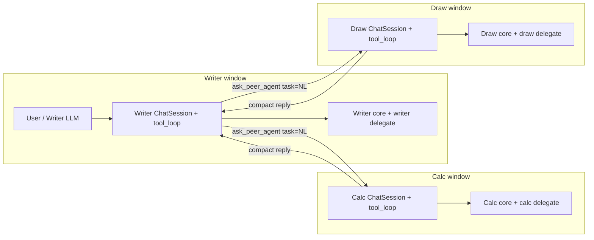
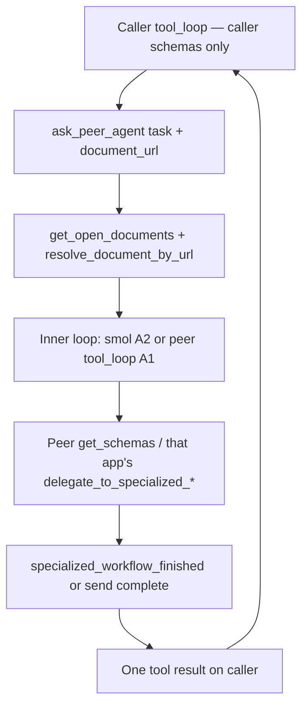

# Cross-app sidebar peer messaging (Writer ↔ Calc ↔ Draw)

**Status:** Design only (no product code).  
**One-liner:** three peers, A2 + pre-open only, GMP via a staged Draw/Writer form (not a PDF product claim), no spawn.

**Assumption:** Writer, Calc, and Draw documents are already open in **one LibreOffice process** / one WriterAgent extension. That is background, not a reason to invent a bus. Talk-to-already-open is enough for SAR/floorstand (Writer ↔ Calc) and GMP (Writer ↔ Draw). Creating or spawning a peer mid-session is later product polish.

This is **not** an IPC problem. WriterAgent already has plenty of process and thread plumbing (MCP HTTP, venv RPC, `queue_executor`, stream queues). The research question is: how **sidebar agent loops** — Writer-context, Calc-context, and Draw-context — can **exchange natural-language tasks and results** by reusing the machinery that already hands work to another agent-like loop.

---

## 1. Problem framing

A user (or an eval harness) has two or three windows open in the same LibreOffice process. Each window has (or can have) its own WriterAgent sidebar.

| Instance | Bound document | Main-chat tool surface | Chat loop |
| -------- | -------------- | ---------------------- | --------- |
| Writer sidebar | That Writer model (`frame.getController().getModel()`) | Writer **core** tools + `delegate_to_specialized_writer_toolset` | `ChatSession` + `ToolCallingMixin` |
| Calc sidebar | That Calc model | Calc **core** tools + `delegate_to_specialized_calc_toolset` | A **second** `ChatSession` + `ToolCallingMixin` |
| Draw sidebar | That Draw model (`com.sun.star.drawing.DrawingDocument`) | Draw **core** tools + `delegate_to_specialized_draw_toolset` | A **third** `ChatSession` + `ToolCallingMixin` |

They already share the process: one `ToolRegistry` (`plugin.main.get_tools()`), one `ServiceRegistry` (`get_services()`), one UNO Desktop, one `LlmClient` stack, one history DB file, one memory/skills directory. What they do **not** share is a conversation or a tool schema. Each send builds schemas for **that** `doc_type` and executes tools against **that** `ToolContext.doc`.

**What the user wants:** the Writer agent can ask the Calc agent to do Calc work, or the Draw agent to do Draw work (and any reverse), in natural language, and get a reply back — without the Writer loop suddenly advertising `write_formula_range` or `shape_upsert`, and without the Calc loop advertising `apply_document_content`.

**What this is not:**

- Switching Writer ↔ Calc ↔ Draw tools inside one agent loop (in-place `active_specialized_domain` is for **same-app** domains).
- Unioning peer write tools onto the caller’s wire schemas. Always **rebind** `ToolContext`.
- Turning `document_research` into a writer. Sibling reads stay read-only (`ToolContext.read_only_target`, `READ_ONLY_TARGET`).
- A new inter-process or in-process message bus (queues, sockets, `storeToURL`, udprops-as-mail, file-drop).
- Opening, creating, or spawning a peer mid-session. The peer document must already be open. No matching open peer → **error**, not a silent create.
- Product PDF editing or an AcroForm API. See [§4.4](#44-gmp-staging--not-a-pdf-product).

The product move is the one chat already knows: **a gateway tool whose argument is a natural-language `task`, which runs another agent-like loop in the peer document’s context and returns one compact result.**

Any of the three can initiate. The diagram shows Writer as caller because that is the usual SAR/GMP shape; Calc ↔ Draw is the same tool.

---

## 2. Inventory of reusable infra

What already moves a **task** into another agent-like loop and a **result** back. Cite these; do not invent a second handoff.

### 2.1 Specialized delegation (the pattern to copy)

This is the closest existing “talk to another agent” feature.

| Piece | Symbol / path | What it already does |
| ----- | ------------- | -------------------- |
| Shared gateway base | `DelegateToSpecializedBase` in [`plugin/doc/specialized_base.py`](../../plugin/doc/specialized_base.py) | Core-tier, `long_running = True`, `is_async()` → True. Args: `domain` + **`task`** (NL). Sub-agent path: gather domain tools → `build_toolcalling_agent` → `SmolAgentExecutor.execute_safe` → one JSON result. |
| Writer / Calc / Draw gateways | `DelegateToSpecializedWriter` / `DelegateToSpecializedCalc` / `DelegateToSpecializedDraw` | Names: `delegate_to_specialized_writer_toolset`, `delegate_to_specialized_calc_toolset`, `delegate_to_specialized_draw_toolset`. Filtered by `uno_services` (`TextDocument` vs `SpreadsheetDocument` vs `DrawingDocument` + `PresentationDocument`). |
| Domain grouping | `ToolWriterSpecialBase`, `ToolCalcSpecialBase`, `ToolDrawSpecialBase` | `tier = "specialized"`, `specialized_domain`. Hidden from default lists via `_DEFAULT_EXCLUDE_TIERS` in [`plugin/framework/tool.py`](../../plugin/framework/tool.py). |
| Inner HTTP / ReAct | `WriterAgentSmolModel`, `build_toolcalling_agent`, `SmolToolAdapter`, `SmolAgentExecutor` in [`plugin/chatbot/smol_agent.py`](../../plugin/chatbot/smol_agent.py) | Same `LlmClient` as main chat. Sync tools marshal to the main thread. Completion tool: `specialized_workflow_finished`. |
| In-place alternative | `USE_SUB_AGENT` in [`plugin/framework/constants.py`](../../plugin/framework/constants.py) | `False`: `ctx.set_active_domain_callback(domain)` swaps **this** session’s schemas until `specialized_workflow_finished`. Same loop, different tools — **not** a peer agent. |
| Prompt teaching | `WRITER_SPECIALIZED_DELEGATION_TEMPLATE` / `CALC_SPECIALIZED_DELEGATION_TEMPLATE` / `DRAW_SPECIALIZED_DELEGATION_TEMPLATE` in [`plugin/framework/prompts.py`](../../plugin/framework/prompts.py) | Main model is told **when** to call the gateway and which `domain` strings exist. |

Docs: [writer/specialized-toolsets.md](../writer/specialized-toolsets.md), [calc/specialized-toolsets.md](../calc/specialized-toolsets.md), [draw/impress-specialized-toolsets.md](../draw/impress-specialized-toolsets.md), [smol-tool-architecture.md](smol-tool-architecture.md).

**Handoff contract (already shipped):** outer model calls one tool with a `task` string → inner loop runs with a **focused** tool list and its own `ToolContext` → inner calls a finish tool → outer gets `{status, message, result}`. The outer wire schema does not grow.

Draw is not an afterthought on this path. The Draw gateway already exists; peer-ask **reuses** it after `ToolContext` is bound to a Draw model.

### 2.2 Main sidebar chat loop (the three instances)

| Piece | Symbol / path | What it already does |
| ----- | ------------- | -------------------- |
| Per-document session | `ChatSession` in [`plugin/chatbot/panel.py`](../../plugin/chatbot/panel.py) | One transcript per sidebar. `active_specialized_domain` is **session-local**. History via `get_chat_history(session_id)`. |
| Session identity | `ChatPanelElement._setup_sessions` in [`plugin/chatbot/panel_factory.py`](../../plugin/chatbot/panel_factory.py) | `WriterAgentSessionID` udprop (URL hash or UUID). Librarian uses a **global** id (`LIBRARIAN_HISTORY_SESSION_ID`) — proof that some chats are already cross-document. |
| Frame → model | `SendButtonListener._get_document_model` → `get_document_from_frame` | Sidebar is bound to **its window**, not `Desktop.getCurrentComponent()`. This is why three loops stay on the right docs. |
| Send entry | `SendButtonListener._do_send` → `ToolCallingMixin._do_send_chat_with_tools` | User text → schemas for `doc_type_str` → `build_tool_execute_fn` → `_start_tool_calling_async`. |
| Tool context per call | `build_tool_execute_fn` in [`plugin/chatbot/tool_loop_actions.py`](../../plugin/chatbot/tool_loop_actions.py) | Builds `ToolContext(doc=…, doc_type=…, caller="chat", set_active_domain_callback=…, stop_checker=…)`. |
| FSM | `next_state` in [`plugin/chatbot/tool_loop_state.py`](../../plugin/chatbot/tool_loop_state.py) | Pure. Gateway names are listed in `DELEGATE_GATEWAY_TOOL_NAMES` (already includes the Draw delegate). Side effects stay in the interpreter. |
| Schema filter | `ToolRegistry.get_schemas("openai", doc_type=…)` | Default excludes `specialized`, `specialized_control`, **and** `mcp`. `tool_supports_document` matches `uno_services` / `doc_types`. |

Two or three open sidebars are that many `SendButtonListener` objects, each with its own `ChatSession`, drain queue, and `ToolContext.doc`. There is **no** production registry of live panels today — only a **debug** `WeakSet` (`register_debug_live_panel` / `iter_debug_live_chat_panels` in `panel_factory.py`, plus `iter_live_chat_panels` in [`plugin/chatbot/sidebar_test_hooks.py`](../../plugin/chatbot/sidebar_test_hooks.py)).

Draw already registers a sidebar deck (`DrawingDocument` in `extension/registry/.../Sidebar.xcu`). A2 does not need that deck constructed; the open Draw **model** is enough.

### 2.3 Nested inner loops that rebind `ToolContext.doc`

`document_research` already runs a **second** (and third) agent on a **different** model without giving the main loop that file’s write tools.

| Piece | Symbol / path | Relevance |
| ----- | ------------- | --------- |
| Outer domain | `delegate_*(domain="document_research", task=…)` | Main stays on active-doc core tools. |
| Inner read agent | `run_inner_read_agent` / `DelegateReadDocument` in [`plugin/doc/document_research_specialized.py`](../../plugin/doc/document_research_specialized.py) | New `ToolContext(doc=opened_model, doc_type=…, read_only_target=True)`. Allowlist `READ_TOOLS_BY_DOC_TYPE` already includes Draw (`list_pages`, `get_draw_tree`). Same `build_toolcalling_agent` + `specialized_workflow_finished`. |
| Open-doc catalog | `get_open_documents` in [`plugin/doc/document_research.py`](../../plugin/doc/document_research.py) | Desktop components → `{name, url, uid, path, doc_type, is_active, modified}`. Labels Writer / Calc / Draw. Main-thread only. |
| Resolve open model | `resolve_document_by_url` in [`plugin/framework/uno_context.py`](../../plugin/framework/uno_context.py) | File URL **or** `RuntimeUID` (untitled). Returns `(model, doc_type)` with `doc_type` in `writer` / `calc` / `draw`. |
| MCP listing tool | `ListOpenDocuments` in [`plugin/doc/document_research_tools.py`](../../plugin/doc/document_research_tools.py) | `tier="mcp"` — **not** on sidebar `get_schemas`. Facade over `get_open_documents`. |
| Write guard | `ToolRegistry.execute` when `ctx.read_only_target` | Mutation → `READ_ONLY_TARGET`. Do not relax this for research. |

Docs: [multi-document-dev-plan.md](multi-document-dev-plan.md). Phase 0 decision #4: write-back to siblings is **out of scope** for research. Peer messaging is a **different** feature: writes happen inside a **peer-context agent** (Writer, Calc, or Draw), not inside the research allowlist.

**Hypothesis (verified against current code):** extending A2’s `ToolContext` retarget to Draw is the **same pattern** as Calc. `run_inner_read_agent` already takes a `doc_type` and builds a new context on `opened_model`. `registry.get_tools(doc=peer_model, doc_type=peer)` already filters by `uno_services`. There is no Draw-specific factory to invent. The peer-ask difference from research is only `read_only_target=False` plus the peer’s **core + that app’s existing delegate**, not the research allowlist.

Implementers must **not** copy the caller’s cached `uno_services_supported` onto the inner context (research currently inherits the parent’s cache). Derive services from the **peer** model (`get_document_uno_services` / `uno_services_for_document`) so a Writer caller does not leave Writer services on a Draw inner loop.

### 2.4 Other “handoffs” (weaker fit, still real)

| Piece | Why it is in the inventory | Why it is not the design center |
| ----- | -------------------------- | -------------------------------- |
| MCP `tools/call` + `document_url` | External host can target any open doc; `delegate_*` still runs an inner smol loop on that model. [`plugin/mcp/mcp_protocol.py`](../../plugin/mcp/mcp_protocol.py) | Host is **outside** the sidebars. Loopback HTTP to talk to yourself is transport, not “agents chatting.” |
| MCP result toast | `SendButtonListener._on_mcp_result` posts `[MCP Result]` onto **a** sidebar | Display of an external call, not a peer ask. |
| `EventBus` | [`plugin/framework/event_bus.py`](../../plugin/framework/event_bus.py) — sync pub/sub (`config:changed`, MCP request/result) | Fan-out of process events, not a conversation. |
| `history_db` | [`plugin/chatbot/history_db.py`](../../plugin/chatbot/history_db.py) — SQLite/JSON keyed by `session_id` | Persistence of **one** transcript. Mixing Writer/Calc/Draw tool turns in one session is the anti-pattern. |
| `MemoryStore` / `SkillStore` | [`plugin/chatbot/memory.py`](../../plugin/chatbot/memory.py), [`plugin/chatbot/skills.py`](../../plugin/chatbot/skills.py) | Profile-global files (`USER.md`, skills). Shared memory ≠ peer turn. |
| `WriterCompoundUndo` | [`plugin/writer/edit_review.py`](../../plugin/writer/edit_review.py) | Per-document undo on the **writer** of that doc. Peer writes stay on the peer model’s undo stack. |
| udprops | [`plugin/doc/udprops.py`](../../plugin/doc/udprops.py) `get_document_property` / `set_document_property` | Already stores `WriterAgentSessionID`. Identity, not a mailbox. |

### 2.5 Threading (only as it constrains the handoff)

Colors from [uno-thread-safety.md](../framework/uno-thread-safety.md): **RED** = main/UNO, **BLUE** = workers (`run_in_background`), **YELLOW** = sync host dispatch (must not block on `execute_on_main_thread`).

Existing delegation already crosses BLUE → RED: `DelegateToSpecializedBase.is_async()` runs on a worker; `get_tools(doc=…)` and UNO reads go through `queue_executor.execute_on_main_thread`; `SmolToolAdapter` marshals sync tools. A peer-ask gateway should be the same color (`long_running`, `is_async()`), not a new queue color.

Sidebar send already owns a drain loop (`_start_tool_calling_async`). `tool_loop.py` warns against nested re-entry of `_do_send_chat_with_tools` / `_start_tool_calling_async` (nested drain). That matters if the **caller** wait sits inside an active Writer send while the **peer** send also drains — see [§5](#5-open-questions--risks).

---

## 3. Candidate designs

Ranked by **reuse of agent-loop handoff** and **trust** (each app keeps its own tools; research stays read-only). IPC-shaped ideas are discarded, not designed.

### A. Recommended — Peer-ask gateway (delegation shape, peer document context)

Add a **core-tier** tool on Writer, Calc, **and** Draw main lists, same *shape* as `delegate_to_specialized_*`:

- **Name (illustrative):** `ask_peer_agent` (or `delegate_to_open_peer_agent`). Not an existing API.
- **Args:** `task` (natural language, reuse `DELEGATE_SPECIALIZED_TASK_PARAM_HINT` tone) + `document_url` (URL or RuntimeUID from `get_open_documents`). If several peers of the same app are open, `document_url` / uid (or a name that matches exactly one open doc) is **required**. Never silently pick the first Calc or first Draw.
- **Behavior:** Do **not** change the caller’s `active_specialized_domain` or wire schemas. Resolve the peer **open** model. Run an **inner agent loop** whose `ToolContext` is bound to **that** model and whose schemas are **that** app’s core + that app’s existing `delegate_to_specialized_*`. Wait for the inner finish tool / send completion. Return one compact NL (or structured) reply to the caller.

Two implementation variants of the **same** product tool — choose at build time, not as two user-visible tools:

| Variant | What the inner loop is | Reuse | Fit to “other sidebar’s agent” |
| ------- | ---------------------- | ----- | ------------------------------ |
| **A1. Drive the live peer sidebar** | The other window’s existing `ChatSession` + `ToolCallingMixin._do_send_chat_with_tools` | Highest fidelity to “two sidebars chat.” Needs a **production** weak map of live panels (today debug-only) keyed by `get_runtime_uid(model)` across Writer, Calc, **and** Draw, plus an extracted “run one user turn, return final assistant text” entry on the mixin. | The peer transcript is the conversation partner. User sees the ask on that sidebar. |
| **A2. Fresh peer-context inner loop** | `DelegateToSpecializedBase`-class path: `build_toolcalling_agent` + `SmolAgentExecutor.execute_safe` with `ToolContext(doc=peer_model, doc_type=peer, read_only_target=False)` and `get_schemas` / `get_tools` for the **peer** `doc_type` (core + peer gateway). Same nesting as `run_inner_read_agent`, **without** the read-only allowlist. | Highest reuse of specialized_base / smol. No live-panel registry required. Open Writer / Calc / Draw doc is enough. | Same *kind* of agent (that app’s tools, that doc), but **not** the user’s peer sidebar history unless you also `add_user_message` / append a summary to that `ChatSession`. |

**Recommendation:** ship the **tool contract** as A; implement **A2 first** for Writer, Calc, **and** Draw (it is the specialized-delegation clone with a retargeted `ToolContext`), and treat **A1** as the follow-up when the product requirement is “the other sidebar’s transcript participates.” A2 already satisfies the rule: Writer never receives Calc or Draw write tools; peer work runs in a peer-context loop. A1 is the same rule plus UI/history identity.

A2 must **not** be implemented by adding Calc or Draw names to the Writer registry listing. It must **rebind** `ToolContext.doc` / `doc_type` / `uno_services_supported` the way `run_inner_read_agent` already does, then list tools for **that** binding.

### B. Strong but rejected as the *only* path — “Just call the other app’s delegate”

Writer already has `delegate_to_specialized_writer_toolset`; Calc and Draw have twins. One might hope Writer could call `delegate_to_specialized_calc_toolset` or `delegate_to_specialized_draw_toolset`.

**Why this is insufficient:** those gateways’ `uno_services` are `SpreadsheetDocument` or `DrawingDocument` (+ Impress). `ToolRegistry.execute` + `tool_supports_document` reject them when `ctx.doc_type` is Writer. Even if you forced the name, the inner `ctx.doc` would still be the **Writer** model (`build_tool_execute_fn` passes the sidebar’s doc). The Calc/Draw gateway is not a peer address; it is “specialized domains **of this document**.”

Useful as an **inner** step **after** `ToolContext` is rebound to the peer model (A2), not as the Writer main-list entry.

### C. Discard — In-place switch of Writer ↔ Calc ↔ Draw tools on one loop

`USE_SUB_AGENT = False` + `set_active_domain_callback` already swaps **same-app** specialized domains on **this** `ChatSession`. Extending that to “now you are Calc” or “now you are Draw” would put foreign schemas on a Writer history, mix `[DOCUMENT CONTENT]` snapshots, and violate the “do not switch app tools inside one loop” rule. `document_research` already **refuses** in-place mode (`DOCUMENT_RESEARCH_REQUIRES_SUB_AGENT`). Same instinct here: **new loop, compact result.**

### D. Discard — Make `document_research` write the sibling

`run_inner_read_agent` is the only shipped “other doc” inner loop. Flipping `read_only_target` or expanding `READ_TOOLS_BY_DOC_TYPE` with `write_formula_range` / `shape_upsert` would turn research into a silent writer of files the user thought were inspect-only. Trust model in [multi-document-dev-plan.md](multi-document-dev-plan.md) is explicit. Peer writes belong in a **named peer-ask** path, not research.

### E. Discard as off-topic — MCP / HTTP / EventBus / udprops / files as the message

| Idea | Why people reach for it | Why it is the wrong center |
| ---- | ------------------------ | -------------------------- |
| Writer sidebar `POST`s localhost MCP `tools/call` at the peer `document_url` | MCP already targets open docs | Same process talking to itself over HTTP. No auth. The host is not the other sidebar agent. |
| Module-level `queue.Queue` / `EventBus` topic between panels | Same-process sharing | Invents in-proc IPC. Chat already returns results from inner loops without a mailbox. |
| Write task JSON into udprops / `history_db` / `USER.md` / a drop folder | Shared disk is visible to both | Persistence and identity, not a turn. No “inner LLM loop.” |
| Collabora / coolwsd service bus | [collabora-online-ai.md](collabora-online-ai.md) | Different product (kit IPC). Out of scope — see [§6](#6-non-goals). |

Keep MCP as it is: **external** clients. A future MCP host can call the same `ask_peer_agent` by name if we register it core-tier; that is reuse of the **tool**, not MCP-as-transport between sidebars.

---

## 4. Recommended approach

**Product:** a core-tier **peer-ask gateway** on Writer, Calc, and Draw main chats. The caller model uses it when it needs another **already-open** app’s writes. The caller loop does not change tools. The reply is one tool result, like specialized delegation.

**Implementation center:** clone the `DelegateToSpecializedBase` handoff (NL `task` → inner `LlmClient` loop → finish tool → compact result), and retarget `ToolContext` the way `run_inner_read_agent` already retargets `doc` / `doc_type`. Do not build a bus. Do not union peer write tools onto the caller.

### 4.1 Addressing (open docs only)

v1 talks to documents that are **already open**. Harness pre-open is in scope; mid-session create/spawn is not.

**Resolve the peer (RED, existing helpers):**

1. `get_open_documents(ctx.ctx, ctx.doc)` — list candidates. Reject self (`is_active` / same RuntimeUID / same model).
2. Accept only these UNO services as v1 peers:
   - `com.sun.star.text.TextDocument` (Writer)
   - `com.sun.star.sheet.SpreadsheetDocument` (Calc)
   - `com.sun.star.drawing.DrawingDocument` (Draw)
3. `resolve_document_by_url(ctx.ctx, document_url)` — bind the open model by file URL **or** RuntimeUID. Do not `loadComponentFromURL` a closed file (that is research’s hidden-open path).
4. After resolve, confirm the model’s **exact** `doc_type` + `uno_services` the way Draw already filters `delegate_to_specialized_draw_toolset` (`DrawingDocument`). `get_open_documents` currently labels both Draw and Impress as `doc_type: "draw"`; v1 peer-ask must still require `DrawingDocument` and **reject** Impress (`PresentationDocument` only).
5. Ambiguous set (two `.ods`, two Draw forms, untitled twins): require `document_url` / uid, or a `name` that matches **exactly one** open candidate. **Never** silently pick the first Calc or first Draw.
6. No matching open peer → return a clear tool error. Do not create, load, or spawn.

Optional later (A1): promote the debug live-panel `WeakSet` to a process-wide weak map keyed by `get_runtime_uid(model)` across all three apps so A1 can find `SendButtonListener`. Until then A2 does not need it.

### 4.2 Call sites / modules (no code here)

**New tool (when implemented):** live under [`plugin/doc/`](../../plugin/doc/) next to the other cross-app gateways, registered from [`plugin/doc/common_module.py`](../../plugin/doc/common_module.py) `auto_discover`. `tier = "core"`, `long_running = True`, `is_async()` True, `requires_document_lock` like other mutating delegates (peer **writes** lock the **peer** uid, not the caller — same idea as MCP’s per-document gate, but this is sidebar-to-sidebar). `uno_services` / `doc_types` must allow **Writer + Calc + Draw** (union of `TextDocument`, `SpreadsheetDocument`, `DrawingDocument`), because all three main lists advertise the same ask tool. Impress stays off the v1 union.

**Inner loop (A2 — first implementation, all three apps):**

1. Build `ToolContext` like `run_inner_read_agent`, but `read_only_target=False`, `doc_type` = peer type, `uno_services_supported` from the **peer** model (not the caller cache), `caller` inherited, `stop_checker` / `send_cancellation` copied from parent.
2. `registry.get_schemas("openai", doc_type=peer)` **or** smol wrap of `get_tools(doc=peer_model, doc_type=peer)` with default tier exclusion — **peer core + that peer’s `delegate_to_specialized_*` only**.
   - Inner Calc still uses `delegate_to_specialized_calc_toolset` for pivot/charts/etc.
   - Inner Draw still uses `delegate_to_specialized_draw_toolset` for shapes/forms/etc. Compact DOM for replies: `get_draw_tree` (already Draw core; research already allowlists it).
   - Writer never sees those peer names on its own wire list.
3. `build_toolcalling_agent` + `SmolAgentExecutor.execute_safe` in [`plugin/chatbot/smol_agent.py`](../../plugin/chatbot/smol_agent.py), finish with `specialized_workflow_finished`. Instructions: you are the **peer app** agent for **this** open file; do the `task`; return a compact answer for the sibling agent. Reuse `get_examples_block` with a new key (e.g. `peer:calc`, `peer:draw`) or the generic delegate block.
4. Gateway `execute` returns the same `{status, message, result}` shape as `DelegateToSpecializedBase`.

**Inner loop (A1 — later, same tool name):**

1. Find peer `SendButtonListener` via uid (map covers Writer, Calc, and Draw).
2. Extract a **non-UI** “run this `query_text` on this host” from `_do_send` / `_do_send_chat_with_tools` (today `_do_send` also clears the Ask box and assumes a click). That extracted function is the missing piece; it is still the chat loop, not a queue.
3. `ChatSession.add_user_message(task)` on the **peer** session so that transcript shows the caller’s ask.
4. Wait for that send’s drain to finish (peer already uses `StreamQueueKind` + `run_stream_drain_loop`). Return last assistant text. If the peer loop is already in a send, fail clearly (one send per sidebar today) or queue **on that listener**, not in a new global mailbox.

**Main-loop wiring (caller side, already exists):**

- `ToolCallingMixin._do_send_chat_with_tools` — no schema change except the new core tool appearing in `get_tools().get_schemas(...)`.
- `build_tool_execute_fn` — same `ToolContext` for the **caller** doc; the gateway internally builds the **peer** context (like `DelegateReadDocument.execute` does today).
- `DELEGATE_GATEWAY_TOOL_NAMES` in `tool_loop_state.py` — add the new name if status/preview should match other gateways (Draw’s delegate is already listed).
- Prompts: a short block next to the Writer / Calc / Draw specialized-delegation templates — “need the other **open** app’s writes? `ask_peer_agent`. Need a **file** fact only? `document_research`.”

**Undo / focus:** peer mutations use the peer document’s undo (`WriterCompoundUndo` only if the peer is Writer). Do not steal the user’s active frame: A2 must not change `Desktop` current component; A1 should append to the peer sidebar without `toFront` unless the user asked to watch. Research’s “active window unchanged” rule applies.

**Triple open:** Writer + Calc + Draw at once is fine for eval if each agent writes **only** its bound doc. Research on siblings stays read-only. Do not treat three open windows as a reason to merge tool lists.

### 4.3 Why this is the least new machinery

Almost every box is an existing symbol. The new work is: one core tool, a peer `ToolContext` factory (refactor the construction in `run_inner_read_agent` so research stays read-only and peer-ask does not share that flag; **same factory for Calc and Draw**), prompt lines, and later a live-panel map for A1.

### 4.4 GMP staging — not a PDF product

GDPval GMP change-control ([`docs/eval/gdpval/58ac1cc5-…`](../eval/gdpval/58ac1cc5-5754-4580-8c9c-8c67e1a9d619/README.md)) ships a **gold PDF** form. That gold file is **not** a v1 peer surface.

**Port path:** the harness **pre-opens** an **editable Draw (or Writer) stand-in** for the form — text boxes / shapes the Draw (or Writer) agent can already write. `ask_peer_agent` fills that stand-in. It does **not** fill arbitrary PDFs.

**Staging fact, not a product claim:** LibreOffice’s File → Open on a PDF often imports as **editable Draw text and shapes**, not live AcroForm widgets. A headed poke may therefore land the gold PDF in Draw. That is a convenient **eval/harness staging** choice (convert or import once, then treat the result as a normal Draw document). It is **not** “WriterAgent edits PDFs” and **not** an AcroForm API. v1 must not claim `ask_peer_agent` fills PDFs.

Fill the staged Draw form with Draw tools the inner loop already has: `get_draw_tree` (compact DOM / reply), `delegate_to_specialized_draw_toolset` → `shape_upsert` / tree edits, and shared `form_*` **if** those tools apply to the stand-in. Do not add a PDF-specific tool for this gold.

### 4.5 Worked scenarios

**SAR / floorstand (Writer ↔ Calc).** User (Writer sidebar): “Take Q4 revenue from the open budget workbook and add a table here.”

1. Writer main keeps Writer tools. It may `document_research` **or** `ask_peer_agent` depending on whether it only needs figures or needs the **Calc agent** to compute/format on the sheet.
2. For writes on the workbook: `ask_peer_agent(document_url=<budget uid>, task="Compute Q4 revenue by region and return an HTML table plus the ranges you used.")`.
3. Inner Calc-context loop: `get_sheet_summary` / `read_cell_range` / maybe `delegate_to_specialized_calc_toolset(domain=…)` / `write_formula_range` **on the Calc model only**.
4. Finish tool returns a compact payload to Writer.
5. Writer main `apply_document_content` on the **Writer** doc.

The reverse (Calc asks Writer to draft a paragraph) is the same tool with a Writer uid.

**GMP-style (Writer ↔ Draw), staged form.** Writer risk memo is open; harness has already opened the **editable Draw stand-in** of the change-control form (not the gold PDF as the write target).

1. Writer main drafts the risk memo with Writer tools. It does not grow Draw write tools.
2. `ask_peer_agent(document_url=<stand-in uid>, task="Fill the change-control fields from this discrepancy summary: … Return get_draw_tree of the filled page.")`.
3. Inner Draw-context loop: `get_draw_tree` to locate text/shape fields → `delegate_to_specialized_draw_toolset` (`shape_upsert`, tree, `form_*` if present) **on the Draw model only**.
4. Compact tree/summary returns to Writer. Writer cites the form in the memo; it does not edit the Draw doc itself.

The reverse (Draw asks Writer for a risk paragraph to paste into a shape) is the same tool with a Writer uid.

Harness pre-open of both documents is enough. Do not spawn the Draw form from the Writer send.

---

## 5. Open questions / risks

| Topic | Notes |
| ----- | ----- |
| **Who initiates** | Any of the three sidebars. The tool is symmetric. No supervisor process. |
| **A1 vs A2** | A2 is implementable with today’s specialized_base + `run_inner_read_agent` retargeting for Writer, Calc, and Draw. A1 is the literal “other sidebar’s agent” but needs a production panel map (uid-keyed, all three apps) and a non-click send entry. Product call: is the peer **transcript** part of the feature, or only peer **tools + that doc**? |
| **Focus steal** | Frame-bound `_get_document_model` is already the right binding. Inner UNO must not activate the peer frame. Hidden research opens already have this constraint. |
| **Wrong-doc writes** | Defense is `ToolContext.doc` + `tool_supports_document`, not a bus key. Never execute Calc or Draw writes with the Writer `ctx.doc`. Copy the research pattern of building a **new** context; do not mutate the caller’s. |
| **Nested drain / latency** | Writer send is waiting on a `long_running` async tool while the inner loop does more LLM rounds. That is **already** how `delegate_to_specialized_*` and `document_research` work (`is_async`, worker + main-thread marshal). A1 must **not** nest a second `_start_tool_calling_async` on the **same** listener (see comment in `tool_loop.py`). Peer listener is a different host — still two drains; UI thread must stay one `processEventsToIdle` owner. Prefer A2’s smol `execute_safe` on the worker (known pattern) until A1 is designed against [streaming-and-threading.md](../framework/streaming-and-threading.md). |
| **Peer sidebar busy** | A1: fail or wait if the peer is already sending. A2: independent inner loop; user may also type in the peer — two writers on one model. MCP already serializes mutating `tools/call` per uid; sidebar chat does **not** take that gate. Decide whether peer-ask should take the same per-document lock (`ToolBase.requires_document_lock`). |
| **Peer sidebar not constructed** | LibreOffice may not create the Calc/Draw deck until the user opens it. A2 still works (open model + registry). A1 cannot. Error: “No peer-context agent available” vs silent A2 fallback — pick one and prompt it. v1 is A2, so “deck not built” is not a failure. |
| **No matching open peer** | Hard error. Do not create, load, or pick another app’s doc. |
| **Ambiguous peers** | Two Calcs or two Draws: require `document_url` / uid (or an unambiguous name). Never default to first. |
| **Auth** | None beyond the user’s machine. Same as sidebar tools today. Do not route through MCP just to feel like auth. |
| **Cycles** | Writer asks Calc asks Writer (or Draw). Cap depth (research already nests only outer→inner once). Inner peer-ask should be forbidden or depth=1. |
| **Untitled / many of one app** | `RuntimeUID` is the handle (`get_runtime_uid`). Gateway errors if the ask is ambiguous. |
| **Prompt vs tool** | Without a prompt line, models will keep using `document_research` for everything or hallucinate Calc/Draw tools. Teach the split explicitly. |
| **Impress** | Out of v1 even though `get_open_documents` may label it `draw`. Same tool can grow a PresentationDocument check later. |
| **GMP gold PDF** | Stay on the staged Draw/Writer stand-in. Do not let prompts talk as if `ask_peer_agent` edits PDFs. |

---

## 6. Non-goals

- **In-process or OS IPC as the feature.** No new mailbox, socket, named pipe, `storeToURL` bus, udprop mailbox, or file-drop protocol. Same-process is why a Python call can start the inner loop — not why we invent a bus.
- **Cross-process soffice.** If two user profiles / two processes ever appear, live-panel lookup and in-process `ToolContext` retargeting do not apply. Do not design for that. MCP might reach the other process by accident; that is not this feature.
- **Collabora Online / coolwsd service bus** or kit-protocol AI ([collabora-online-ai.md](collabora-online-ai.md)).
- **One mega-agent** that lists Writer, Calc, and Draw write tools together.
- **Write-enable `document_research`** or hidden-open of closed files for mutation.
- **Mid-session create / spawn** of a peer document. v1 requires the peer already open (user or harness). Error if none matches.
- **Product PDF editing / AcroForm API.** Gold PDFs are not peer surfaces. LO PDF→Draw import is harness staging, not a shipped PDF filler.
- **Impress as a v1 peer.** Optional later wedge; Draw (`DrawingDocument`) ships with Writer and Calc.
- **Menu “Chat with Document”** (no tool-calling today).
- **Hermes / ACP** as the peer transport (optional later if a backend is the sidebar, not required).
- **Per-client MCP LLM profiles** or exposing specialized tiers on MCP for this.

---

## 7. Related docs

- [specialized-toolsets (Writer)](../writer/specialized-toolsets.md) — gateway, tiers, `USE_SUB_AGENT`
- [specialized-toolsets (Calc)](../calc/specialized-toolsets.md) — Calc domains and in-process PyUNO
- [specialized-toolsets (Draw/Impress)](../draw/impress-specialized-toolsets.md) — `delegate_to_specialized_draw_toolset`, `get_draw_tree`, shapes/forms
- [smol-tool-architecture.md](smol-tool-architecture.md) — two runtimes, one `LlmClient`
- [multi-document-dev-plan.md](multi-document-dev-plan.md) — open docs, read-only research, `ToolContext` retarget (peer-ask is the write-side complement)
- [sidebar-implementation.md](sidebar-implementation.md) — frame-bound panel, send pipeline
- [mcp-protocol.md](../mcp-protocol.md) — external host, `document_url`, not sidebar-to-sidebar
- [uno-thread-safety.md](../framework/uno-thread-safety.md) / [threading.md](../framework/threading.md) — RED/BLUE, `execute_on_main_thread`
- [GDPval GMP gold `58ac1cc5`](../eval/gdpval/58ac1cc5-5754-4580-8c9c-8c67e1a9d619/README.md) — materials only; peer/Draw port is separate work
