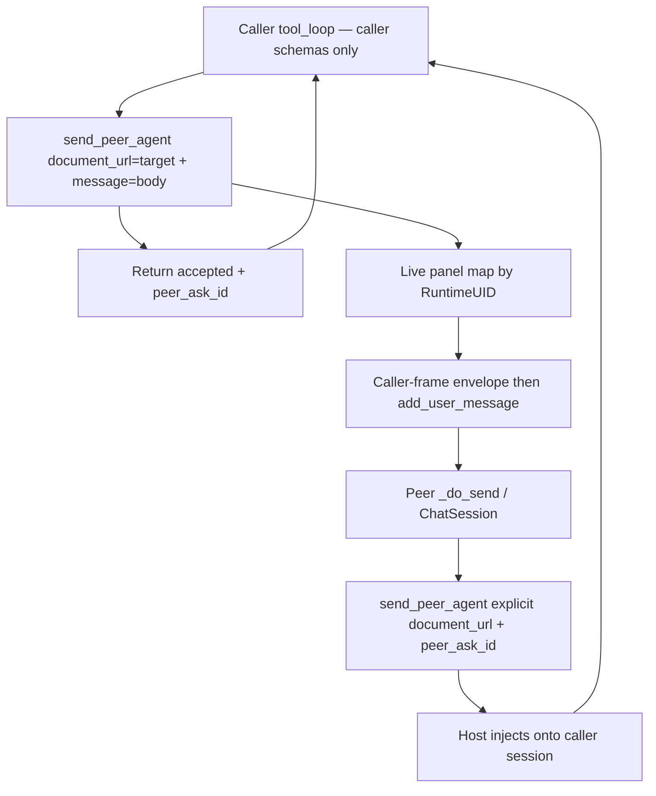

# Cross-app sidebar peer messaging (Writer ↔ Calc ↔ Draw)

**Status:** Design only (no product code).  
**One-liner:** three peers, A1 async `send_peer_*` (user-send equivalence), pre-open only, GMP via a staged Draw/Writer form (not a PDF product claim), no spawn.

**Assumption:** Writer, Calc, and Draw documents are already open in **one LibreOffice process** / one WriterAgent extension. Talk-to-already-open is enough for SAR/floorstand (Writer ↔ Calc) and GMP (Writer ↔ Draw). Creating or spawning a peer mid-session is later product polish.

This is **not** an IPC problem and **not** a blocking inner-agent RPC. The product center is: one sidebar **sends a natural-language turn into another already-open sidebar**, as if the user typed there. The send tool **returns immediately**. The peer, when done, **sends back** (same tool) with a correlation id. No `ToolContext` rebind on the caller. No schema union.

---

## 1. Problem framing

A user (or an eval harness) has two or three windows open in the same LibreOffice process. Each window has (or can have) its own WriterAgent sidebar.

| Instance | Bound document | Main-chat tool surface | Chat loop |
| -------- | -------------- | ---------------------- | --------- |
| Writer sidebar | That Writer model (`frame.getController().getModel()`) | Writer **core** tools + `delegate_to_specialized_writer_toolset` | `ChatSession` + `ToolCallingMixin` |
| Calc sidebar | That Calc model | Calc **core** tools + `delegate_to_specialized_calc_toolset` | A **second** `ChatSession` + `ToolCallingMixin` |
| Draw sidebar | That Draw model (`com.sun.star.drawing.DrawingDocument`) | Draw **core** tools + `delegate_to_specialized_draw_toolset` | A **third** `ChatSession` + `ToolCallingMixin` |

They already share the process: one `ToolRegistry` (`plugin.main.get_tools()`), one `ServiceRegistry` (`get_services()`), one UNO Desktop, one `LlmClient` stack, one history DB file, one memory/skills directory. What they do **not** share is a conversation or a tool schema. Each send builds schemas for **that** `doc_type` and executes tools against **that** `ToolContext.doc`.

**What the user wants:** the Writer agent can send the Calc agent Calc work, or the Draw agent Draw work (and any reverse), in natural language. The other sidebar **shows the message and runs it**. A reply comes back later on the caller’s transcript. Writer never advertises `write_formula_range` or `shape_upsert`; Calc never advertises `apply_document_content`.

**What this is not:**

- A long-running `ask_*` that waits for a compact inner-loop result (optional later wrapper — see [§3 A2](#a2-demoted--optional-later--documented-escape-hatch)).
- Rebinding the caller’s `ToolContext` to the peer document.
- Switching Writer ↔ Calc ↔ Draw tools inside one agent loop (in-place `active_specialized_domain` is for **same-app** domains).
- Unioning peer write tools onto the caller’s wire schemas.
- Turning `document_research` into a writer. Sibling reads stay read-only (`ToolContext.read_only_target`, `READ_ONLY_TARGET`).
- A new inter-process or in-process message bus (queues, sockets, `storeToURL`, udprops-as-mail, file-drop).
- Opening, creating, or spawning a peer mid-session. No matching open peer → **error**, not a silent create.
- Product PDF editing or an AcroForm API. See [§4.5](#45-gmp-staging--not-a-pdf-product).

The product move: **`send_peer_agent(document_url=target, message=body)` queues one user-equivalent turn on the peer sidebar and returns `{status: accepted, peer_ask_id}`.** The caller puts **only** the task in `message` — never the source URL. The gateway derives the sender from the **caller frame** and prepends a code-inserted envelope before `add_user_message`. The peer’s own `_do_send` / `ChatSession` path does the work. When finished, the peer calls the same tool with an **explicit** `document_url` copied from that envelope (plus `peer_ask_id`). No last-sender default — with 3+ docs, “whoever messaged last” is the wrong target under fan-in.

```mermaid
sequenceDiagram
  participant W as Writer ChatSession
  participant WT as send_peer_agent
  participant C as Calc ChatSession
  W->>WT: document_url=target + message=body
  WT-->>W: accepted + peer_ask_id
  Note over W: Caller keeps its schemas; no from-url in body
  WT->>C: envelope from caller frame + body then add_user_message
  C->>C: _do_send / tool_loop on Calc tools
  C->>WT: send_peer_agent document_url=Writer + peer_ask_id + message
  WT->>W: same envelope inject onto caller session
```

Any of the three can initiate. Writer as first sender is the usual SAR/GMP shape; Calc ↔ Draw is the same tool.

---

## 2. Inventory of reusable infra

Cite these. Do not invent a bus. v1 copies the **sidebar send path**, not specialized-delegation’s blocking inner smol loop.

### 2.1 Main sidebar send (the pattern to copy)

This is user-send equivalence.

| Piece | Symbol / path | What it already does |
| ----- | ------------- | -------------------- |
| Per-document session | `ChatSession` in [`plugin/chatbot/panel.py`](../../plugin/chatbot/panel.py) | One transcript per sidebar. `active_specialized_domain` is **session-local**. History via `get_chat_history(session_id)`. |
| Send entry | `SendButtonListener._do_send` → `ToolCallingMixin._do_send_chat_with_tools` | Reads the Ask box, clears it, binds **this** frame’s model, builds schemas for **this** `doc_type`, starts that listener’s drain. |
| Tool context per call | `build_tool_execute_fn` in [`plugin/chatbot/tool_loop_actions.py`](../../plugin/chatbot/tool_loop_actions.py) | Builds `ToolContext(doc=…)` for **that** sidebar’s doc. The caller of `send_peer_*` does not rebind this. |
| Frame → model | `_get_document_model` → `get_document_from_frame` | Sidebar stays on **its** window. |
| FSM | `next_state` in [`plugin/chatbot/tool_loop_state.py`](../../plugin/chatbot/tool_loop_state.py) | Pure. `DELEGATE_GATEWAY_TOOL_NAMES` already includes the Draw delegate. |
| Schema filter | `ToolRegistry.get_schemas("openai", doc_type=…)` | Default excludes `specialized`, `specialized_control`, `mcp`. Precedent for hiding a tool: `filter_vision_delegate_schemas` in [`plugin/framework/tool.py`](../../plugin/framework/tool.py). |
| Live panels | Debug `WeakSet` only today (`register_debug_live_panel` / `iter_debug_live_chat_panels` in [`plugin/chatbot/panel_factory.py`](../../plugin/chatbot/panel_factory.py); `iter_live_chat_panels` in [`plugin/chatbot/sidebar_test_hooks.py`](../../plugin/chatbot/sidebar_test_hooks.py)) | A1 **requires** a production weak map keyed by `get_runtime_uid(model)` across Writer, Calc, and Draw. |

`_do_send` today also clears the Ask box and assumes a click. v1 needs a **non-UI** “run this `query_text` on this host” extracted from that path (same `ChatSession` + `_do_send_chat_with_tools`). That is still the chat loop, not a mailbox.

Draw already registers a sidebar deck (`DrawingDocument` in `extension/registry/.../Sidebar.xcu`). A1 still needs that deck **constructed once** so a live panel exists — see [§4.3](#43-live-panel--busy--deck).

### 2.2 Open-doc addressing (already shipped)

| Piece | Symbol / path | Relevance |
| ----- | ------------- | --------- |
| Open-doc catalog | `get_open_documents` in [`plugin/doc/document_research.py`](../../plugin/doc/document_research.py) | Desktop components → `{name, url, uid, path, doc_type, is_active, modified}`. Main-thread only. |
| Resolve open model | `resolve_document_by_url` in [`plugin/framework/uno_context.py`](../../plugin/framework/uno_context.py) | File URL **or** `RuntimeUID`. Returns `(model, doc_type)` in `writer` / `calc` / `draw`. |
| Write guard | `ToolRegistry.execute` when `ctx.read_only_target` | Research mutations → `READ_ONLY_TARGET`. Do not relax this. |

Docs: [multi-document-dev-plan.md](multi-document-dev-plan.md). Phase 0 decision #4: write-back to siblings is **out of scope** for research. Peer messaging is a **different** feature: writes happen because the **peer sidebar** ran a normal user turn on **its** bound doc.

### 2.3 Specialized delegation (contrast — A2 only)

`DelegateToSpecializedBase` + `build_toolcalling_agent` + `SmolAgentExecutor.execute_safe` is the closest shipped “task in, compact result out” loop. Writer / Calc / Draw already have `delegate_to_specialized_*` (`DrawingDocument` + `PresentationDocument` on the Draw gateway).

That path **rebinds** a fresh `ToolContext` and **blocks** the caller tool until `specialized_workflow_finished`. It is the right shape for **A2** (optional later / documented escape hatch). It is **not** v1. Draw is already first-class on this path; A1 does not need a Draw-specific send factory — same panel map + `_do_send` as Calc.

`document_research` / `run_inner_read_agent` also rebind `ToolContext` (read-only allowlist, including Draw `list_pages` / `get_draw_tree`). Keep that for sibling **reads**. Do not flip `read_only_target` to implement peer writes.

### 2.4 Other “handoffs” (weaker fit)

| Piece | Why people reach for it | Why it is not the design center |
| ----- | -------------------------- | -------------------------------- |
| MCP `tools/call` + `document_url` | External host can target any open doc | Loopback HTTP is not two sidebars chatting. |
| MCP result toast | `_on_mcp_result` posts onto **a** sidebar | External call display, not a peer send. |
| `EventBus` | Sync pub/sub | Process events, not a conversation. |
| `history_db` / memory / skills | Shared disk | Persistence ≠ a turn. Mixing app tool traces in one session is the anti-pattern. |
| udprops | Already stores `WriterAgentSessionID` | Identity, not a mailbox. |
| Collabora / coolwsd | Kit IPC | Different product — [§6](#6-non-goals). |

### 2.5 Threading

Colors from [uno-thread-safety.md](../framework/uno-thread-safety.md): **RED** = main/UNO, **BLUE** = workers, **YELLOW** = sync host dispatch.

v1 `send_peer_*` is **not** a `long_running` wait-for-reply gateway. `execute` resolves the peer, fail-fast checks, injects, returns `accepted`. The **peer** send uses that listener’s existing drain (`StreamQueueKind` + `run_stream_drain_loop`). Do **not** nest `_do_send_chat_with_tools` / `_start_tool_calling_async` on the **caller** listener (`tool_loop.py` already forbids nested drain). Two sidebars may drain at once; the UI thread stays one `processEventsToIdle` owner — see [streaming-and-threading.md](../framework/streaming-and-threading.md).

---

## 3. Candidate designs

### A1. Recommended (product center) — Async user-send into the live peer sidebar

One core-tier tool, advertised only when a **resolvable other peer** exists ([§4.2](#42-tool-visibility)).

- **Name (illustrative):** `send_peer_agent` (or `send_peer_message`). Not an existing API. Not `ask_peer_agent`.
- **Args:** `document_url` = **target** only (URL or RuntimeUID) — **required on every call**. `message` = NL body only. Replies also pass `peer_ask_id` (copied from the inbound envelope). There is no `reply=true` and no `last_peer_from` default ([§4.1](#41-envelope-and-correlation)).
- **Caller must not put a from-url in `message`.** Source identity is automatic ([§4.1](#41-envelope-and-correlation)).
- **Behavior:** Do **not** change the caller’s schemas or `ToolContext.doc`. Resolve an **open** supported peer. Find that uid’s live `SendButtonListener`. Gateway builds the envelope from the **caller frame**, prepends it to `message`, then `add_user_message` + the peer’s normal send path. **Return immediately** `{status: "accepted", peer_ask_id}`.
- **Reply:** the peer later calls the same tool with `document_url` = the envelope’s from uid/url and that `peer_ask_id`. The host injects that send onto the **caller** session (symmetric envelope). Prompt + protocol **require** the reply; do not hope the peer mentions it in passing.

No schema union. Each sidebar keeps its own tools because each send runs on **that** host.

### A2. Demoted — optional later / documented escape hatch

Fresh peer-context smol loop: `ToolContext` rebound to the peer model, `get_tools` for that `doc_type`, block until `specialized_workflow_finished`. Same retarget pattern as `run_inner_read_agent` (Calc and Draw are the same factory). Useful if the peer deck was never built or as a later **sync wrapper** (`ask_*` that waits).

**v1 must not silently fall back to A2.** If A2 is ever shipped, document it as an explicit escape hatch (setting or distinct behavior), not as a quiet substitute for “open the peer sidebar once.”

### B–E. Discarded (unchanged reasons)

- **B.** Calling the other app’s `delegate_to_specialized_*` from Writer fails `tool_supports_document` / wrong `ctx.doc`. That gateway is “specialized domains **of this** document.”
- **C.** In-place Writer↔Calc↔Draw tool switch on one `ChatSession` mixes histories and schemas. `document_research` already refuses in-place mode.
- **D.** Write-enabling research. Trust model in [multi-document-dev-plan.md](multi-document-dev-plan.md) stays read-only on siblings.
- **E.** MCP / EventBus / udprops / files / Collabora as the message. Keep MCP for **external** hosts; they may call `send_peer_*` by name later.

---

## 4. Recommended approach (A1 async)

**Product:** a core-tier **peer-send** tool on Writer, Calc, and Draw main chats, **only when** a resolvable other v1 peer is open. The caller queues a user-equivalent turn on the peer sidebar and continues. The peer replies with the same tool. The caller loop never grows foreign write tools.

**Implementation center:** production live-panel map + envelope injection + extracted non-click send on the **target** listener. Do not build a bus. Do not rebind the caller’s `ToolContext`.

### 4.1 Envelope and correlation

**Tool shape (v1):** `send_peer_agent(document_url=target, message=body)`.

- `document_url` addresses the **peer** (file URL or RuntimeUID). It is never “who I am.”
- `message` is the NL body only. Prompts must tell the model **not** to paste its own path, uid, or URL into `message`. LLMs will get that wrong; the gateway always has the caller frame.

**Sender is derived, not authored.** On `execute`, read the **caller** sidebar’s bound model (`_get_document_model` / frame): display **name**, `RuntimeUID`, and file URL if the doc is saved (untitled → empty url, uid still required). Build a one-line envelope in **code**, then the body. Inject **before** `ChatSession.add_user_message` so the peer transcript and the send path see the same wrapped user turn:

```text
[Peer from: Budget 2026.ods | uid=… | url=file:///… ]

Compute Q4 revenue by region and reply with an HTML table.
```

Illustrative layout: `[Peer from: Name | uid=… | url=…]\n\n` + `message`. Include `peer_ask_id` on the same envelope line or the next (implementer choice; must be present so replies can cite it). Same user-send path after that; the wrapper is not model-written and not a second tool.

**Outbound `execute` (immediate):**

1. Resolve **target** from required `document_url`. Fail if missing / none / ambiguous / unsupported ([§4.2](#42-tool-visibility), [§4.4](#44-addressing)). Do not default to a last sender.
2. Fail fast if the target sidebar is busy ([§4.3](#43-live-panel--busy--deck)).
3. Allocate `peer_ask_id` (opaque string; unique per accepted send). Needed for concurrent peers and re-asks.
4. Derive sender from the **caller frame**. Prepend the envelope to `message`. `add_user_message` on the **peer** session, then start that host’s `_do_send` path. Do not wait for it to finish.
5. Return `{status: "accepted", peer_ask_id}` to the **caller** tool (same turn). This is not a compact task result.

**No last-sender default.** Do not store `last_peer_from` or accept `reply=true` to omit `document_url`. With three (or more) open docs, fan-in means “whoever messaged last” is often the wrong peer. The inbound envelope already has name / uid / url / `peer_ask_id`. The model copies those into the next `send_peer_agent` call. That is cheap and unambiguous. Missing `document_url` → tool error (do not guess).

**Reply delivery (must land on the caller session):**

- Symmetric `send_peer_agent(document_url=<from envelope>, message=…, peer_ask_id=…)` with a fresh **caller-frame** envelope **is** the injection. The host matches `peer_ask_id` to the originating turn and injects onto that `ChatSession` (envelope before `add_user_message`, then that host’s send path if a new turn is needed).
- Prompt + protocol: when you finish the asked work, **you must** `send_peer_agent` back to the envelope’s from uid/url, cite `peer_ask_id`, and say what you completed. Do not rely on the peer happening to narrate in its own sidebar only.

**Caller Ready vs reply (soft):** the caller’s original send may finish (`Ready`) before the peer replies. Teach: if the user task depends on the peer payload, **do not Ready until a host-injected reply with that `peer_ask_id` arrives**. Parallel **local** work after `accepted` is OK. If they Ready early, the reply still injects as a **follow-up** user turn when the caller is idle.

### 4.2 Tool visibility

Advertise `send_peer_*` on `get_schemas` **iff** `get_open_documents` has at least one **resolvable other peer**:

- Different RuntimeUID than self (not two views of the same model).
- Supported v1 service: `TextDocument` / `SpreadsheetDocument` / `DrawingDocument`.
- Addressable (`url` or `uid`).

Hide when alone. Hide when the only other components are Start Center, Impress-only, or unresolvable. Two Writer documents with distinct uids **do** count (Writer↔Writer is a legal pair). “Two Writer tabs of confusion” means: do **not** show the tool merely because two components exist if you cannot name a supported non-self uid.

Same idea as `filter_vision_delegate_schemas`: filter at schema time, not only at `execute`. Re-evaluate each caller send (open set changes).

### 4.3 Live panel, busy, deck

**Live panel map (v1, not later):** promote the debug `WeakSet` to a process-wide weak map keyed by `get_runtime_uid(model)` for Writer, Calc, and Draw. `send_peer_*` looks up the target `SendButtonListener`.

**Deck not built:** LibreOffice may not construct the Calc/Draw (or Writer) deck until the user opens it. A1 cannot inject without a live panel. **Error** (clear, user-facing): open the peer sidebar once. **No silent A2 fallback** in v1. A2 only if later documented as an escape hatch.

**Peer busy (v1):** if that listener is already in a send / drain, **fail fast** with a clear tool error. No silent drop. **Queue-on-listener is v1.1**, not v1.

**Focus:** do not `toFront` / steal `Desktop` current component unless the user asked to watch. Research’s “active window unchanged” rule applies.

**Per-doc lock (soft):** peer mutations already run as a normal sidebar send on the peer model. Decide whether `send_peer_*` should also take `ToolBase.requires_document_lock` on the **peer** uid (MCP already serializes mutating `tools/call` per uid; sidebar chat does not). Name it; do not block the design on it.

### 4.4 Addressing (open docs only)

Harness pre-open is in scope; mid-session create/spawn is not.

1. `get_open_documents(ctx.ctx, ctx.doc)` — reject self.
2. v1 peer services only: `TextDocument`, `SpreadsheetDocument`, `DrawingDocument`.
3. `resolve_document_by_url` — open model only. Do not `loadComponentFromURL` a closed file.
4. Confirm exact type: `get_open_documents` labels Draw **and** Impress as `doc_type: "draw"`; v1 still requires `DrawingDocument` and **rejects** Impress.
5. Ambiguous set (two `.ods`, two Draw forms): require `document_url` / uid, or a `name` that matches **exactly one**. Never silently pick the first Calc or first Draw.
6. No matching open peer → clear error. Do not create, load, or spawn.

### 4.5 Call sites / prompts (no code here)

**New tool:** under [`plugin/doc/`](../../plugin/doc/), `auto_discover` from [`common_module.py`](../../plugin/doc/common_module.py). `tier = "core"`. `uno_services` union of Writer + Calc + Draw (so any of the three may send). Impress off the v1 union. **Not** `long_running` wait-for-reply; `execute` returns after accept. A later optional sync wrapper may be `long_running`.

**Extracted send:** wrap `message` with the caller-frame envelope, `add_user_message` on the peer session, then a non-UI `_do_send_chat_with_tools` (no Send click / Ask-box clear). The envelope is visible in that transcript.

**Prompts** (short block next to Writer / Calc / Draw specialized-delegation templates):

- Need the other **open** app’s writes? `send_peer_agent(document_url=<peer>, message=<task>)`. Do **not** put your own path, uid, or URL in `message` — the gateway inserts `[Peer from: …]`. Need a **file** fact only? `document_research`.
- After `accepted`, you may keep working on **your** document (parallel is OK).
- When you **receive** a peer envelope: do the work with **your** tools; then `send_peer_agent(document_url=<uid or url from the envelope>, message=<result>, peer_ask_id=<id from the envelope>)`. Say what you completed. Never omit `document_url`.
- If the user’s request depends on that reply, do not Ready until it lands.
- Never invent the other app’s write tools on this loop.

**Undo:** peer edits use the peer document’s undo. `WriterCompoundUndo` only if the peer is Writer.

**Triple open:** Writer + Calc + Draw is fine for eval if each agent writes **only** its bound doc. Research on siblings stays read-only.

### 4.6 Why this is the least new machinery



New work: one core tool, schema-time visibility, production panel map, caller-frame envelope + required target `document_url` + `peer_ask_id`, extracted non-click send, prompt lines. Not a `ToolContext` factory on the caller. Not a last-sender default. Not a bus.

**Hypothesis:** A1 for Draw is the same as Calc — look up the uid in the panel map, inject, `_do_send`. No Draw-specific send path. (A2 Draw retarget would also match Calc; that path is demoted.)

### 4.7 GMP staging — not a PDF product

GDPval GMP change-control ([`docs/eval/gdpval/58ac1cc5-…`](../eval/gdpval/58ac1cc5-5754-4580-8c9c-8c67e1a9d619/README.md)) ships a **gold PDF** form. That gold file is **not** a v1 peer surface.

**Port path:** the harness **pre-opens** an **editable Draw (or Writer) stand-in** for the form (text boxes / shapes). `send_peer_*` targets that stand-in. It does **not** fill arbitrary PDFs.

**Staging fact, not a product claim:** LibreOffice File → Open on a PDF often imports as **editable Draw text and shapes**, not live AcroForm widgets. A headed poke may land the gold PDF in Draw. That is eval/harness staging. It is **not** “WriterAgent edits PDFs” and **not** an AcroForm API.

The Draw sidebar fills the stand-in with Draw tools (`get_draw_tree`, `delegate_to_specialized_draw_toolset` → `shape_upsert` / tree, shared `form_*` if present). Then it `send_peer_*`s back with the `peer_ask_id`.

### 4.8 Worked scenarios

**SAR / floorstand (Writer ↔ Calc).** User (Writer): “Take Q4 revenue from the open budget workbook and add a table here.”

1. Writer schemas stay Writer-only. `send_peer_agent` is visible because the budget `.ods` is a resolvable other peer.
2. `send_peer_agent(document_url=<budget uid>, message="Compute Q4 revenue by region and reply with an HTML table plus the ranges you used.")` → `{accepted, peer_ask_id}`. Writer does **not** put its own URL in `message`.
3. Gateway prepends `[Peer from: Risk memo.odt | uid=… | url=…]` then `add_user_message` on the **Calc** sidebar. Calc `_do_send` uses Calc tools / `delegate_to_specialized_calc_toolset` / `write_formula_range` **on the Calc model only**.
4. Calc `send_peer_agent(document_url=<Writer uid or url from the envelope>, message=<table + ranges>, peer_ask_id=…)`. No from-url in the body. Host wraps with Calc’s caller-frame envelope and injects onto **Writer**.
5. Writer `apply_document_content` on the Writer doc.

Writer may draft locally after `accepted`. If the table is required to finish, do not Ready until the reply injects.

**GMP-style (Writer ↔ Draw), staged form.** Writer risk memo open; harness pre-opened the **editable Draw stand-in** (not the gold PDF as the write target). User opened the Draw sidebar once.

1. Writer drafts the memo with Writer tools.
2. `send_peer_agent(document_url=<stand-in uid>, message="Fill the change-control fields from this discrepancy summary: … Reply with a short confirmation.")` → `{accepted, peer_ask_id}`.
3. Draw sidebar sees the Writer envelope, runs `get_draw_tree` / specialized shapes or `form_*` **on the Draw model only**.
4. Draw `send_peer_agent(document_url=<Writer uid or url from the envelope>, message=<confirmation>, peer_ask_id=…)`. Writer cites the form in the memo.

Reverse (Draw asks Writer for a paragraph) is the same tool with a Writer uid.

Harness pre-open + “open the peer sidebar once” is enough. Do not spawn the form from the Writer send.

---

## 5. Open questions / risks

| Topic | Notes |
| ----- | ----- |
| **Who initiates** | Any of the three. Symmetric tool. No supervisor. |
| **A1 vs A2** | A1 is v1. A2 is later / explicit escape hatch only. |
| **Correlation** | `peer_ask_id` on every accept and every reply. Concurrent Calc + Draw, or a second ask before the first reply, depend on this. |
| **Reply must land** | Host injection + prompt. Fail the design if replies only exist in the peer transcript. |
| **Ready before reply** | Soft: prompt wait. Reply still injects as a follow-up turn when idle. |
| **Peer busy** | v1 fail fast, clear error. v1.1 queue-on-listener. No silent drop. |
| **Deck not built** | Error: open the peer sidebar once. No silent A2. |
| **Caller busy on reply** | Same busy rule as any target. Soft: prefer Ready-or-idle before expecting the reply inject; v1.1 queue helps. |
| **Focus steal** | No `toFront` unless asked. |
| **Per-doc lock** | Soft: consider lock on peer uid for the injected send. |
| **Wrong-doc writes** | Defense is the **peer** sidebar’s `ToolContext.doc`, not a bus key. Caller never executes Calc/Draw writes. |
| **Nested drain** | Caller `execute` must not start a second drain on itself. Peer drain is a different host. |
| **Ambiguous / none** | Require url/uid (or unique name). Error if none. No spawn. |
| **Two Writer docs** | Legal peers if uids differ. Visibility uses resolvable other uid, not “count ≥ 2 components.” |
| **Auth** | User’s machine only. Do not route through MCP for a sense of auth. |
| **Cycles** | Send-back is required. Do not forbid reply `send_peer_*`. A third hop (Writer→Calc→Draw) is optional; keep prompts to ask/reply pairs in v1. |
| **Impress** | Out of v1. |
| **Fan-in / last sender** | No `last_peer_from`. Every send names `document_url` from the envelope (or `get_open_documents`). Cheap; unambiguous with 3+ docs. |
| **From-url in body** | Prompt + schema: `message` is body only. If the model pastes a source URL anyway, still inject the **caller-frame** envelope; do not parse the body for identity. |
| **GMP gold PDF** | Staged Draw/Writer stand-in only. |

---

## 6. Non-goals

- **`reply=true` / `last_peer_from` auto-default.** Last-sender is wrong under fan-in. Every send requires explicit `document_url`.
- **Blocking v1 `ask_*`** that waits for a compact inner result. Optional later sync wrapper.
- **Silent A2** when the peer deck is missing.
- **Queue-on-listener** as a v1 requirement (v1.1).
- **In-process or OS IPC as the feature.** No new mailbox, socket, named pipe, `storeToURL` bus, udprop mailbox, or file-drop protocol.
- **Cross-process soffice.** Live-panel lookup does not apply across profiles/processes.
- **Collabora Online / coolwsd** ([collabora-online-ai.md](collabora-online-ai.md)).
- **One mega-agent** that lists Writer, Calc, and Draw write tools together.
- **Write-enable `document_research`** or hidden-open of closed files for mutation.
- **Mid-session create / spawn.** Error if no matching open peer.
- **Product PDF editing / AcroForm API.** Gold PDFs are not peer surfaces. LO PDF→Draw import is harness staging.
- **Impress as a v1 peer.**
- **Menu “Chat with Document”** (no tool-calling today).
- **Hermes / ACP** as the peer transport.
- **Per-client MCP LLM profiles** or exposing specialized tiers on MCP for this.

---

## 7. Related docs

- [sidebar-implementation.md](sidebar-implementation.md) — frame-bound panel, `_do_send`, drain
- [specialized-toolsets (Writer)](../writer/specialized-toolsets.md) / [Calc](../calc/specialized-toolsets.md) / [Draw/Impress](../draw/impress-specialized-toolsets.md) — each sidebar’s own gateway; A2 contrast
- [smol-tool-architecture.md](smol-tool-architecture.md) — A2 only
- [multi-document-dev-plan.md](multi-document-dev-plan.md) — open docs, read-only research
- [mcp-protocol.md](../mcp-protocol.md) — external host, `document_url`
- [uno-thread-safety.md](../framework/uno-thread-safety.md) / [threading.md](../framework/threading.md) / [streaming-and-threading.md](../framework/streaming-and-threading.md)
- [GDPval GMP gold `58ac1cc5`](../eval/gdpval/58ac1cc5-5754-4580-8c9c-8c67e1a9d619/README.md) — materials only; peer/Draw port is separate work
