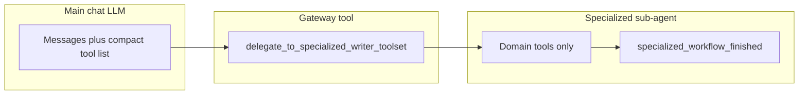

# Writer specialized toolsets (nested delegation)

This document describes **why** Writer exposes many UNO-backed tools through a **two-level** model (main chat + domain-scoped sub-agent), **how** that is implemented in code, and the **API design philosophies** (Fine-grained vs. Fat APIs) driving these decisions.

---

## 1. Problem and goals

### 1.1 Why this feature exists

Writer documents support a large surface area in LibreOffice UNO: tables, styles, text frames, drawing shapes, embedded OLE objects, fields, indexes (TOC, bibliographies), bookmarks, charts, **track changes** (record/review markup), and more. Each area has many service names, properties, and multi-step workflows (DevGuide "create table in five steps," field masters + dependents + refresh, etc.).

If **every** tool were advertised to the primary chat model on every turn:

- **Context cost** grows quickly (dozens of long JSON schemas).
- **Decision quality** drops: the model must choose among unrelated tools (e.g. `create_table` vs `indexes_update_all`).
- **Strict JSON-schema providers** (e.g. some Gemini/OpenRouter paths) are harder to satisfy when schemas proliferate.

The design goal is **progressive disclosure**: keep a **small, stable default tool list** for routine chat and document editing, while still allowing **full access** to deep Writer operations when the user or model explicitly enters a **domain**.

### 1.2 Two Perspectives on API Design

Another way to solve the tool proliferation problem is through API design. There are two primary perspectives on how to structure the tools exposed to the LLM:

**Perspective A: Fine-Grained (Skinny) APIs**
Create highly specific, narrowly-scoped tools for each operation. 
Examples: `create_footnote`, `edit_footnote`, `delete_footnote`, `create_rectangle`, `create_ellipse`.
* **Pros:** Simpler parameter schemas per tool, easier to map directly to underlying UNO DevGuide steps, less confusing validation logic per tool. LLMs often perform better with explicit constraints.
* **Cons:** Exploding tool counts. Even with nested delegation, a single domain like "Shapes" could end up with a dozen individual tools (`create_rectangle`, `create_ellipse`, `create_line`, `create_text_shape`, etc.).

**Perspective B: Fat APIs**
Combine related operations into broader, multi-purpose "fat" tools. 
Examples: `manage_footnotes(action, ...)` or `create_shape(shape_type="rectangle", ...)` or `insert_element(type="footnote", text="...")`
* **Pros:** Drastically reduces the total number of tools, limiting context size. A polymorphic schema allows more capabilities to remain in the main chat prompt, potentially eliminating the need for the sub-agent delegation pattern.
* **Cons:** The parameter schemas become extremely large and complex (e.g., union types or deeply nested generic objects). LibreOffice operations are highly disparate, making a unified underlying Python handler harder to write compared to pure RPC bindings, and LLMs may struggle to reliably structure the union parameters correctly.

#### Detailed Comparison 1: What the two APIs would look like (Footnotes)

**Skinny API (Granular Approach):**
```json
// Tool 1: create_footnote
{
  "name": "create_footnote",
  "parameters": {
    "text": {"type": "string", "description": "The content of the footnote"}
  }
}

// Tool 2: edit_footnote
{
  "name": "edit_footnote",
  "parameters": {
    "footnote_index": {"type": "integer"},
    "new_text": {"type": "string"}
  }
}

// Tool 3: delete_footnote
{
  "name": "delete_footnote",
  "parameters": {
    "footnote_index": {"type": "integer"}
  }
}
```

**Fat API (Polymorphic Approach):**
```json
// Single Tool: manage_footnotes
{
  "name": "manage_footnotes",
  "parameters": {
    "action": {"type": "string", "enum": ["create", "edit", "delete"]},
    "footnote_index": {"type": "integer", "description": "Required for edit/delete"},
    "text": {"type": "string", "description": "Required for create/edit"}
  }
}
```

#### Detailed Comparison 2: What the two APIs would look like (Shapes)

LibreOffice provides numerous drawing shapes through the generic UNO `com.sun.star.drawing.Shape` interface, but instances are created using specific service names (e.g., `RectangleShape`, `EllipseShape`, `LineShape`, `TextShape`).

**Skinny API (Granular Approach):**
```json
// Tool 1: create_rectangle
{
  "name": "create_rectangle",
  "parameters": {
    "x": {"type": "integer"},
    "y": {"type": "integer"},
    "width": {"type": "integer"},
    "height": {"type": "integer"},
    "bg_color": {"type": "string", "description": "e.g., 'red' or '#FF0000'"}
  }
}

// Tool 2: create_ellipse
// (Similar schema to create_rectangle)

// Tool 3: create_text_shape
{
  "name": "create_text_shape",
  "parameters": {
    "x": {"type": "integer"},
    "y": {"type": "integer"},
    "width": {"type": "integer"},
    "height": {"type": "integer"},
    "text": {"type": "string"}
  }
}
```

**Fat API (Polymorphic Approach):**
*(Note: This is similar to how WriterAgent currently implements shapes via `CreateShape`)*
```json
// Single Tool: create_shape
{
  "name": "create_shape",
  "parameters": {
    "shape_type": {"type": "string", "enum": ["rectangle", "ellipse", "text", "line"]},
    "x": {"type": "integer"},
    "y": {"type": "integer"},
    "width": {"type": "integer"},
    "height": {"type": "integer"},
    "text": {"type": "string", "description": "Initial text (optional, applicable to text shapes)"},
    "bg_color": {"type": "string", "description": "Background color (optional)"}
  }
}
```
**Ultra-Fat API (Single `manage_shapes` Tool):**
```json
{
  "name": "manage_shapes",
  "parameters": {
    "action": {"type": "string", "enum": ["create", "edit", "delete"]},
    "shape_index": {"type": "integer", "description": "Target shape (for edit/delete)"},
    "shape_type": {"type": "string", "enum": ["rectangle", "ellipse", "text", "line"], "description": "Required for create"},
    "geometry": {
      "type": "object", 
      "properties": {"x": {"type": "integer"}, "y": {"type": "integer"}, "width": {"type": "integer"}, "height": {"type": "integer"}}
    },
    ...
  }
}
```

While the "Fat API" approach drastically reduces tool count and could potentially eliminate the need for nested sub-agents, we currently use the "Fine-Grained + Nested Delegation" approach for most domains because LibreOffice UNO bindings map better to explicit discrete steps, and many LLMs perform better with simpler parameter shapes than with highly polymorphic schemas. However, domains like `shapes` do employ a "medium-fat" API (`create_shape` vs `create_rectangle`, `create_ellipse`) to balance practical usability with LLM schema robustness.

### 1.3 What "success" looks like under the Delegation model

- The **main** sidebar chat sees `core` / `extended` tools plus the **gateway** `delegate_to_specialized_writer_toolset`, not the full set of table/style/chart/… tools.
- When the model (or product logic) calls the gateway with a **domain** and **task**, the system dynamically grants access to that domain's focused toolset.
- **MCP** and **direct `execute(tool_name, …)`** remain able to run any registered tool by name (registry does not block execution by tier).
- **Tests** can enumerate specialized tools with `exclude_tiers=()` when registration needs to be asserted.

### 1.4 Two Implementations for Specialized Workflows

We currently support two alternative implementations for the `delegate_to_specialized_writer_toolset` tool. This allows us to experiment, research, and quantify which approach works best (e.g., perhaps smaller models need the sub-agent approach to avoid confusion, while larger models can handle in-place tool switching seamlessly). You can toggle between them using the `USE_SUB_AGENT` global variable in `plugin/modules/writer/specialized.py`. Both modes use a `final_answer` tool to explicitly return control and exit the mode.

**Approach A: The Sub-Agent Model (`USE_SUB_AGENT = True`)**
- The gateway tool launches a **short-lived sub-agent** (via `smolagents`) in a background thread.
- This sub-agent receives the user's task description and has access *only* to the specialized domain tools (and `smolagents`' built-in `final_answer` tool).
- The main chat model is blocked, waiting for the sub-agent to finish and return its final answer.

**Approach B: In-Place Tool Switching (`USE_SUB_AGENT = False`)**
- The gateway tool simply sets an active domain flag on the current session and immediately returns control to the main chat model with a message like: `"Tool call switched to '{domain}'..."`.
- On the next turn, the main chat model receives *only* the specialized tools for that domain, plus a custom `final_answer` tool (designed to perfectly mimic the smolagents exit approach). All normal core/extended tools are hidden to keep the context clean and make the sub-task easy for the model.
- The model continues its reasoning within the same context and explicitly calls `final_answer` when the sub-task is complete, which clears the active domain and restores the default toolset.

---

## 2. Architecture overview



1. **Tier filtering** on `ToolRegistry.get_tools` / `get_schemas` hides `specialized` and `specialized_control` from the default lists used by chat and MCP `tools/list`. The registry accepts an `active_domain` parameter to explicitly bypass this exclusion when the session is in a specialized mode.
2. **Domain bases** (`ToolWriterTableBase`, …) set `tier = "specialized"` and a `specialized_domain` string.
3. **Delegation** (Sub-Agent mode) collects tools where `isinstance(t, ToolWriterSpecialBase) and t.specialized_domain == domain`, wraps them for smolagents, and runs a bounded `ToolCallingAgent` loop in a **background thread** (`is_async()` on the gateway).
4. **Delegation** (In-Place mode) sets the `active_specialized_domain` on the `ChatSession`, dynamically returning a customized `final_answer` tool along with the domain tools, and responds to the LLM to trigger a new cycle with the updated schema.

---

## 3. Implementation reference

### 3.1 Registry: default exclusion of specialized tiers

**File:** [`plugin/framework/tool_registry.py`](../../plugin/framework/tool_registry.py)

- Constants: `_DEFAULT_EXCLUDE_TIERS = frozenset({"specialized", "specialized_control"})`.
- `get_tools(..., exclude_tiers=...)`:
  - If `exclude_tiers` is omitted (sentinel), those tiers are **filtered out**.
  - Pass `exclude_tiers=()` (empty) to **include all** tiers (used when building the sub-agent tool list).

`get_schemas` forwards `**kwargs` to `get_tools`, so chat and MCP inherit the same default.

**Call sites (default listing):**

- Chat: [`plugin/modules/chatbot/tool_loop.py`](../../plugin/modules/chatbot/tool_loop.py) — `get_schemas("openai", doc=model)` (no `exclude_tiers` → default exclusion).
- MCP: [`plugin/modules/http/mcp_protocol.py`](../../plugin/modules/http/mcp_protocol.py) — `get_schemas("mcp", doc=doc)` (same).

**Execution:** `ToolRegistry.execute` is unchanged; any registered name can still be invoked if the caller passes it.

### 3.2 Writer domain bases and control tool

**File:** [`plugin/modules/writer/base.py`](../../plugin/modules/writer/base.py)

| Class | `specialized_domain` | Status |
|--------|----------------------|---------|
| `ToolWriterTableBase` | `tables` | ❌ Not implemented (tables edited via HTML) |
| `ToolWriterStyleBase` | `styles` | ✅ Implemented |
| `ToolWriterLayoutBase` | `layout` | ✅ Implemented |
| `ToolWriterTextFramesBase` | `textframes` | ✅ Implemented |
| `ToolWriterEmbeddedBase` | `embedded` | ✅ Implemented |
| `ToolWriterImageBase` | `images` | ✅ Implemented |
| `ToolWriterShapeBase` | `shapes` | ✅ Implemented |
| `ToolWriterChartBase` | `charts` | ✅ Implemented |
| `ToolWriterIndexBase` | `indexes` | ✅ Implemented |
| `ToolWriterFieldBase` | `fields` | ✅ Implemented |
| `WriterAgentSpecialTracking` | `tracking` | ✅ Implemented |
| `ToolWriterBookmarkBase` | `bookmarks` | ✅ Implemented |
| `ToolWriterFootnoteBase` | `footnotes` | ✅ Implemented |

`ToolWriterSpecialBase` sets `tier = "specialized".

`SpecializedWorkflowFinished` is a normal `ToolBase` with `tier = "specialized_control"`: visible **only** to the sub-agent (default list excludes it), and used to signal completion with a `summary`.

### 3.3 Gateway: delegate to sub-agent

**File:** [`plugin/modules/writer/specialized.py`](../../plugin/modules/writer/specialized.py)

- Tool name: `delegate_to_specialized_writer_toolset`.
- Parameters: `domain` (enum aligned with `_AVAILABLE_DOMAINS`), `task` (natural language).
- `tier = "core"`, `long_running = True`, `is_async()` → **True** so the sidebar drain loop is not blocked.
- Tool gathering:
  - `registry.get_tools(filter_doc_type=False, exclude_tiers=())` — **all** tiers, no doc filter (needed so specialized tools are discoverable server-side).
  - Filter to `ToolWriterSpecialBase` with matching `specialized_domain`, plus `specialized_workflow_finished`.
- Depending on the `USE_SUB_AGENT` toggle, it either uses `ToolCallingAgent` + `WriterAgentSmolModel` to execute the task autonomously, or calls `ctx.set_active_domain_callback(domain)` to switch the context for the main model.

### 3.4 System prompt guidance

**File:** [`plugin/framework/constants.py`](../../plugin/framework/constants.py)

Block `WRITER_SPECIALIZED_DELEGATION` is prepended into `DEFAULT_CHAT_SYSTEM_PROMPT` so the main Writer model is told **when** to call the gateway and **which** domain strings are valid.

### 3.5 Exceptions: tools that stay on the main list

Some Writer tools intentionally use **`tier = "extended"`** (or `core`) so users do not need delegation for common actions, for example:

- **Track changes:** [`plugin/modules/writer/tracking.py`](../../plugin/modules/writer/tracking.py) — `set_track_changes`, `get_tracked_changes`, `manage_tracked_changes` (nelson-aligned behavior; combined accept/reject in `manage_tracked_changes`).
- **Paragraph style apply:** [`plugin/modules/writer/styles.py`](../../plugin/modules/writer/styles.py) — `styles_apply_to_selection` subclasses `plugin.framework.tool_base.ToolBase` with `tier = "extended".

**Style discovery** (`list_styles`, `get_style_info`) remains under `ToolWriterStyleBase` (specialized) so the main list does not duplicate large style catalog traffic; the prompt steers toward delegation or other discovery when needed.

### 3.6 Module layout (illustrative)

| Area | Typical module(s) | Domain / tier notes | Status |
|------|-------------------|---------------------|---------|
| Tables | N/A | Tables edited via HTML | ❌ Not implemented |
| Styles (list/info) | `plugin/modules/writer/styles.py` | `ToolWriterStyleBase` for list/info; `styles_apply_to_selection` extended | ✅ Implemented |
| Layout (frames) | `plugin/modules/writer/layout.py` | `ToolWriterLayoutBase`; nelson `frames.py` lineage noted in file | ✅ Implemented |
| Text Frames | `plugin/modules/writer/textframes.py` | `ToolWriterTextFramesBase` | ✅ Implemented |
| Shapes / draw bridge | `plugin/modules/writer/shapes.py` | `ToolWriterShapeBase`; bridges Draw tools for Writer | ✅ Implemented |
| Images (AI / selection) | `plugin/modules/writer/images.py` | `ToolWriterImageBase` / `ToolCalcImageBase`, `specialized_domain` `images`; `generate_image` is registered (not `ToolBaseDummy`) but omitted from default chat schemas | ✅ Implemented |
| Charts in Writer | `plugin/modules/writer/charts.py` | `ToolWriterChartBase`; reuses Calc chart tool classes with Writer `uno_services` | ✅ Implemented |
| Indexes | `plugin/modules/writer/indexes.py` | `ToolWriterIndexBase` | ✅ Implemented |
| Fields | `plugin/modules/writer/fields.py` | `ToolWriterFieldBase` | ✅ Implemented |
| Embedded OLE | `plugin/modules/writer/embedded.py` | `ToolWriterEmbeddedBase` | ✅ Implemented |
| Bookmarks | `plugin/modules/writer/bookmark_tools.py` | `ToolWriterBookmarkBase`; nelson `writer_nav` bookmark lineage | ✅ Implemented |
| Footnotes/Endnotes | `plugin/modules/writer/footnotes.py` | `ToolWriterFootnoteBase` | ✅ Implemented |
| Structural navigation | `plugin/modules/writer/structural.py` | Mostly `ToolBaseDummy` / navigate tools; index/field refresh moved to domains above | ❌ Not implemented |

Writer module bootstrap: [`plugin/modules/writer/__init__.py`](../../plugin/modules/writer/__init__.py) imports key submodules so discovery and side-effect imports run in a sensible order.

---

## 4. Testing and operations

- **Default tool list:** Specialized tools must **not** appear in `get_schemas(..., doc=...)` without overriding `exclude_tiers`.
- **Registration checks:** Use `get_tools(..., exclude_tiers=())` (and a real or mock `doc` as required by `uno_services`) to assert that table tools and other specialized tools are registered. See [`plugin/tests/smoke_writer_tools.py`](../../plugin/tests/smoke_writer_tools.py) and [`plugin/tests/test_tool_registry.py`](../../plugin/tests/test_tool_registry.py) (`TestExcludeSpecializedTiers`).
- **Run tests from the WriterAgent repo root** (`make test`), not from `nelson-mcp/` (different project and pytest layout).

---

## 5. Current Implementation Status

### 5.1 ✅ Implemented Domains

**Styles Domain** (`plugin/modules/writer/styles.py`)
- ✅ `ListStyles` - List all styles in the document
- ✅ `GetStyleInfo` - Get detailed information about a specific style
- ✅ `StylesApply` - Apply a style to the current selection (extended tier, available in main chat)

**Layout Domain** (`plugin/modules/writer/layout.py`)
- ✅ `GetPageStyleProperties` - Get page style dimensions, margins, headers/footers
- ✅ `SetPageStyleProperties` - Set page style properties
- ✅ `GetHeaderFooterText` - Get header/footer text content
- ✅ `SetHeaderFooterText` - Set header/footer text content
- ✅ `GetPageColumns` - Get page column configuration
- ✅ `SetPageColumns` - Set page column configuration
- ✅ `InsertPageBreak` - Insert a page break at cursor position

**Text Frames Domain** (`plugin/modules/writer/textframes.py`)
- ✅ `ListTextFrames` - List all text frames in the document
- ✅ `GetTextFrameInfo` - Get detailed information about a text frame
- ✅ `SetTextFrameProperties` - Set text frame properties (position, size, etc.)

**Embedded Objects Domain** (`plugin/modules/writer/embedded.py`)
- ✅ `EmbeddedInsert` - Insert an embedded OLE object
- ✅ `EmbeddedEdit` - Edit an existing embedded object

**Images Domain** (`plugin/modules/writer/images.py`)
- ✅ `GenerateImage` - Generate an image using AI (async)
- ✅ `ListImages` - List all images in the document
- ✅ `GetImageInfo` - Get detailed information about an image
- ✅ `SetImageProperties` - Set image properties
- ✅ `DownloadImage` - Download an image to file
- ✅ `InsertImage` - Insert an image at cursor position
- ✅ `DeleteImage` - Delete an image
- ✅ `ReplaceImage` - Replace an existing image

**Shapes Domain** (`plugin/modules/writer/shapes.py`)
- ✅ `CreateShape` - Create a new shape (inherits from Draw)
- ✅ `EditShape` - Edit an existing shape (inherits from Draw)
- ✅ `DeleteShape` - Delete a shape (inherits from Draw)
- ✅ `GetDrawSummary` - Get summary of all shapes (inherits from Draw)
- ✅ `ListWriterImages` - List images in Writer document
- ✅ `ConnectShapes` - Connect two shapes (inherits from Draw)
- ✅ `GroupShapes` - Group multiple shapes (inherits from Draw)

**Charts Domain** (`plugin/modules/writer/charts.py`)
- ✅ `ListCharts` - List all charts in the document (inherits from Calc)
- ✅ `GetChartInfo` - Get detailed chart information (inherits from Calc)
- ✅ `CreateChart` - Create a new chart (inherits from Calc)
- ✅ `EditChart` - Edit an existing chart (inherits from Calc)
- ✅ `DeleteChart` - Delete a chart (inherits from Calc)

**Indexes Domain** (`plugin/modules/writer/indexes.py`)
- ✅ `IndexesUpdateAll` - Update all indexes in the document
- ✅ `RefreshIndexesAlias` - Alias for indexes_update_all
- ✅ `IndexesList` - List all indexes in the document
- ✅ `IndexesCreate` - Create a new index
- ✅ `IndexesAddMark` - Add an index mark

**Fields Domain** (`plugin/modules/writer/fields.py`)
- ✅ `FieldsUpdateAll` - Update all fields in the document
- ✅ `UpdateFieldsAlias` - Alias for fields_update_all
- ✅ `FieldsList` - List all fields in the document
- ✅ `FieldsDelete` - Delete a field
- ✅ `FieldsInsert` - Insert a new field

**Tracking Domain** (`plugin/modules/writer/tracking.py`)
- ✅ `TrackChangesStart` - Start recording changes
- ✅ `TrackChangesStop` - Stop recording changes
- ✅ `TrackChangesList` - List all tracked changes
- ✅ `TrackChangesShow` - Show/hide change markup
- ✅ `TrackChangesAcceptAll` - Accept all changes
- ✅ `TrackChangesRejectAll` - Reject all changes
- ✅ `TrackChangesAccept` - Accept a specific change
- ✅ `TrackChangesReject` - Reject a specific change
- ✅ `TrackChangesCommentInsert` - Insert a comment
- ✅ `TrackChangesCommentList` - List all comments
- ✅ `TrackChangesCommentDelete` - Delete a comment

**Bookmarks Domain** (`plugin/modules/writer/bookmark_tools.py`)
- ✅ `ListBookmarks` - List all bookmarks
- ✅ `CleanupBookmarks` - Remove _mcp* bookmarks
- ✅ `CreateBookmark` - Create a new bookmark
- ✅ `DeleteBookmark` - Delete a bookmark
- ✅ `RenameBookmark` - Rename a bookmark
- ✅ `GetBookmark` - Get bookmark information

**Footnotes Domain** (`plugin/modules/writer/footnotes.py`)
- ✅ `FootnotesInsert` - Insert a footnote or endnote
- ✅ `FootnotesList` - List all footnotes/endnotes
- ✅ `FootnotesEdit` - Edit a footnote/endnote
- ✅ `FootnotesDelete` - Delete a footnote/endnote
- ✅ `FootnotesSettingsGet` - Get footnote/endnote settings
- ✅ `FootnotesSettingsUpdate` - Update footnote/endnote settings

### 5.2 ❌ Not Implemented / Future Work

**Tables Domain**
- ❌ No dedicated tables.py module (tables edited via HTML)
- Consider implementing if specific table operations are needed beyond HTML editing

**Structural Navigation Domain**
- ❌ `plugin/modules/writer/structural.py` contains mostly `ToolBaseDummy` tools
- Future: Implement proper structural navigation tools

**Forms Domain**
- ❌ No forms module implemented
- Future: Form field management, form design tools

**Mail Merge Domain**
- ❌ No mail merge module implemented
- Future: Data source management, merge field insertion, mail merge execution

**Bibliography Domain**
- ❌ No bibliography module implemented
- Future: Bibliographic entry management, citation insertion, bibliography generation

**Watermark Domain**
- ❌ No watermark module implemented
- Future: Watermark insertion, removal, customization

**AutoText Domain**
- ❌ No auto-text module implemented
- Future: AutoText entry management, insertion

**Table of Contents Enhancement**
- ❌ Basic TOC tools exist in indexes domain
- Future: Enhanced TOC customization, multi-level TOC management

---

## 6. Future work

The following items align with a fuller UNO/DevGuide coverage map; they are **not** all implemented today. Prioritize by product need.

### 6.1 Forms (high value for business documents)
- Implement form field tools: text fields, checkboxes, dropdowns, radio buttons
- Form design and layout tools
- Data source binding and management
- Form protection and validation

### 6.2 Mail Merge (high value for business documents)
- Data source connection and management
- Merge field insertion and editing
- Mail merge execution and output options
- Address block and greeting line tools

### 6.3 Bibliography (high value for academic documents)
- Bibliographic database management
- Citation insertion and formatting
- Bibliography generation and updating
- Citation style management

### 6.4 Watermark (medium value)
- Watermark insertion, removal, and customization
- Text and image watermarks
- Positioning and transparency controls

### 6.5 AutoText (medium value)
- AutoText entry creation, editing, and deletion
- AutoText insertion and management
- Category organization

### 6.6 Enhanced Table of Contents
- Multi-level TOC customization
- TOC style management
- TOC field editing and updating
- TOC entry formatting controls

### 6.7 Cross-cutting Enhancements

- **MCP / API opt-in:** Config or query parameter to list `specialized` tools on `tools/list` for power users or external agents that do not use `delegate_to_specialized_writer_toolset`.
- **Review domain:** Optional `delegate` domain for **track changes** + comment workflows if the main list should shrink further; see [§5.10 Track changes (planned specialized toolset)](#510-track-changes-planned-specialized-toolset) for UNO entry points.
- **Limits:** Tune `max_steps` / timeouts for the sub-agent; add telemetry on which domains are used.
- **Documentation:** Keep [`AGENTS.md`](../../AGENTS.md) in sync when behavior or entry points change.

### 6.8 Track changes (specialized toolset)

**Status:** ✅ Implemented (`plugin/modules/writer/tracking.py`). Treat this like other **specialized** domains: keep **record / review / accept-reject** operations off the default Writer tool list, and expose them only after `delegate_to_specialized_writer_toolset` enters a **track_changes** (or **review**) domain—same progressive-disclosure story as fields, indexes, tables, etc.

**Product fit:** Lets the model turn recording on before bulk edits, list or filter changes by author/type, accept or reject individually or in bulk, and toggle markup visibility—without bloating every chat turn with long schemas.

**UNO reference (LibreOffice Writer):** Obtain `XTrackChanges` from the document model (query the text document for the appropriate interface; exact `queryInterface` path follows your LO version and DevGuide). Use the supplier/enumeration pattern to walk changes.

| Interface / type | Method | Role |
|------------------|--------|------|
| `XTrackChanges` | `setRecordChanges(boolean)` | Start/stop recording changes. |
| `XTrackChanges` | `getRecordChanges()` | Query whether recording is active. |
| `XTrackChanges` | `setShowChanges(boolean)` | Show or hide revision markup. |
| `XTrackChanges` | `getShowChanges()` | Query whether markup is visible. |
| `XTrackChanges` | `acceptAllChanges()` | Accept every tracked change. |
| `XTrackChanges` | `rejectAllChanges()` | Reject every tracked change. |
| `XTrackChangesSupplier` | `getChanges()` | Obtain an `XChanges` collection. |
| `XChanges` | `createEnumeration()` | Enumerate `XChange` objects. |
| `XChange` | `getAuthor()` | Author of the change. |
| `XChange` | `getDate()` | Timestamp of the change. |
| `XChange` | `getChangeType()` | Type: **INSERT**, **DELETE**, **FORMAT**, **MOVE**, etc. |
| `XChange` | `getTextRange()` | Affected text range. |
| `XChange` | `accept()` | Accept this change. |
| `XChange` | `reject()` | Reject this change. |

For specific UNO API implementation details used by WriterAgent, see [Writer Tracking API Reference](./writer-tracking-api-reference.md).

---

## 7. Summary

| Concern | Mechanism |
|---------|-----------|
| Smaller default tool list | `exclude_tiers` default in `ToolRegistry.get_tools` / `get_schemas` |
| Domain grouping | `ToolWriter*Base.specialized_domain` + `tier = "specialized"` |
| User/model entry point | `delegate_to_specialized_writer_toolset` (`tier = "core"`, async) |
| Sub-agent completion | `final_answer` (`tier = "specialized_control"`) |
| Prompt teaching | `WRITER_SPECIALIZED_DELEGATION` in `constants.py` |
| Execution by name | Unchanged `execute()` — tier only affects **listing**, not **dispatch** |

This design trades a second LLM hop (delegation) for a **cleaner main conversation** and **safer tool choice**, while preserving a path to **full** Writer automation per domain.

### 7.1 What's Been Implemented

✅ **Core Infrastructure:**
- Tier-based tool filtering in ToolRegistry
- Domain-based specialization with base classes
- Gateway tool with sub-agent delegation
- System prompt guidance for when to delegate

✅ **Implemented Domains (11/12):**
- Styles (list/info + apply on main list)
- Layout (page styles, margins, headers/footers, columns, breaks)
- Text Frames (list, get info, set properties)
- Embedded Objects (insert, edit)
- Images (generate, list, insert, replace, etc.)
- Shapes (create, edit, delete, connect, group)
- Charts (list, create, edit, delete - inherits from Calc)
- Indexes (update, list, create, add marks)
- Fields (update, list, delete, insert)
- Tracking (full change tracking and comments)
- Bookmarks (list, create, delete, rename)
- Footnotes/Endnotes (insert, list, edit, delete, settings)

❌ **Not Implemented (1/12):**
- Tables (by design - edited via HTML)

### 7.2 What's Next (Prioritized)

**High Priority (Business/Academic Use Cases):**
1. **Forms** - Form field management for business documents
2. **Mail Merge** - Data-driven document generation
3. **Bibliography** - Academic citation management
4. **Enhanced UI Settings** - More granular control over tool visibility and behavior

**Medium Priority:**
5. **Watermark** - Document branding and security
6. **AutoText** - Reusable content snippets
7. **Structural Navigation** - Proper implementation beyond stubs

**Low Priority:**
8. **Table of Contents Enhancement** - Beyond basic index tools

The current implementation provides comprehensive coverage of Writer's core UNO capabilities through specialized domains, with clear paths for future expansion based on user needs and use cases.
