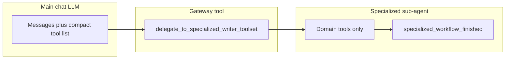

# Writer specialized toolsets (nested delegation)

This document describes **why** Writer exposes many UNO-backed tools through a **two-level** model (main chat + domain-scoped sub-agent), **how** that is implemented in code, and **what** remains to be built.

---

## 1. Problem and goals

### 1.1 Why this feature exists

Writer documents support a large surface area in LibreOffice UNO: tables, styles, text frames, drawing shapes, embedded OLE objects, fields, indexes (TOC, bibliographies), bookmarks, charts, and more. Each area has many service names, properties, and multi-step workflows (DevGuide “create table in five steps,” field masters + dependents + refresh, etc.).

If **every** tool were advertised to the primary chat model on every turn:

- **Context cost** grows quickly (dozens of long JSON schemas).
- **Decision quality** drops: the model must choose among unrelated tools (e.g. `create_table` vs `indexes_update_all`).
- **Strict JSON-schema providers** (e.g. some Gemini/OpenRouter paths) are harder to satisfy when schemas proliferate.

The design goal is **progressive disclosure**: keep a **small, stable default tool list** for routine chat and document editing, while still allowing **full access** to deep Writer operations when the user or model explicitly enters a **domain**.

### 1.2 What “success” looks like

- The **main** sidebar chat sees `core` / `extended` tools plus the **gateway** `delegate_to_specialized_writer_toolset`, not the full set of table/style/chart/… tools.
- When the model (or product logic) calls the gateway with a **domain** and **task**, a **short-lived sub-agent** runs with **only** tools for that domain (plus a completion tool).
- **MCP** and **direct `execute(tool_name, …)`** remain able to run any registered tool by name (registry does not block execution by tier).
- **Tests** can enumerate specialized tools with `exclude_tiers=()` when registration needs to be asserted.

---

## 2. Architecture overview

1. **Tier filtering** on `ToolRegistry.get_tools` / `get_schemas` hides `specialized` and `specialized_control` from the default lists used by chat and MCP `tools/list`.
2. **Domain bases** (`ToolWriterTableBase`, …) set `tier = "specialized"` and a `specialized_domain` string.
3. **Delegation** collects tools where `isinstance(t, ToolWriterSpecialBase) and t.specialized_domain == domain`, adds `specialized_workflow_finished`, wraps them for smolagents, and runs a bounded `ToolCallingAgent` loop in a **background thread** (`is_async()` on the gateway).

---

## 3. Implementation reference

### 3.1 Registry: default exclusion of specialized tiers

**File:** [`plugin/framework/tool_registry.py`](../../plugin/framework/tool_registry.py)

- Constants: `_DEFAULT_EXCLUDE_TIERS = frozenset({"specialized", "specialized_control"})`.
- `get_tools(..., exclude_tiers=...)`:
  - If `exclude_tiers` is omitted (sentinel), those tiers are **filtered out**.
  - Pass `exclude_tiers=()` (empty) to **include all** tiers (used when building the sub-agent tool list).

`get_schemas` forwards `**kwargs` to `get_tools`, so chat and MCP inherit the same default.

**Call sites (default listing):**

- Chat: [`plugin/modules/chatbot/tool_loop.py`](../../plugin/modules/chatbot/tool_loop.py) — `get_schemas("openai", doc=model)` (no `exclude_tiers` → default exclusion).
- MCP: [`plugin/modules/http/mcp_protocol.py`](../../plugin/modules/http/mcp_protocol.py) — `get_schemas("mcp", doc=doc)` (same).

**Execution:** `ToolRegistry.execute` is unchanged; any registered name can still be invoked if the caller passes it.

### 3.2 Writer domain bases and control tool

**File:** [`plugin/modules/writer/base.py`](../../plugin/modules/writer/base.py)

| Class | `specialized_domain` |
|--------|----------------------|
| `ToolWriterTableBase` | `tables` |
| `ToolWriterStyleBase` | `styles` |
| `ToolWriterLayoutBase` | `layout` |
| `ToolWriterEmbeddedBase` | `embedded` |
| `ToolWriterShapeBase` | `shapes` |
| `ToolWriterChartBase` | `charts` |
| `ToolWriterIndexBase` | `indexes` |
| `ToolWriterFieldBase` | `fields` |
| `ToolWriterBookmarkBase` | `bookmarks` |

`ToolWriterSpecialBase` sets `tier = "specialized"`.

`SpecializedWorkflowFinished` is a normal `ToolBase` with `tier = "specialized_control"`: visible **only** to the sub-agent (default list excludes it), and used to signal completion with a `summary`.

### 3.3 Gateway: delegate to sub-agent

**File:** [`plugin/modules/writer/specialized.py`](../../plugin/modules/writer/specialized.py)

- Tool name: `delegate_to_specialized_writer_toolset`.
- Parameters: `domain` (enum aligned with `_AVAILABLE_DOMAINS`), `task` (natural language).
- `tier = "core"`, `long_running = True`, `is_async()` → **True** so the sidebar drain loop is not blocked.
- Tool gathering:
  - `registry.get_tools(filter_doc_type=False, exclude_tiers=())` — **all** tiers, no doc filter (needed so specialized tools are discoverable server-side).
  - Filter to `ToolWriterSpecialBase` with matching `specialized_domain`, plus `specialized_workflow_finished`.
- Uses `ToolCallingAgent` + `WriterAgentSmolModel` + shared chat config (`chat_max_tokens`, etc.), with optional `status_callback` / `append_thinking_callback` / `stop_checker` from `ToolContext`.

### 3.4 System prompt guidance

**File:** [`plugin/framework/constants.py`](../../plugin/framework/constants.py)

Block `WRITER_SPECIALIZED_DELEGATION` is prepended into `DEFAULT_CHAT_SYSTEM_PROMPT` so the main Writer model is told **when** to call the gateway and **which** domain strings are valid.

### 3.5 Exceptions: tools that stay on the main list

Some Writer tools intentionally use **`tier = "extended"`** (or `core`) so users do not need delegation for common actions, for example:

- **Track changes:** [`plugin/modules/writer/tracking.py`](../../plugin/modules/writer/tracking.py) — `set_track_changes`, `get_tracked_changes`, `manage_tracked_changes` (nelson-aligned behavior; combined accept/reject in `manage_tracked_changes`).
- **Paragraph style apply:** [`plugin/modules/writer/styles.py`](../../plugin/modules/writer/styles.py) — `styles_apply_to_selection` subclasses `plugin.framework.tool_base.ToolBase` with `tier = "extended"`.

**Style discovery** (`list_styles`, `get_style_info`) remains under `ToolWriterStyleBase` (specialized) so the main list does not duplicate large style catalog traffic; the prompt steers toward delegation or other discovery when needed.

### 3.6 Module layout (illustrative)

| Area | Typical module(s) | Domain / tier notes |
|------|-------------------|---------------------|
| Tables | `plugin/modules/writer/tables.py` | `ToolWriterTableBase` |
| Styles (list/info) | `plugin/modules/writer/styles.py` | `ToolWriterStyleBase` for list/info; `styles_apply_to_selection` extended |
| Layout (frames) | `plugin/modules/writer/frames.py` | `ToolWriterLayoutBase`; nelson `frames.py` lineage noted in file |
| Shapes / draw bridge | `plugin/modules/writer/shapes.py` | `ToolWriterShapeBase`; bridges Draw tools for Writer |
| Images (AI / selection) | `plugin/modules/writer/images.py` | `ToolWriterShapeBase` (same domain as drawing for delegation) |
| Charts in Writer | `plugin/modules/writer/charts.py` | `ToolWriterChartBase`; reuses Calc chart tool classes with Writer `uno_services` |
| Indexes | `plugin/modules/writer/indexes.py` | `ToolWriterIndexBase` |
| Fields | `plugin/modules/writer/fields.py` | `ToolWriterFieldBase` |
| Embedded OLE | `plugin/modules/writer/embedded.py` | `ToolWriterEmbeddedBase` |
| Bookmarks | `plugin/modules/writer/bookmark_tools.py` | `ToolWriterBookmarkBase`; nelson `writer_nav` bookmark lineage |
| Structural navigation | `plugin/modules/writer/structural.py` | Mostly `ToolBaseDummy` / navigate tools; index/field refresh moved to domains above |

Writer module bootstrap: [`plugin/modules/writer/__init__.py`](../../plugin/modules/writer/__init__.py) imports key submodules so discovery and side-effect imports run in a sensible order.

---

## 4. Testing and operations

- **Default tool list:** Specialized tools must **not** appear in `get_schemas(..., doc=...)` without overriding `exclude_tiers`.
- **Registration checks:** Use `get_tools(..., exclude_tiers=())` (and a real or mock `doc` as required by `uno_services`) to assert that table tools and other specialized tools are registered. See [`plugin/tests/smoke_writer_tools.py`](../../plugin/tests/smoke_writer_tools.py) and [`plugin/tests/test_tool_registry.py`](../../plugin/tests/test_tool_registry.py) (`TestExcludeSpecializedTiers`).
- **Run tests from the WriterAgent repo root** (`make test`), not from `nelson-mcp/` (different project and pytest layout).

---

## 5. Future work

The following items align with a fuller UNO/DevGuide coverage map; they are **not** all implemented today. Prioritize by product need.

### 5.1 Fields domain (high value)

- Implement **`fields_insert`** (and related): field masters, dependents, `XTextFieldsSupplier`, `XDependentTextField`, refresh patterns; multi-step create → attach → `XUpdatable.refresh`.
- Expand **`fields_update_all`** / listing if the model needs visibility into field instances beyond a simple refresh count.

### 5.2 Indexes / TOC domain

- Replace stub **`indexes_create`** / **`indexes_add_mark`** with real UNO (or a narrow supported subset): `BaseIndex`, `ContentIndex`, marks, level formats, `XDocumentIndexesSupplier`.
- Keep **`indexes_update_all`** / **`refresh_indexes`** as the “refresh all indexes” path; document interaction with Writer’s TOC update semantics.

### 5.3 Tables domain

- Optional **nelson diff** for parity (e.g. single-cell write vs batch-only).
- Optional **vocabulary**: `tables_*` aliases or `tables_edit_cell` if prompts consistently expect those names.
- **DevGuide** alignment: explicit creation sequence, merge/split cells, sorting, formulas where applicable.

### 5.4 Layout domain

- Beyond nelson **frames**: sections (`TextSection`), columns (`TextColumns`), chained frames, page-style header/footer properties; tools such as `layout_create_section`, `layout_create_frame` with clear schemas.

### 5.5 Embedded domain

- **`embedded_insert`** / **`embedded_edit`**: Calc CLSID (and other OLE types), `TextEmbeddedObject`, suppliers, in-place activation, model access — multi-step tool flows with strong error messages.

### 5.6 Shapes / graphics

- Real implementations for **`shapes_connect`** / **`shapes_group`** (currently WIP stubs), or remove/rename if not pursued.
- Richer **image** operations in the shapes domain (crop, replace, list/detail) while avoiding duplicate semantics with [`plugin/modules/writer/images.py`](../../plugin/modules/writer/images.py) and `generate_image`.

### 5.7 Charts

- Today, Writer **charts** tools are **Calc-chart-tool bridges** with Writer `uno_services` — not a dedicated **chart2** Writer embedding story.
- Future: **`charts_insert_from_table`**, **`charts_edit_series`**, data binding from Writer tables, refresh on table changes, `ChartDocument` / `XDataProvider` where appropriate.

### 5.8 Styles domain

- **`styles_create_or_update`**: user-defined styles, inheritance via `XStyleFamiliesSupplier` / `XStyle`, conditional or page styles as scope allows.

### 5.9 Cross-cutting

- **MCP / API opt-in:** Config or query parameter to list `specialized` tools on `tools/list` for power users or external agents that do not use `delegate_to_specialized_writer_toolset`.
- **Review domain:** Optional `delegate` domain for track changes + comment workflows if the main list should shrink further.
- **Limits:** Tune `max_steps` / timeouts for the sub-agent; add telemetry on which domains are used.
- **Documentation:** Keep [`AGENTS.md`](../../AGENTS.md) in sync when behavior or entry points change.

---

## 6. Summary

| Concern | Mechanism |
|---------|-----------|
| Smaller default tool list | `exclude_tiers` default in `ToolRegistry.get_tools` / `get_schemas` |
| Domain grouping | `ToolWriter*Base.specialized_domain` + `tier = "specialized"` |
| User/model entry point | `delegate_to_specialized_writer_toolset` (`tier = "core"`, async) |
| Sub-agent completion | `specialized_workflow_finished` (`tier = "specialized_control"`) |
| Prompt teaching | `WRITER_SPECIALIZED_DELEGATION` in `constants.py` |
| Execution by name | Unchanged `execute()` — tier only affects **listing**, not **dispatch** |

This design trades a second LLM hop (delegation) for a **cleaner main conversation** and **safer tool choice**, while preserving a path to **full** Writer automation per domain.
